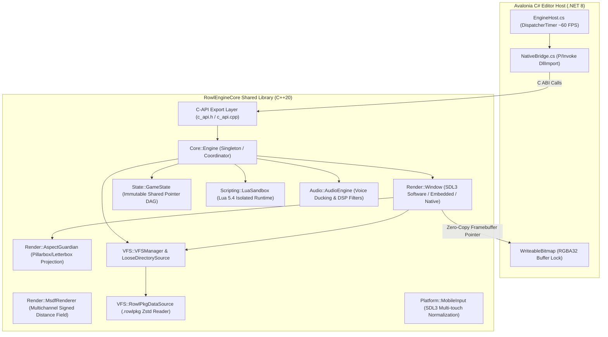

# ROWL ENGINE — COMPLETE PROJECT SPECIFICATION & REPRODUCTION GUIDE

> **Version:** 1.0.0 | **Generated:** 2026-08-29 | **Total Lines:** ~2900 | **Language:** English  
> **Purpose:** This document contains every technical detail needed to fully reproduce the Rowl Engine project from scratch — including all C++ engine subsystems, C# Avalonia editor architecture, AXAML UI layouts, binary format specifications, build systems, test suites, and tool scripts.

---

## Master Table of Contents

### Part I — C++ Native Engine Core (`engine/`)
1. Executive Summary & Architectural Overview
2. Build Matrix & Compilation Architecture
3. C-API Layer (18 Exported Functions)
4. Core Engine Coordinator (Story Graph Navigation)
5. Logger Subsystem (Thread-Safe, File Rotation)
6. AspectGuardian Viewport (Pillarbox/Letterbox Projection)
7. MSDF Typography (Multichannel Signed Distance Field)
8. SDL3 Window & Render Pipeline (3 Init Modes)
9. VFS & .rowlpkg Binary Archive Format
10. Immutable GameState & Rewind (DAG Sharing)
11. Lua 5.4 Sandbox (Instruction-Limited Isolation)
12. Audio Engine & DSP Filters (Voice Ducking)
13. Mobile Multi-Touch Input (48dp Accessibility)
14. P/Invoke Bridge (C# ↔ C++ Interop)
15. Native Test Suite (6 Test Categories)

### Part II — C# Editor ViewModels, Services & Models (`editor/ViewModels/`, `editor/Services/`, `editor/Models/`)
16. ViewModelBase & ConnectionViewModel
17. NodeViewModel (Modular Component Container)
18. Component ViewModels (Dialogue, Background, Character, Audio)
19. MainWindowViewModel (2,565 Lines — Complete Command Reference)
20. ProjectHubViewModel & ProjectCardViewModel
21. SettingsViewModel (4 Theme Palettes)
22. ToastService (Singleton Notification System)
23. UndoRedoService (50-Step Command Pattern Stack)
24. ProjectRegistryService & ProjectFactory
25. RowlPackageBuilder (FNV-1a 64-bit Hashing)
26. AssetBitmapCache (Concurrent Negative Caching)
27. NativeBridge & EngineHost (Zero-Copy Framebuffer)

### Part III — Editor Views & AXAML UI (`editor/Views/`, `editor/Styles/`)
28. Project Configuration & Build System (.csproj)
29. Application Entry Point & Headless Test Harness (Program.cs)
30. Application Lifecycle & Shell Configuration (App.axaml)
31. Complete Theme Color System (ThemeStyles.axaml)
32. Primary Editor Shell (MainWindow.axaml — 2-Row Toolbar)
33. Project Hub Window (Minecraft-Style Cards)
34. Editor Panels (NodeGraph, Assets, Inspector, Log, Hub)
35. Modal Dialogs (Create, Rename, Confirm, Settings)
36. Modular Node Components (Audio, Background, Character, Dialogue)
37. Visual Node Card Control (ComfyUI-Style)
38. Live Preview & OBS-Style Scene Editor
39. Engine Offscreen Game Preview (Zero-Copy SDL3)
40. High-Performance Bezier Wire Renderer
41. Master Keyboard Shortcuts & Gesture Reference

### Part IV — Build Configuration, Tools & Data Formats
42. CMake Build System (Root + Engine + Tests)
43. .NET Editor Build (.csproj, Post-Build Native Lib Copy)
44. Shell Scripts (start_editor.sh, run_editor.sh, etc.)
45. Python CLI Tools (export_game.py, package_assets.py, stress_test)
46. Binary Format: .rowlpkg Specification (Byte Layout)
47. JSON Schemas (project.rowlproj, story graph, active_story)
48. Complete File Inventory & Directory Tree

---
---

# PART I — C++ NATIVE ENGINE CORE

# Rowl Engine C++ Core Codebase: Comprehensive Technical Analysis & Architecture Specification

---

## 1. Executive Summary & Architectural Overview

Rowl Engine is a high-performance, cross-platform Visual Novel and 2D narrative engine. The engine core is engineered in **modern C++20** and packaged as a native shared library (`RowlEngineCore`), consumed directly by a C# Avalonia-based visual IDE via **P/Invoke** in an in-process, zero-copy shared framebuffer architecture.



### Key Architectural Tenets
1. **Embedded Shared Library Model**: Legacy inter-process communication (IPC / Named Pipes) was replaced with direct in-process C-linkage dynamic loading.
2. **Zero-Copy Framebuffer Sharing**: Offscreen rendering outputs directly into an internal 32-bit RGBA surface (`SDL_CreateSurface` + `SDL_CreateSoftwareRenderer`), exposing raw memory pointers to host runtimes (`WriteableBitmap.Lock()` / `Buffer.MemoryCopy`).
3. **Immutable History DAG**: Story progression generates immutable state snapshots with structural sharing of script variable maps, enabling instantaneous multi-step rewinds without serialization overhead.
4. **Sandboxed Lua 5.4 Execution**: Deterministic Lua environment with blacklisted system libraries (`os`, `io`, `debug`, `package`) and a hardware instruction counter debug hook preventing infinite loops (10,000,000 instruction ceiling).
5. **Hybrid VFS Architecture**: Unified virtual namespace overlaying loose disk assets and indexed, Zstandard-compressed binary archives (`.rowlpkg`).
6. **Virtual Canvas & Aspect Guardian**: Fixed 1920x1080 design canvas mapped dynamically to arbitrary display aspect ratios (Letterbox / Pillarbox) with bidirectional coordinate projection.

---

## 2. Build Matrix & Compilation Architecture

### 2.1 Root CMake Configuration
- **File**: [`CMakeLists.txt`](file:///home/chaple/Belgeler/Rowl%20Engine/CMakeLists.txt)
- **Minimum CMake Version**: 3.25
- **Languages**: CXX (C++20), C
- **Compiler Options**:
  - MSVC: `/W4`, `/permissive-`, `/utf-8`
  - Clang/GCC: `-Wall`, `-Wextra`, `-Wpedantic`, `-Wno-unused-parameter`
- **Output Directories**:
  - Binaries: `${CMAKE_BINARY_DIR}/bin`
  - Shared Libraries / Archives: `${CMAKE_BINARY_DIR}/lib`
- **Subdirectories**: `engine/`, `tests/`

### 2.2 Core Shared Library CMake Configuration
- **File**: [`engine/CMakeLists.txt`](file:///home/chaple/Belgeler/Rowl%20Engine/engine/CMakeLists.txt)
- **Target**: `RowlEngineCore` (`SHARED` library)
- **Target Platform Artifacts**:
  - Linux/Android: `libRowlEngineCore.so`
  - Windows: `RowlEngineCore.dll`
  - macOS/iOS: `libRowlEngineCore.dylib`
- **Compile Definitions**:
  - `ROWL_BUILDING_DLL` (Defines `__declspec(dllexport)` on Windows)
  - `-fvisibility=hidden` on non-MSVC compilers to enforce explicit symbol exporting via `ROWL_API`.
- **Dependencies**:
  - `nlohmann_json` (Fetched via `FetchContent` from `https://github.com/nlohmann/json.git`, tag `v3.11.3`)
  - `zstd` (Discovered via `find_package(zstd)` or fallback to `find_library(zstd)` + `find_path(zstd.h)`)
  - `SDL3` (Discovered via `find_package(SDL3)` or fallback to `find_library(SDL3)` + `find_path(SDL3/SDL.h)`)
  - `Lua 5.4` (`find_package(Lua REQUIRED)`)

### 2.3 Unit & Integration Tests CMake Configuration
- **File**: [`tests/CMakeLists.txt`](file:///home/chaple/Belgeler/Rowl%20Engine/tests/CMakeLists.txt)
- **Target**: `rowl_tests` (`EXECUTABLE`)
- **Direct Source Compilation**: Compiles [`tests/main_test_runner.cpp`](file:///home/chaple/Belgeler/Rowl%20Engine/tests/main_test_runner.cpp) along with all engine source units and links against `RowlEngineCore`.

---

## 3. Detailed File-by-File Technical Documentation

### 3.1 [`engine/include/rowl/c_api.h`](file:///home/chaple/Belgeler/Rowl%20Engine/engine/include/rowl/c_api.h) & [`engine/src/c_api.cpp`](file:///home/chaple/Belgeler/Rowl%20Engine/engine/src/c_api.cpp)

The C API provides an `extern "C"` ABI boundary for dynamic binding across language runtimes. It enforces strict decoupling: no C++ classes, standard library containers, templates, or exceptions cross this layer.

#### Includes & Dependencies
- [`engine/include/rowl/c_api.h`](file:///home/chaple/Belgeler/Rowl%20Engine/engine/include/rowl/c_api.h): `<stdint.h>`
- [`engine/src/c_api.cpp`](file:///home/chaple/Belgeler/Rowl%20Engine/engine/src/c_api.cpp): [`rowl/c_api.h`](file:///home/chaple/Belgeler/Rowl%20Engine/engine/include/rowl/c_api.h), [`rowl/core/engine.hpp`](file:///home/chaple/Belgeler/Rowl%20Engine/engine/include/rowl/core/engine.hpp), [`rowl/core/logger.hpp`](file:///home/chaple/Belgeler/Rowl%20Engine/engine/include/rowl/core/logger.hpp), `<cstring>`

#### Macros & Preprocessor Definitions
```c
#if defined(_WIN32) || defined(_WIN64)
    #ifdef ROWL_BUILDING_DLL
        #define ROWL_API __declspec(dllexport)
    #else
        #define ROWL_API __declspec(dllimport)
    #endif
#elif defined(__GNUC__) || defined(__clang__)
    #define ROWL_API __attribute__((visibility("default")))
#else
    #define ROWL_API
#endif
```

#### Types & Handles
- `typedef void* RowlEngineHandle;` (Opaque handle pointing to an allocated `Rowl::Core::Engine` instance)

#### Function Signatures, Parameters, Returns, & Internal Logic

1. [`RowlEngineHandle RowlEngine_Create(void)`](file:///home/chaple/Belgeler/Rowl%20Engine/engine/src/c_api.cpp#L27-L29)
   - **Returns**: Opaque pointer `RowlEngineHandle` to newly allocated `new Rowl::Core::Engine()`.
   - **Logic**: Instantiates the engine instance on the heap and assigns `s_instance`.

2. [`void RowlEngine_Destroy(RowlEngineHandle handle)`](file:///home/chaple/Belgeler/Rowl%20Engine/engine/src/c_api.cpp#L31-L34)
   - **Parameters**: `RowlEngineHandle handle`
   - **Logic**: Null-checked cast to `Rowl::Core::Engine*` followed by `delete`. Destructor automatically executes clean subsystem shutdown.

3. [`int RowlEngine_Init(RowlEngineHandle handle, uint32_t virtualWidth, uint32_t virtualHeight, int vsync)`](file:///home/chaple/Belgeler/Rowl%20Engine/engine/src/c_api.cpp#L36-L50)
   - **Parameters**:
     - `handle`: Pointer to engine instance.
     - `virtualWidth`: Virtual canvas width (e.g., 1920).
     - `virtualHeight`: Virtual canvas height (e.g., 1080).
     - `vsync`: `1` to enable VSync, `0` to disable.
   - **Returns**: `1` on success, `0` on failure or null handle.
   - **Logic**: Builds a `Rowl::Core::EngineConfig` structure (`appName = "Rowl Engine"`, `isIpcMode = false`) and invokes `Engine::initialize(cfg)`.

4. [`void RowlEngine_Step(RowlEngineHandle handle, float deltaTime)`](file:///home/chaple/Belgeler/Rowl%20Engine/engine/src/c_api.cpp#L52-L55)
   - **Parameters**: `RowlEngineHandle handle`, `float deltaTime`
   - **Logic**: Advances the engine simulation, polls input events, and performs rendering for one frame via `Engine::step(deltaTime)`.

5. [`void RowlEngine_Shutdown(RowlEngineHandle handle)`](file:///home/chaple/Belgeler/Rowl%20Engine/engine/src/c_api.cpp#L57-L60)
   - **Parameters**: `RowlEngineHandle handle`
   - **Logic**: Invokes `Engine::shutdown()`, releasing SDL3 surfaces, renderers, and texture caches.

6. [`int RowlEngine_IsRunning(RowlEngineHandle handle)`](file:///home/chaple/Belgeler/Rowl%20Engine/engine/src/c_api.cpp#L62-L65)
   - **Parameters**: `RowlEngineHandle handle`
   - **Returns**: `1` if engine is active and quit was not requested; otherwise `0`.

7. [`void RowlEngine_SetExternalWindowHandle(RowlEngineHandle handle, void* nativeWindowHandle, uint32_t width, uint32_t height)`](file:///home/chaple/Belgeler/Rowl%20Engine/engine/src/c_api.cpp#L69-L75)
   - **Parameters**: `RowlEngineHandle handle`, `void* nativeWindowHandle` (HWND / NSView / X11 Window ID), `uint32_t width`, `uint32_t height`.
   - **Logic**: Configures external OS window embedding before `RowlEngine_Init()`.

8. [`void RowlEngine_ResizeViewport(RowlEngineHandle handle, uint32_t newWidth, uint32_t newHeight)`](file:///home/chaple/Belgeler/Rowl%20Engine/engine/src/c_api.cpp#L77-L83)
   - **Parameters**: `RowlEngineHandle handle`, `uint32_t newWidth`, `uint32_t newHeight`.
   - **Logic**: Delegates to `Rowl::Render::Window::resizeViewport()` to resize the display target.

9. [`const uint8_t* RowlEngine_GetPixelBuffer(RowlEngineHandle handle, uint32_t* outW, uint32_t* outH)`](file:///home/chaple/Belgeler/Rowl%20Engine/engine/src/c_api.cpp#L87-L94)
   - **Parameters**: `RowlEngineHandle handle`, `uint32_t* outW` (output width), `uint32_t* outH` (output height).
   - **Returns**: Direct pointer to offscreen RGBA32 raw byte buffer (`SDL_Surface::pixels`), or `nullptr`.

10. [`void RowlEngine_SetPlayState(RowlEngineHandle handle, int isPlaying)`](file:///home/chaple/Belgeler/Rowl%20Engine/engine/src/c_api.cpp#L96-L99)
    - **Parameters**: `RowlEngineHandle handle`, `int isPlaying` (`1` = active play, `0` = editor edit mode).
    - **Logic**: Invokes `Engine::setPlayState(bool)`.

11. [`void RowlEngine_ResetToStartNode(RowlEngineHandle handle)`](file:///home/chaple/Belgeler/Rowl%20Engine/engine/src/c_api.cpp#L101-L104)
    - **Parameters**: `RowlEngineHandle handle`
    - **Logic**: Resets story node cursor to `m_startNodeId` (or minimum discovered node ID) and reloads component/legacy properties.

12. [`void RowlEngine_UpdateScene(RowlEngineHandle handle, const char* speaker, const char* dialogue, const char* background, float bgX, float bgY, float bgW, float bgH, const char* character, float charX, float charY, float charW, float charH, float dlgX, float dlgY, float dlgW, float dlgH)`](file:///home/chaple/Belgeler/Rowl%20Engine/engine/src/c_api.cpp#L108-L128)
    - **Parameters**: Handle, UTF-8 strings for speaker, dialogue, background, character, along with explicit float coordinates and bounding dimensions for background, character, and dialogue box.
    - **Logic**: Null-safe wrapper forwarding parameters to `Engine::updateActiveScene()`.

13. [`void RowlEngine_UpdateSceneFromJson(RowlEngineHandle handle, const char* componentsJson)`](file:///home/chaple/Belgeler/Rowl%20Engine/engine/src/c_api.cpp#L130-L136)
    - **Parameters**: `RowlEngineHandle handle`, `const char* componentsJson` (UTF-8 JSON array).
    - **Logic**: Forwards JSON payload to `Engine::updateSceneFromComponents()`.

14. [`void RowlEngine_LoadStoryGraph(RowlEngineHandle handle, const char* jsonPath)`](file:///home/chaple/Belgeler/Rowl%20Engine/engine/src/c_api.cpp#L138-L142)
    - **Parameters**: `RowlEngineHandle handle`, `const char* jsonPath` (path to story graph JSON on disk).
    - **Logic**: Reads file into string and executes `Engine::loadStoryGraphFromPath()`.

15. [`void RowlEngine_AdvanceNode(RowlEngineHandle handle, uint32_t choiceIndex)`](file:///home/chaple/Belgeler/Rowl%20Engine/engine/src/c_api.cpp#L144-L147)
    - **Parameters**: `RowlEngineHandle handle`, `uint32_t choiceIndex` (0-indexed branch choice).
    - **Logic**: Advances the story graph to the destination node associated with the specified branch.

16. [`const char* RowlEngine_GetSpeaker(RowlEngineHandle handle)`](file:///home/chaple/Belgeler/Rowl%20Engine/engine/src/c_api.cpp#L151-L157)
    - **Returns**: UTF-8 pointer stored in thread-local storage `thread_local std::string buf` to ensure pointer validity across FFI call lifetime.

17. [`const char* RowlEngine_GetDialogue(RowlEngineHandle handle)`](file:///home/chaple/Belgeler/Rowl%20Engine/engine/src/c_api.cpp#L159-L165)
    - **Returns**: Thread-local UTF-8 pointer to current active dialogue string.

18. [`uint64_t RowlEngine_GetCurrentNodeId(RowlEngineHandle handle)`](file:///home/chaple/Belgeler/Rowl%20Engine/engine/src/c_api.cpp#L166-L169)
    - **Returns**: 64-bit integer ID of the currently active story node.

---

### 3.2 [`engine/include/rowl/core/engine.hpp`](file:///home/chaple/Belgeler/Rowl%20Engine/engine/include/rowl/core/engine.hpp) & [`engine/src/core/engine.cpp`](file:///home/chaple/Belgeler/Rowl%20Engine/engine/src/core/engine.cpp)

The central coordinator class managing engine lifecycle, story graph navigation, component extraction, and frame stepping.

#### Includes & Dependencies
- [`engine/include/rowl/core/engine.hpp`](file:///home/chaple/Belgeler/Rowl%20Engine/engine/include/rowl/core/engine.hpp): [`rowl/render/window.hpp`](file:///home/chaple/Belgeler/Rowl%20Engine/engine/include/rowl/render/window.hpp), `<cstdint>`, `<string>`, `<memory>`, `<unordered_map>`, `<vector>`, `<nlohmann/json.hpp>`
- [`engine/src/core/engine.cpp`](file:///home/chaple/Belgeler/Rowl%20Engine/engine/src/core/engine.cpp): [`rowl/core/logger.hpp`](file:///home/chaple/Belgeler/Rowl%20Engine/engine/include/rowl/core/logger.hpp), [`rowl/vfs/vfs.hpp`](file:///home/chaple/Belgeler/Rowl%20Engine/engine/include/rowl/vfs/vfs.hpp), `<chrono>`, `<thread>`, `<fstream>`, `<filesystem>`

#### Data Structures

##### [`Rowl::Core::ComponentData`](file:///home/chaple/Belgeler/Rowl%20Engine/engine/include/rowl/core/engine.hpp#L14-L19)
```cpp
struct ComponentData {
    std::string type;       // "speaker", "background", "character", "dialogue_box", "audio"
    std::string id;         // Unique GUID / identifier
    bool enabled = true;
    nlohmann::json data;    // Arbitrary JSON payload
};
```

##### [`Rowl::Core::EngineConfig`](file:///home/chaple/Belgeler/Rowl%20Engine/engine/include/rowl/core/engine.hpp#L23-L30)
```cpp
struct EngineConfig {
    std::string appName     = "Rowl Engine Game";
    uint32_t virtualWidth   = 1920;
    uint32_t virtualHeight  = 1080;
    bool isIpcMode          = false; // Kept for schema compat
    std::string pipeId      = "";    // Kept for schema compat
    bool vsync              = true;
};
```

##### [`Rowl::Core::StoryNode`](file:///home/chaple/Belgeler/Rowl%20Engine/engine/include/rowl/core/engine.hpp#L32-L61)
```cpp
struct StoryNode {
    uint64_t id = 0;
    std::string speaker;
    std::string dialogue;
    std::string background;
    float backgroundX = 0.0f, backgroundY = 0.0f;
    float backgroundWidth = 1920.0f, backgroundHeight = 1080.0f;
    std::string character;
    float characterX = 1440.0f, characterY = 340.0f;
    float characterWidth = 360.0f, characterHeight = 540.0f, characterScale = 1.0f;
    float dialogueBoxX = 80.0f, dialogueBoxY = 860.0f;
    float dialogueBoxWidth = 1760.0f, dialogueBoxHeight = 180.0f;

    struct NextNode {
        uint64_t nodeId = 0;
        std::string label;
    };
    std::vector<NextNode> nextNodes;
    std::vector<ComponentData> components;
};
```

#### Class Methods & Logic

- **Constructor / Destructor**: Assigns singleton pointer `s_instance = this`. Destructor safely invokes `shutdown()` and resets `s_instance`.
- **`initialize(const EngineConfig&)`**: Initializes `Logger`, `VFSManager::instance().initialize()`, allocates `Rowl::Render::Window`, and activates either `initializeOffscreen()` (default) or `initializeEmbedded()` if an OS handle was injected. Automatically searches disk for story graph files.
- **`setPlayState(bool isPlaying)`**: Toggles playback mode flag.
- **`resetToStartNode()`**: Resets `m_currentNodeId` to `m_startNodeId` (or minimum key in `m_storyNodes`), deserializes its component list or legacy fields, and triggers a scene refresh.
- **`advanceToNextNode(uint32_t choiceIndex)`**: Inspects `m_storyNodes[m_currentNodeId].nextNodes`. If `choiceIndex` is within bounds, sets `m_currentNodeId = nextNodes[choiceIndex].nodeId` and refreshes scene state.
- **`updateActiveScene(...)`**: Directly assigns speaker, dialogue text, background texture and layout coords, populates single-element `m_activeCharacters` list, and sets dialogue box dimensions.
- **`updateSceneFromComponents(const std::string& json)`**: Parses JSON array of component objects. Supports multi-character rendering: clears `m_activeCharacters` and extracts every component of type `"character"`, appending `{sprite, x, y, width, height}`. Processes `"speaker"`, `"dialogue"`, `"background"`, `"dialogue_box"`, and `"audio"` (`dsp_filter`).
- **`parseStoryGraphJson(const std::string& jsonContent)`**: Parses full node graph JSON structure (`start_node_id`, `nodes` array with `id`, `speaker`, `dialogue`, `components`, `next_nodes` or legacy `next_id`). Populates `m_storyNodes` map.
- **`loadStoryGraphFromPath(const std::string& path)`**: Opens `std::ifstream`, reads entire content into `std::string`, and calls `parseStoryGraphJson()`.
- **`loadStoryGraphFile()`**: Iterates candidate paths (`Assets/json/full_story_graph.json`, `Assets/full_story_graph.json`, `../Assets/...`). Falls back to `loadActiveStoryFile()`.
- **`loadActiveStoryFile()`**: Loads single-node `active_story.json` fallback.
- **`step(float deltaTime)`**: Calls `m_window->pollEvents(shouldQuit)`, executes `m_window->renderVisualNovelFrame(...)` passing all active characters and background/dialogue parameters, and calls `m_window->endFrame()`.
- **`run()`**: Standalone blocking game loop calculating `dt` via `std::chrono::high_resolution_clock` and clamping `dt` between `0.0f` and `0.25f`.
- **`shutdown()`**: Tears down `m_window` and resets runtime flags.

---

### 3.3 [`engine/include/rowl/core/logger.hpp`](file:///home/chaple/Belgeler/Rowl%20Engine/engine/include/rowl/core/logger.hpp) & [`engine/src/core/logger.cpp`](file:///home/chaple/Belgeler/Rowl%20Engine/engine/src/core/logger.cpp)

Thread-safe logging subsystem supporting ANSI console color coding and automatic file rotation.

#### Includes & Dependencies
- [`engine/include/rowl/core/logger.hpp`](file:///home/chaple/Belgeler/Rowl%20Engine/engine/include/rowl/core/logger.hpp): `<string>`, `<string_view>`, `<mutex>`, `<memory>`, `<iostream>`, `<fstream>`
- [`engine/src/core/logger.cpp`](file:///home/chaple/Belgeler/Rowl%20Engine/engine/src/core/logger.cpp): `<chrono>`, `<iomanip>`, `<sstream>`, `<filesystem>`

#### Enumerations
```cpp
enum class LogLevel { Trace, Debug, Info, Warn, Error, Critical };
```

#### Constants & Macros
- `MAX_LOG_FILE_SIZE = 10 * 1024 * 1024` (10 MB per log file before rotation)
- Macros: `ROWL_LOG_TRACE(...)`, `ROWL_LOG_DEBUG(...)`, `ROWL_LOG_INFO(...)`, `ROWL_LOG_WARN(...)`, `ROWL_LOG_ERROR(...)`, `ROWL_LOG_CRITICAL(...)`

#### Implementation Logic
- **`Logger::init(const std::string& logFile)`**: Thread-safe initialization. If a file path is provided, opens `std::ofstream` with `std::ios::app` and tracks file size.
- **`Logger::formatTimestamp()`**: Queries `std::chrono::system_clock::now()`, formats timestamp to `YYYY-MM-DD HH:MM:SS.mmm` using `localtime_r` and `std::put_time`.
- **`Logger::rotateLogFile()`**: If `s_logFileSize >= 10MB`, closes stream, shifts backup generations (`rowl_engine.log.2` $\to$ `.3`, `.1` $\to$ `.2`, base $\to$ `.1`), and opens a fresh log file.
- **`Logger::log(LogLevel level, std::string_view msg)`**: Locks `s_logMutex`. Discards if `level < s_logLevel`. Formats colored output using ANSI codes (`Trace` = White `\033[37m`, `Debug` = Cyan `\033[36m`, `Info` = Green `\033[32m`, `Warn` = Yellow `\033[33m`, `Error` = Red `\033[31m`, `Critical` = Magenta `\033[35m`). Emits to `std::cout` and writes unformatted timestamped line to log file.

---

### 3.4 [`engine/include/rowl/render/aspect_guardian.hpp`](file:///home/chaple/Belgeler/Rowl%20Engine/engine/include/rowl/render/aspect_guardian.hpp) & [`engine/src/render/aspect_guardian.cpp`](file:///home/chaple/Belgeler/Rowl%20Engine/engine/src/render/aspect_guardian.cpp)

Resolution-independence subsystem guaranteeing consistent 16:9 layout scaling across arbitrary display sizes (Ultra-wide 21:9, Box 4:3, Mobile 19.5:9).

#### Includes & Dependencies
- [`engine/include/rowl/render/aspect_guardian.hpp`](file:///home/chaple/Belgeler/Rowl%20Engine/engine/include/rowl/render/aspect_guardian.hpp): `<cstdint>`
- [`engine/src/render/aspect_guardian.cpp`](file:///home/chaple/Belgeler/Rowl%20Engine/engine/src/render/aspect_guardian.cpp): [`rowl/render/aspect_guardian.hpp`](file:///home/chaple/Belgeler/Rowl%20Engine/engine/include/rowl/render/aspect_guardian.hpp)

#### Data Structures
```cpp
struct ViewportMetrics {
    int x = 0;
    int y = 0;
    int width = 1920;
    int height = 1080;
    float scaleFactor = 1.0f;
    bool isPillarbox = false;
};

struct NineSliceMetrics {
    int leftMargin;
    int rightMargin;
    int topMargin;
    int bottomMargin;
};
```

#### Algorithms & Mathematics

```
1. Calculate Aspect Ratios:
   virtualAspect  = virtualWidth / virtualHeight   (e.g., 1920 / 1080 = 1.7777...)
   physicalAspect = physicalWidth / physicalHeight

2. Branch Condition:
   if (physicalAspect > virtualAspect):
       // Screen is wider than target canvas -> PILLARBOX (black bars on left & right)
       viewportHeight = physicalHeight
       viewportWidth  = physicalHeight * virtualAspect
       offsetX        = (physicalWidth - viewportWidth) / 2
       offsetY        = 0
       scaleFactor    = physicalHeight / virtualHeight
       isPillarbox    = true
   else:
       // Screen is taller than target canvas -> LETTERBOX (black bars on top & bottom)
       viewportWidth  = physicalWidth
       viewportHeight = physicalWidth / virtualAspect
       offsetX        = 0
       offsetY        = (physicalHeight - viewportHeight) / 2
       scaleFactor    = physicalWidth / virtualWidth
       isPillarbox    = false

3. Coordinate Transformation:
   physicalX = offsetX + (virtualX * scaleFactor)
   physicalY = offsetY + (virtualY * scaleFactor)
```

---

### 3.5 [`engine/include/rowl/render/msdf_renderer.hpp`](file:///home/chaple/Belgeler/Rowl%20Engine/engine/include/rowl/render/msdf_renderer.hpp) & [`engine/src/render/msdf_renderer.cpp`](file:///home/chaple/Belgeler/Rowl%20Engine/engine/src/render/msdf_renderer.cpp)

Multichannel Signed Distance Field (MSDF) vector typography subsystem for crisp font rasterization at arbitrary zoom levels.

#### Includes & Dependencies
- [`engine/include/rowl/render/msdf_renderer.hpp`](file:///home/chaple/Belgeler/Rowl%20Engine/engine/include/rowl/render/msdf_renderer.hpp): `<string>`, `<vector>`, `<cstdint>`, `<unordered_map>`, `<nlohmann/json.hpp>`
- [`engine/src/render/msdf_renderer.cpp`](file:///home/chaple/Belgeler/Rowl%20Engine/engine/src/render/msdf_renderer.cpp): `<algorithm>`, `<nlohmann/json.hpp>`, [`rowl/core/logger.hpp`](file:///home/chaple/Belgeler/Rowl%20Engine/engine/include/rowl/core/logger.hpp)

#### Data Structures
```cpp
struct MsdfGlyphMetrics {
    uint32_t unicode;
    float advance;
    float planeLeft, planeBottom, planeRight, planeTop;
    float atlasLeft, atlasBottom, atlasRight, atlasTop;
};
```

#### Class Methods & Logic
- **`loadAtlasMetadata(const std::string& jsonMetadata)`**: Parses JSON containing `pixel_range`, `atlas_width`, `atlas_height`, and an array of `glyphs`. Stores glyph bounds and texture UV coordinates mapped by unicode codepoints.
- **`calculateMedianDistance(float r, float g, float b)`**: Computes MSDF median distance across RGB channels:
  $$\text{median}(r, g, b) = \max(\min(r, g), \min(\max(r, g), b))$$

---

### 3.6 [`engine/include/rowl/render/window.hpp`](file:///home/chaple/Belgeler/Rowl%20Engine/engine/include/rowl/render/window.hpp) & [`engine/src/render/window.cpp`](file:///home/chaple/Belgeler/Rowl%20Engine/engine/src/render/window.cpp)

SDL3 Windowing, Surface Management, Hardware/Software Rendering, Texture Caching, and Visual Novel Frame Composition.

#### Includes & Dependencies
- [`engine/include/rowl/render/window.hpp`](file:///home/chaple/Belgeler/Rowl%20Engine/engine/include/rowl/render/window.hpp): Forward declarations for `SDL_Window`, `SDL_Renderer`, `SDL_Texture`, `SDL_Surface`; `<string>`, `<cstdint>`, `<memory>`, `<vector>`, `<unordered_map>`.
- [`engine/src/render/window.cpp`](file:///home/chaple/Belgeler/Rowl%20Engine/engine/src/render/window.cpp): `#define STB_IMAGE_IMPLEMENTATION`, [`thirdparty/stb_image.h`](file:///home/chaple/Belgeler/Rowl%20Engine/engine/include/thirdparty/stb_image.h), [`rowl/render/aspect_guardian.hpp`](file:///home/chaple/Belgeler/Rowl%20Engine/engine/include/rowl/render/aspect_guardian.hpp), [`rowl/core/engine.hpp`](file:///home/chaple/Belgeler/Rowl%20Engine/engine/include/rowl/core/engine.hpp), [`rowl/core/logger.hpp`](file:///home/chaple/Belgeler/Rowl%20Engine/engine/include/rowl/core/logger.hpp), [`rowl/vfs/vfs.hpp`](file:///home/chaple/Belgeler/Rowl%20Engine/engine/include/rowl/vfs/vfs.hpp), `<SDL3/SDL.h>`, `<filesystem>`, `<vector>`, `<algorithm>`.

#### Data Structures
```cpp
struct CharacterRenderData {
    std::string sprite;
    float x = 1440.0f;
    float y = 340.0f;
    float width = 360.0f;
    float height = 540.0f;
};
```

#### Private Structures
```cpp
struct TextWrapCache {
    std::string dialogue;
    float boxWidth = 0.0f;
    float scaleFactor = 0.0f;
    std::vector<std::string> wrappedLines;
};
```

#### Core Rendering Logic & Lifecycle

1. **`initializeOffscreen(uint32_t width, uint32_t height)`**:
   - Calls `SDL_Init(SDL_INIT_VIDEO)`.
   - Creates RGBA32 software pixel surface: `m_offscreenSurface = SDL_CreateSurface(width, height, SDL_PIXELFORMAT_RGBA32)`.
   - Attaches software renderer: `m_sdlRenderer = SDL_CreateSoftwareRenderer(m_offscreenSurface)`.
   - Sets `m_isOffscreen = true`, `m_isOpen = true`, `m_initialized = true`.

2. **`initialize(const std::string& title, uint32_t width, uint32_t height, bool vsync)`**:
   - Calls `SDL_CreateWindow(title.c_str(), width, height, SDL_WINDOW_RESIZABLE | SDL_WINDOW_HIGH_PIXEL_DENSITY)`.
   - Creates accelerated hardware renderer: `SDL_CreateRenderer(m_sdlWindow, nullptr)`.
   - Sets VSync via `SDL_SetRenderVSync(m_sdlRenderer, 1)`.

3. **`initializeEmbedded(void* nativeHandle, uint32_t width, uint32_t height, bool vsync)`**:
   - Injects native OS window handle via SDL3 property bag `SDL_CreateProperties()`:
     - Windows: `SDL_PROP_WINDOW_CREATE_WIN32_HWND_POINTER` $\to$ `nativeHandle`
     - macOS: `SDL_PROP_WINDOW_CREATE_COCOA_WINDOW_POINTER` $\to$ `nativeHandle`
     - Linux X11: `SDL_PROP_WINDOW_CREATE_X11_WINDOW_NUMBER` $\to$ `(Sint64)nativeHandle`
   - Creates embedded window via `SDL_CreateWindowWithProperties(props)`.

4. **`loadTexture(const std::string& filename)`**:
   - Checks `m_textureCache[filename]` for instantaneous hit.
   - **VFS Resolution**: Queries `VFSManager::instance().readBytes()` with prefixes (`""`, `"images/"`, `"Assets/images/"`, `"Assets/"`).
   - If found in VFS, decodes via `stbi_load_from_memory(bytes.data(), bytes.size(), &w, &h, &channels, 4)`.
   - **Direct Disk Fallback**: If not found in VFS, searches local filesystem relative paths with `stbi_load(path, &w, &h, &channels, 4)`.
   - Converts raw pixels to `SDL_Surface` via `SDL_CreateSurfaceFrom()`, builds `SDL_Texture` with `SDL_CreateTextureFromSurface()`, and releases CPU image buffers with `stbi_image_free()`.
   - **Negative Caching**: If texture loading fails across all lookups, caches `nullptr` to prevent repeating expensive disk/VFS checks every frame.

5. **`renderVisualNovelFrame(...)`**:
   - Updates physical viewport dimensions.
   - Computes layout via `AspectGuardian::calculateViewport(m_width, m_height, 1920, 1080)`.
   - Clears frame with letterbox background color `#0B0F19` (`SDL_SetRenderDrawColor(11, 15, 25, 255)` + `SDL_RenderClear`).
   - **Layer 1: Background**: Projects virtual background coordinates through AspectGuardian. Renders background texture with `SDL_RenderTexture()` or falls back to slate fill `#141826`.
   - **Layer 2: Character Sprites (Multi-Character)**: Iterates `std::vector<CharacterRenderData>`, calculates individual scaled coordinates, renders textures or fallback portrait rects with debug text.
   - **Layer 3: Dialogue Box & Text**:
     - Renders dark glass dialogue rectangle `#0F0F1A` (alpha 240) with neon cyan border `#00F0FF`.
     - Renders Speaker Badge tag `#2563EB` with white debug text.
     - **Dialogue Word-Wrapping & Memoization Cache**: Compares `m_textWrapCache` against current dialogue string, box width, and scale factor. On cache miss, tokenizes paragraphs by `\n` and performs greedy word-wrapping based on character capacity. Renders pre-calculated wrapped lines directly from cache without per-frame heap allocations.

6. **`pollEvents(bool& outShouldQuit)`**:
   - Iterates `SDL_PollEvent()`.
   - `SDL_EVENT_QUIT` or `SDLK_ESCAPE`: Triggers clean exit.
   - `SDLK_SPACE`, `SDLK_RETURN`, `SDLK_KP_ENTER`, or Left Mouse Click: Calls `Engine::instance().advanceToNextNode()`.
   - `SDL_EVENT_WINDOW_RESIZED`: Updates physical dimensions.

7. **`shutdown()`**:
   - Destroys all cached `SDL_Texture` pointers.
   - Cleans up `SDL_Renderer`, `SDL_Window`, and `SDL_Surface`.
   - Calls `SDL_Quit()`.

---

### 3.7 [`engine/include/rowl/vfs/vfs.hpp`](file:///home/chaple/Belgeler/Rowl%20Engine/engine/include/rowl/vfs/vfs.hpp) & [`engine/src/vfs/vfs.cpp`](file:///home/chaple/Belgeler/Rowl%20Engine/engine/src/vfs/vfs.cpp)

Virtual File System abstracting loose disk directories, mod directories, and `.rowlpkg` binary archives into a unified hierarchy.

#### Includes & Dependencies
- [`engine/include/rowl/vfs/vfs.hpp`](file:///home/chaple/Belgeler/Rowl%20Engine/engine/include/rowl/vfs/vfs.hpp): `<cstdint>`, `<string>`, `<vector>`, `<memory>`, `<utility>`
- [`engine/src/vfs/vfs.cpp`](file:///home/chaple/Belgeler/Rowl%20Engine/engine/src/vfs/vfs.cpp): [`rowl/vfs/vfs.hpp`](file:///home/chaple/Belgeler/Rowl%20Engine/engine/include/rowl/vfs/vfs.hpp), [`rowl/vfs/rowlpkg_reader.hpp`](file:///home/chaple/Belgeler/Rowl%20Engine/engine/include/rowl/vfs/rowlpkg_reader.hpp), [`rowl/core/logger.hpp`](file:///home/chaple/Belgeler/Rowl%20Engine/engine/include/rowl/core/logger.hpp), `<fstream>`, `<filesystem>`, `<algorithm>`

#### Interfaces & Classes

##### [`Rowl::VFS::IDataSource`](file:///home/chaple/Belgeler/Rowl%20Engine/engine/include/rowl/vfs/vfs.hpp#L11-L17)
```cpp
class IDataSource {
public:
    virtual ~IDataSource() = default;
    virtual bool exists(const std::string& path) = 0;
    virtual std::vector<uint8_t> read(const std::string& path) = 0;
    virtual std::string getSourceName() const = 0;
};
```

##### [`Rowl::VFS::LooseDirectorySource`](file:///home/chaple/Belgeler/Rowl%20Engine/engine/include/rowl/vfs/vfs.hpp#L19-L30)
- Implements `IDataSource` for a physical directory on disk.
- **`exists(const std::string& path)`**: Validates `std::filesystem::exists(m_physicalPath / path) && std::filesystem::is_regular_file(...)`.
- **`read(const std::string& path)`**: Opens binary stream with `std::ios::ate`, reads complete byte payload into `std::vector<uint8_t>`.

##### [`Rowl::VFS::VFSManager`](file:///home/chaple/Belgeler/Rowl%20Engine/engine/include/rowl/vfs/vfs.hpp#L32-L50)
- Singleton managing an ordered vector of mount points: `std::vector<std::pair<std::string, std::shared_ptr<IDataSource>>> m_mountPoints;`.
- **`initialize()`**: Discovers root asset folders (`Assets`, `images`, `packages/*.rowlpkg`, `mods/`) and registers mount points.
- **`mountDirectory(prefix, physicalPath)`**: Appends `LooseDirectorySource`.
- **`mountPackage(prefix, pkgPath)`**: Appends `RowlPkgDataSource` if valid.
- **`readBytes(const std::string& vfsPath)`**:
  - Traverses mount points. If `vfsPath` starts with the mount prefix, attempts prefix-stripped resolution on the data source.
  - Falls back to querying the full path directly against each data source.

---

### 3.8 [`engine/include/rowl/vfs/rowlpkg_reader.hpp`](file:///home/chaple/Belgeler/Rowl%20Engine/engine/include/rowl/vfs/rowlpkg_reader.hpp) & [`engine/src/vfs/rowlpkg_reader.cpp`](file:///home/chaple/Belgeler/Rowl%20Engine/engine/src/vfs/rowlpkg_reader.cpp)

High-performance binary package reader for `.rowlpkg` archives with Zstandard (`libzstd`) decompression.

#### Includes & Dependencies
- [`engine/include/rowl/vfs/rowlpkg_reader.hpp`](file:///home/chaple/Belgeler/Rowl%20Engine/engine/include/rowl/vfs/rowlpkg_reader.hpp): [`rowl/vfs/vfs.hpp`](file:///home/chaple/Belgeler/Rowl%20Engine/engine/include/rowl/vfs/vfs.hpp), `<cstdint>`, `<string>`, `<vector>`, `<unordered_map>`, `<fstream>`, `<memory>`, `<mutex>`
- [`engine/src/vfs/rowlpkg_reader.cpp`](file:///home/chaple/Belgeler/Rowl%20Engine/engine/src/vfs/rowlpkg_reader.cpp): `<zstd.h>`, `<cstring>`, `<mutex>`, [`rowl/core/logger.hpp`](file:///home/chaple/Belgeler/Rowl%20Engine/engine/include/rowl/core/logger.hpp)

#### Binary Archive Specification: `.rowlpkg`

```
 0x00               0x04       0x06               0x0A                             0x12
┌──────────────────┬──────────┬──────────────────┬────────────────────────────────┬───────...
│ Magic: "ROWL"    │ Version  │ File Count       │ Index Offset (64-bit uint)     │ Payloads
│ (4 bytes ASCII)  │ (uint16) │ (uint32)         │ (Points to Index Table)        │
└──────────────────┴──────────┴──────────────────┴────────────────────────────────┴───────...
```

##### 1. Archive Header Layout (`#pragma pack(push, 1)`)
| Field | Type | Offset (Bytes) | Size (Bytes) | Description |
| :--- | :--- | :--- | :--- | :--- |
| `magic` | `char[4]` | `0x00` | 4 | Magic identifier: ASCII `"ROWL"` (`0x52, 0x4F, 0x57, 0x4C`) |
| `specVersion`| `uint16_t`| `0x04` | 2 | Package specification format version (`1`) |
| `fileCount` | `uint32_t`| `0x06` | 4 | Number of archived file entries in index table |
| `indexOffset`| `uint64_t`| `0x0A` | 8 | Absolute byte offset from start of file to index table |
| **Total Header Size** | | | **18 Bytes** | |

##### 2. Raw Index Entry Layout (`RowlPkgEntryRaw`)
| Field | Type | Size (Bytes) | Description |
| :--- | :--- | :--- | :--- |
| `pathHash` | `uint64_t` | 8 | 64-bit FNV-1a hash of relative path |
| `pathLength` | `uint32_t` | 4 | Byte length $N$ of relative path string |
| `offset` | `uint64_t` | 8 | Absolute file offset to entry payload bytes |
| `compressedSize` | `uint64_t` | 8 | Byte size of stored payload |
| `uncompressedSize`| `uint64_t`| 8 | Original decompressed byte size |
| `flags` | `uint32_t` | 4 | Compression Flag: `0 = Raw / Uncompressed`, `1 = Zstandard (Zstd)` |
| `path` | `char[pathLength]` | $N$ | Variable-length UTF-8 relative path string |
| **Fixed Struct Size**| | **40 Bytes + $N$** | |

##### Reader Logic
- **`loadIndexTable()`**: Seeks to `header.indexOffset`, iterates `header.fileCount` times, reads `RowlPkgEntryRaw` followed by $N$ bytes of path data, populating `m_indexTable[relPath]`.
- **`read(const std::string& path)`**: Thread-safe method protected by `std::lock_guard<std::mutex> lock(m_fileMutex)`. Seeks to `entry.offset`, reads `entry.compressedSize` bytes into a buffer.
  - If `flags == 0`: Returns raw buffer.
  - If `flags == 1`: Allocates `std::vector<uint8_t> decompressedBuffer(entry.uncompressedSize)` and calls `ZSTD_decompress(decompressedBuffer.data(), entry.uncompressedSize, compressedBuffer.data(), entry.compressedSize)`.

---

### 3.9 [`engine/include/rowl/state/game_state.hpp`](file:///home/chaple/Belgeler/Rowl%20Engine/engine/include/rowl/state/game_state.hpp) & [`engine/src/state/game_state.cpp`](file:///home/chaple/Belgeler/Rowl%20Engine/engine/src/state/game_state.cpp)

Immutable state snapshot architecture with structural sharing for instant historical rewind without state serialization.

#### Includes & Dependencies
- [`engine/include/rowl/state/game_state.hpp`](file:///home/chaple/Belgeler/Rowl%20Engine/engine/include/rowl/state/game_state.hpp): `<string>`, `<unordered_map>`, `<memory>`, `<cstdint>`
- [`engine/src/state/game_state.cpp`](file:///home/chaple/Belgeler/Rowl%20Engine/engine/src/state/game_state.cpp): [`rowl/core/logger.hpp`](file:///home/chaple/Belgeler/Rowl%20Engine/engine/include/rowl/core/logger.hpp)

#### Data Structures
```cpp
struct VariableMap {
    std::unordered_map<std::string, std::string> data;
};

struct GameState {
    uint64_t stepId = 0;
    uint64_t activeNodeId = 101;
    uint32_t typewriterIndex = 0;
    std::string activeBackground = "bg_beach_sunset.png";
    std::string dspFilter = "Normal";

    std::shared_ptr<const VariableMap> variables = std::make_shared<VariableMap>();
    std::shared_ptr<const GameState> previousState = nullptr;
    // ...
};
```

#### Structural Sharing & Historical Rewind Algorithm

```mermaid
graph LR
    S1["GameState #1 (Step 1)\nNode: 101\nVars: {}"]
    S2["GameState #2 (Step 2)\nNode: 102\nVars: {affinity: 10}"]
    S3["GameState #3 (Step 3)\nNode: 103\nVars: Shared Pointer to S2 Vars"]

    S2 -->|previousState| S1
    S3 -->|previousState| S2

    VM["VariableMap\n{affinity: 10}"]
    S2 -.->|variables| VM
    S3 -.->|variables (Zero-Copy)| VM
```

1. **`createInitialState(uint64_t startNodeId)`**: Creates root `GameState` with `stepId = 1`, `previousState = nullptr`, and an empty `VariableMap`.
2. **`createNextState(current, nextNodeId, varKey, varValue)`**:
   - Allocates new `GameState` with `stepId = current->stepId + 1`, `previousState = current`.
   - **Zero-Copy Optimization**: If `varKey` is empty or the new value equals the existing value, `nextState->variables = current->variables` (shares `std::shared_ptr` with zero allocations).
   - **Copy-On-Write Mutation**: If a variable changed, deep copies `current->variables->data` into a new `VariableMap` and updates the key.
3. **`rewind(current, stepsToRewind)`**:
   - Traverses the backwards linked list `target = target->previousState` up to `stepsToRewind` times. Runs in $O(k)$ time where $k$ is the number of steps to rewind.

---

### 3.10 [`engine/include/rowl/scripting/lua_sandbox.hpp`](file:///home/chaple/Belgeler/Rowl%20Engine/engine/include/rowl/scripting/lua_sandbox.hpp) & [`engine/src/scripting/lua_sandbox.cpp`](file:///home/chaple/Belgeler/Rowl%20Engine/engine/src/scripting/lua_sandbox.cpp)

Secure, isolated Lua 5.4 scripting environment with infinite loop defense and C++ engine variable bridges.

#### Includes & Dependencies
- [`engine/include/rowl/scripting/lua_sandbox.hpp`](file:///home/chaple/Belgeler/Rowl%20Engine/engine/include/rowl/scripting/lua_sandbox.hpp): `<string>`, `<memory>`, `<unordered_map>`, forward declared `struct lua_State`.
- [`engine/src/scripting/lua_sandbox.cpp`](file:///home/chaple/Belgeler/Rowl%20Engine/engine/src/scripting/lua_sandbox.cpp): `extern "C" { #include <lua.h> #include <lualib.h> #include <lauxlib.h> }`, [`rowl/core/logger.hpp`](file:///home/chaple/Belgeler/Rowl%20Engine/engine/include/rowl/core/logger.hpp), `<cstdint>`.

#### Sandbox Security Architecture

1. **Whitelisted Standard Libraries**:
   - Base (`_G` via `luaopen_base`)
   - `math` (`luaopen_math`)
   - `string` (`luaopen_string`)
   - `table` (`luaopen_table`)

2. **Explicitly Blacklisted Libraries**:
   ```cpp
   lua_pushnil(m_luaState); lua_setglobal(m_luaState, "io");
   lua_pushnil(m_luaState); lua_setglobal(m_luaState, "os");
   lua_pushnil(m_luaState); lua_setglobal(m_luaState, "debug");
   lua_pushnil(m_luaState); lua_setglobal(m_luaState, "package");
   ```

3. **Infinite Loop Protection Hook (`lua_instruction_hook`)**:
   - Registered via `lua_sethook(m_luaState, lua_instruction_hook, LUA_MASKCOUNT, 100000)`.
   - Fires every 100,000 executed Lua instructions.
   - Accumulates instruction count in Lua registry `_rowl_instruction_count`.
   - If cumulative count exceeds **10,000,000 instructions**, raises `lua_pushstring` error and halts execution with `lua_error(L)`.

4. **Engine Lua Bridge API**:
   - `rowl.var_set(key, value)`: Stores string key-value pair in engine variable map.
   - `rowl.var_get(key)`: Retrieves string variable value.
   - Implemented via C functions extracting the `LuaSandbox*` pointer stored in `LUA_REGISTRYINDEX["_rowl_sandbox_ptr"]`.

5. **Crash-Resilient Script Invocation (`executeString`)**:
   - Resets instruction counter to 0.
   - Compiles script with `luaL_loadstring()`.
   - Executes inside protected call `lua_pcall(m_luaState, 0, 0, 0)`. Script runtime errors and infinite loops are safely caught and logged without crashing the engine process.

---

### 3.11 [`engine/include/rowl/audio/audio_engine.hpp`](file:///home/chaple/Belgeler/Rowl%20Engine/engine/include/rowl/audio/audio_engine.hpp) & [`engine/src/audio/audio_engine.cpp`](file:///home/chaple/Belgeler/Rowl%20Engine/engine/src/audio/audio_engine.cpp)

Dual-Path Audio Subsystem managing multi-channel playback, automatic voice ducking attenuation, and DSP filter emulation.

#### Includes & Dependencies
- [`engine/include/rowl/audio/audio_engine.hpp`](file:///home/chaple/Belgeler/Rowl%20Engine/engine/include/rowl/audio/audio_engine.hpp): `<string>`, `<memory>`, `<unordered_map>`
- [`engine/src/audio/audio_engine.cpp`](file:///home/chaple/Belgeler/Rowl%20Engine/engine/src/audio/audio_engine.cpp): [`rowl/core/logger.hpp`](file:///home/chaple/Belgeler/Rowl%20Engine/engine/include/rowl/core/logger.hpp), `<algorithm>` (`std::clamp`)

#### Enumerations
```cpp
enum class AudioChannelType {
    Bgm,    // Streaming background music
    Voice,  // Spoken character dialogue
    Sfx     // Memory-pooled sound effects
};

enum class DSPFilterType {
    Normal,             // Direct pass-through
    CaveReverb,         // Extended decay reverberation
    Telephone,          // Band-pass filter (300 Hz - 3400 Hz)
    UnderwaterLowPass   // Low-pass filter (Cutoff: 800 Hz)
};
```

#### Audio Logic & Ducking Algorithms
- **`triggerVoiceDucking(bool isVoiceActive)`**:
  - When voice playback commences (`isVoiceActive = true`), attenuates BGM gain by `m_duckingFactor` (default 0.5 = -6dB):
    $$\text{Gain}_{\text{BGM}} = \text{Volume}_{\text{BGM}} \times \text{Factor}_{\text{ducking}}$$
  - When voice ends (`isVoiceActive = false`), restores BGM gain:
    $$\text{Gain}_{\text{BGM}} = \text{Volume}_{\text{BGM}}$$
- **`setDuckingFactor(float factor)`**: Clamps ducking factor to $[0.0, 1.0]$.
- **`applyDspFilter(DSPFilterType filter)`**: Applies active DSP filter profile to the audio processing graph.

---

### 3.12 [`engine/include/rowl/platform/mobile_input.hpp`](file:///home/chaple/Belgeler/Rowl%20Engine/engine/include/rowl/platform/mobile_input.hpp) & [`engine/src/platform/mobile_input.cpp`](file:///home/chaple/Belgeler/Rowl%20Engine/engine/src/platform/mobile_input.cpp)

Mobile input abstraction translating SDL3 normalized multi-touch events to virtual canvas coordinates and enforcing touch accessibility targets.

#### Includes & Dependencies
- [`engine/include/rowl/platform/mobile_input.hpp`](file:///home/chaple/Belgeler/Rowl%20Engine/engine/include/rowl/platform/mobile_input.hpp): `<cstdint>`, `<string>`, forward declaration `union SDL_Event`.
- [`engine/src/platform/mobile_input.cpp`](file:///home/chaple/Belgeler/Rowl%20Engine/engine/src/platform/mobile_input.cpp): `<SDL3/SDL.h>`, [`rowl/core/logger.hpp`](file:///home/chaple/Belgeler/Rowl%20Engine/engine/include/rowl/core/logger.hpp)

#### Data Structures
```cpp
enum class InputEventType { TapDown, TapUp, DragMotion };

struct InputEvent {
    InputEventType type;
    float x = 0.0f;
    float y = 0.0f;
    float deltaX = 0.0f;
    float deltaY = 0.0f;
    uint32_t touchId = 0;
};
```

#### Input Processing Logic
- **`processSdlEvent(const SDL_Event& sdlEvent, InputEvent& outEvent)`**:
  - `SDL_EVENT_MOUSE_BUTTON_DOWN` / `UP`: Maps mouse coordinates directly, assigns `touchId = UINT32_MAX`.
  - `SDL_EVENT_FINGER_DOWN` / `UP`: Takes normalized $[0, 1]$ touch coordinates and converts them to virtual canvas coordinates:
    $$x = \text{tfinger.x} \times 1920.0,\quad y = \text{tfinger.y} \times 1080.0$$
  - `SDL_EVENT_FINGER_MOTION`: Sets `InputEventType::DragMotion`, calculating `deltaX = tfinger.dx * 1920.0f`, `deltaY = tfinger.dy * 1080.0f`.
- **`isTouchTargetValid(float widthDp, float heightDp)`**: Enforces mobile accessibility standards: returns `true` if $\min(\text{width}, \text{height}) \ge 48.0\text{ dp}$.

---

### 3.13 [`engine/include/thirdparty/stb_image.h`](file:///home/chaple/Belgeler/Rowl%20Engine/engine/include/thirdparty/stb_image.h)
- Public domain header-only image loader (v2.30) by Sean Barrett.
- Instantiated in [`engine/src/render/window.cpp`](file:///home/chaple/Belgeler/Rowl%20Engine/engine/src/render/window.cpp) via `#define STB_IMAGE_IMPLEMENTATION`.
- Provides decoding for PNG, JPEG, BMP, TGA, PSD, GIF into 32-bit RGBA pixel arrays via `stbi_load` and `stbi_load_from_memory`.

---

## 4. Managed P/Invoke Interop Bridge Layer

The C# Avalonia Editor consumes the C++ engine via P/Invoke declarations in [`editor/Src/Native/NativeBridge.cs`](file:///home/chaple/Belgeler/Rowl%20Engine/editor/Src/Native/NativeBridge.cs) and lifetime management in [`editor/Src/Native/EngineHost.cs`](file:///home/chaple/Belgeler/Rowl%20Engine/editor/Src/Native/EngineHost.cs).

### 4.1 NativeBridge P/Invoke Declarations Table

| C# P/Invoke Method | Native C Export Function | Calling Conv. | Marshaling / Parameters |
| :--- | :--- | :--- | :--- |
| `RowlEngine_Create()` | `RowlEngine_Create` | `Cdecl` | Returns `IntPtr` handle |
| `RowlEngine_Destroy(IntPtr)` | `RowlEngine_Destroy` | `Cdecl` | `IntPtr handle` |
| `RowlEngine_Init(...)` | `RowlEngine_Init` | `Cdecl` | `IntPtr, uint, uint, int` $\to$ `int` |
| `RowlEngine_Step(...)` | `RowlEngine_Step` | `Cdecl` | `IntPtr handle, float deltaTime` |
| `RowlEngine_Shutdown(...)` | `RowlEngine_Shutdown` | `Cdecl` | `IntPtr handle` |
| `RowlEngine_IsRunning(...)` | `RowlEngine_IsRunning` | `Cdecl` | `IntPtr` $\to$ `int` |
| `RowlEngine_SetExternalWindowHandle(...)` | `RowlEngine_SetExternalWindowHandle` | `Cdecl` | `IntPtr, IntPtr, uint, uint` |
| `RowlEngine_ResizeViewport(...)` | `RowlEngine_ResizeViewport` | `Cdecl` | `IntPtr, uint, uint` |
| `RowlEngine_GetPixelBuffer(...)` | `RowlEngine_GetPixelBuffer` | `Cdecl` | `IntPtr, out uint, out uint` $\to$ `IntPtr` |
| `RowlEngine_SetPlayState(...)` | `RowlEngine_SetPlayState` | `Cdecl` | `IntPtr, int` |
| `RowlEngine_ResetToStartNode(...)` | `RowlEngine_ResetToStartNode` | `Cdecl` | `IntPtr` |
| `RowlEngine_UpdateScene(...)` | `RowlEngine_UpdateScene` | `Cdecl` | `[MarshalAs(UnmanagedType.LPUTF8Str)] string`, floats |
| `RowlEngine_UpdateSceneFromJson(...)`| `RowlEngine_UpdateSceneFromJson`| `Cdecl` | `[MarshalAs(UnmanagedType.LPUTF8Str)] string` |
| `RowlEngine_LoadStoryGraph(...)` | `RowlEngine_LoadStoryGraph` | `Cdecl` | `[MarshalAs(UnmanagedType.LPUTF8Str)] string` |
| `RowlEngine_AdvanceNode(...)` | `RowlEngine_AdvanceNode` | `Cdecl` | `IntPtr, uint` |
| `RowlEngine_GetSpeaker(...)` | `RowlEngine_GetSpeaker` | `Cdecl` | Returns `IntPtr` (marshaled via `Marshal.PtrToStringUTF8`) |
| `RowlEngine_GetDialogue(...)`| `RowlEngine_GetDialogue`| `Cdecl` | Returns `IntPtr` (marshaled via `Marshal.PtrToStringUTF8`) |
| `RowlEngine_GetCurrentNodeId(...)` | `RowlEngine_GetCurrentNodeId` | `Cdecl` | Returns `ulong` |

### 4.2 EngineHost Zero-Copy Framebuffer Copy Logic
[`editor/Src/Native/EngineHost.cs`](file:///home/chaple/Belgeler/Rowl%20Engine/editor/Src/Native/EngineHost.cs) manages the tick loop and frame presentation:
```csharp
private void UpdatePixelBuffer() {
    IntPtr pixelPtr = NativeBridge.RowlEngine_GetPixelBuffer(_handle, out uint w, out uint h);
    if (pixelPtr != IntPtr.Zero && w > 0 && h > 0) {
        int width = (int)w;
        int height = (int)h;
        if (RenderTargetBitmap == null ||
            RenderTargetBitmap.PixelSize.Width != width ||
            RenderTargetBitmap.PixelSize.Height != height) {
            RenderTargetBitmap = new WriteableBitmap(
                new PixelSize(width, height), new Vector(96, 96),
                PixelFormat.Rgba8888, AlphaFormat.Opaque);
        }
        using (var buf = RenderTargetBitmap.Lock()) {
            unsafe {
                Buffer.MemoryCopy(
                    (void*)pixelPtr,
                    (void*)buf.Address,
                    buf.RowBytes * height,
                    width * height * 4);
            }
        }
        OnPropertyChanged(nameof(RenderTargetBitmap));
    }
}
```

---

## 5. Native Test Suite Analysis

- **File**: [`tests/main_test_runner.cpp`](file:///home/chaple/Belgeler/Rowl%20Engine/tests/main_test_runner.cpp)
- **Compilation**: Built via [`tests/CMakeLists.txt`](file:///home/chaple/Belgeler/Rowl%20Engine/tests/CMakeLists.txt) into `rowl_tests`.

### Test Sections & Verification Coverage

| Test Function | Target Subsystem | Assertions & Behaviors Tested |
| :--- | :--- | :--- |
| `test_aspect_guardian()` | AspectGuardian | 1. 1:1 Match (1920x1080 on 1920x1080 display).<br>2. 21:9 Ultra-Wide (2560x1080 $\to$ Pillarbox, `x = 320`).<br>3. 4:3 Box (1024x768 $\to$ Letterbox, `y > 0`).<br>4. Virtual-to-physical coordinate projection. |
| `test_game_state()` | GameState | 1. Initial state creation (`stepId = 1`, `nodeId = 101`).<br>2. Immutable state transition with variable mutation (`player_name = Evelyn`).<br>3. Zero-copy structural sharing verification (`s3->variables == s2->variables`).<br>4. Multi-step historical rewind (Step 3 $\to$ Step 1). |
| `test_audio_engine()` | AudioEngine | 1. Initialization and state check.<br>2. Voice ducking BGM attenuation (-6dB / 50% gain).<br>3. Voice completion full gain restoration (100%).<br>4. DSP filter profile switching (Normal, Telephone, Underwater, Cave).<br>5. Subsystem shutdown. |
| `test_lua_sandbox()` | LuaSandbox | 1. Sandboxed runtime initialization.<br>2. Standard math & arithmetic execution.<br>3. Engine variable bridge (`rowl.var_set` / `getVariable`).<br>4. Security sandbox blacklist verification (`os == nil`, `io == nil`, `debug == nil`).<br>5. Infinite loop defense (10M instruction hook termination). |
| `test_mobile_input()` | MobileInput | 1. Mobile touch target size validation ($\ge 48\times 48\text{ dp}$).<br>2. SDL3 normalized touch coordinate conversion to 1920x1080 virtual canvas coordinates. |
| `test_native_c_api()` | C API & Render Loop | 1. `RowlEngine_Create` and `RowlEngine_Init` (1920x1080 offscreen).<br>2. `RowlEngine_UpdateSceneFromJson` with multi-character JSON payload.<br>3. 60-frame simulation loop step execution.<br>4. Pixel buffer validation (1920x1080 RGBA32 pointer).<br>5. `RowlEngine_Shutdown` and `RowlEngine_Destroy`. |

---

## 6. Comprehensive File Matrix & Symbol Index

| File Path | Component | Classes / Structs / Enums | Key Functions / Methods |
| :--- | :--- | :--- | :--- |
| [`engine/include/rowl/c_api.h`](file:///home/chaple/Belgeler/Rowl%20Engine/engine/include/rowl/c_api.h) | C API | `RowlEngineHandle` | `RowlEngine_Create`, `RowlEngine_Destroy`, `RowlEngine_Init`, `RowlEngine_Step`, `RowlEngine_Shutdown`, `RowlEngine_UpdateScene`, `RowlEngine_UpdateSceneFromJson`, `RowlEngine_GetPixelBuffer`, `RowlEngine_GetSpeaker`, `RowlEngine_GetDialogue`, `RowlEngine_GetCurrentNodeId` |
| [`engine/src/c_api.cpp`](file:///home/chaple/Belgeler/Rowl%20Engine/engine/src/c_api.cpp) | C API Implementation | - | Implements all 18 exported `c_api.h` functions |
| [`engine/include/rowl/core/engine.hpp`](file:///home/chaple/Belgeler/Rowl%20Engine/engine/include/rowl/core/engine.hpp) | Core Coordinator | `ComponentData`, `EngineConfig`, `StoryNode`, `Engine` | `initialize`, `run`, `step`, `shutdown`, `setExternalWindowHandle`, `updateActiveScene`, `updateSceneFromComponents`, `loadStoryGraphFromPath`, `advanceToNextNode`, `getPixelBuffer` |
| [`engine/src/core/engine.cpp`](file:///home/chaple/Belgeler/Rowl%20Engine/engine/src/core/engine.cpp) | Core Implementation | - | Lifecycle management, JSON story graph parsing, component unpacking, step loop execution |
| [`engine/include/rowl/core/logger.hpp`](file:///home/chaple/Belgeler/Rowl%20Engine/engine/include/rowl/core/logger.hpp) | Logging Subsystem | `LogLevel`, `Logger` | `init`, `setLogLevel`, `getLogLevel`, `log`, `trace`, `debug`, `info`, `warn`, `error`, `critical` |
| [`engine/src/core/logger.cpp`](file:///home/chaple/Belgeler/Rowl%20Engine/engine/src/core/logger.cpp) | Logging Implementation | - | Formatting, ANSI coloring, file output, 10MB log rotation |
| [`engine/include/rowl/render/aspect_guardian.hpp`](file:///home/chaple/Belgeler/Rowl%20Engine/engine/include/rowl/render/aspect_guardian.hpp) | Viewport Subsystem | `ViewportMetrics`, `NineSliceMetrics`, `AspectGuardian` | `calculateViewport`, `virtualToPhysical` |
| [`engine/src/render/aspect_guardian.cpp`](file:///home/chaple/Belgeler/Rowl%20Engine/engine/src/render/aspect_guardian.cpp) | Viewport Implementation | - | Aspect ratio math, letterbox/pillarbox offsets, scale factors |
| [`engine/include/rowl/render/msdf_renderer.hpp`](file:///home/chaple/Belgeler/Rowl%20Engine/engine/include/rowl/render/msdf_renderer.hpp) | MSDF Font System | `MsdfGlyphMetrics`, `MsdfRenderer` | `loadAtlasMetadata`, `calculateMedianDistance`, `getGlyphs` |
| [`engine/src/render/msdf_renderer.cpp`](file:///home/chaple/Belgeler/Rowl%20Engine/engine/src/render/msdf_renderer.cpp) | MSDF Implementation | - | JSON glyph metrics extraction, median distance calculation |
| [`engine/include/rowl/render/window.hpp`](file:///home/chaple/Belgeler/Rowl%20Engine/engine/include/rowl/render/window.hpp) | SDL3 Window / Render | `CharacterRenderData`, `Window` | `initializeOffscreen`, `initialize`, `initializeEmbedded`, `resizeViewport`, `pollEvents`, `renderVisualNovelFrame`, `loadTexture`, `getPixelBuffer` |
| [`engine/src/render/window.cpp`](file:///home/chaple/Belgeler/Rowl%20Engine/engine/src/render/window.cpp) | Render Implementation | `TextWrapCache` | SDL3 surface creation, texture caching, layered VN rendering, memoized text wrapping |
| [`engine/include/rowl/vfs/vfs.hpp`](file:///home/chaple/Belgeler/Rowl%20Engine/engine/include/rowl/vfs/vfs.hpp) | VFS Subsystem | `IDataSource`, `LooseDirectorySource`, `VFSManager` | `initialize`, `mountDirectory`, `mountPackage`, `exists`, `readBytes`, `readString` |
| [`engine/src/vfs/vfs.cpp`](file:///home/chaple/Belgeler/Rowl%20Engine/engine/src/vfs/vfs.cpp) | VFS Implementation | - | Directory scanning, prefix-based mount point resolution |
| [`engine/include/rowl/vfs/rowlpkg_reader.hpp`](file:///home/chaple/Belgeler/Rowl%20Engine/engine/include/rowl/vfs/rowlpkg_reader.hpp) | Package Reader | `RowlPkgHeader`, `RowlPkgEntryRaw`, `PackageEntry`, `RowlPkgDataSource` | `exists`, `read`, `getSourceName`, `isValid` |
| [`engine/src/vfs/rowlpkg_reader.cpp`](file:///home/chaple/Belgeler/Rowl%20Engine/engine/src/vfs/rowlpkg_reader.cpp) | Package Implementation | - | Binary header validation, index loading, thread-safe Zstd decompression |
| [`engine/include/rowl/state/game_state.hpp`](file:///home/chaple/Belgeler/Rowl%20Engine/engine/include/rowl/state/game_state.hpp) | State & Rewind | `VariableMap`, `GameState` | `getVariable`, `createInitialState`, `createNextState`, `rewind` |
| [`engine/src/state/game_state.cpp`](file:///home/chaple/Belgeler/Rowl%20Engine/engine/src/state/game_state.cpp) | State Implementation | - | Structural sharing, copy-on-write variable mutation, $O(k)$ rewind traversal |
| [`engine/include/rowl/scripting/lua_sandbox.hpp`](file:///home/chaple/Belgeler/Rowl%20Engine/engine/include/rowl/scripting/lua_sandbox.hpp) | Lua Scripting | `LuaSandbox` | `initialize`, `executeString`, `shutdown`, `setVariable`, `getVariable` |
| [`engine/src/scripting/lua_sandbox.cpp`](file:///home/chaple/Belgeler/Rowl%20Engine/engine/src/scripting/lua_sandbox.cpp) | Lua Implementation | - | Sandboxed standard libraries, instruction hook (10M cap), C callback bridge |
| [`engine/include/rowl/audio/audio_engine.hpp`](file:///home/chaple/Belgeler/Rowl%20Engine/engine/include/rowl/audio/audio_engine.hpp) | Audio Subsystem | `AudioChannelType`, `DSPFilterType`, `AudioEngine` | `initialize`, `playAudio`, `setBgmVolume`, `applyDspFilter`, `triggerVoiceDucking`, `setDuckingFactor` |
| [`engine/src/audio/audio_engine.cpp`](file:///home/chaple/Belgeler/Rowl%20Engine/engine/src/audio/audio_engine.cpp) | Audio Implementation | - | Voice ducking gain attenuation (-6dB), DSP filter profiles |
| [`engine/include/rowl/platform/mobile_input.hpp`](file:///home/chaple/Belgeler/Rowl%20Engine/engine/include/rowl/platform/mobile_input.hpp) | Input Abstraction | `InputEventType`, `InputEvent`, `MobileInput` | `processSdlEvent`, `isTouchTargetValid` |
| [`engine/src/platform/mobile_input.cpp`](file:///home/chaple/Belgeler/Rowl%20Engine/engine/src/platform/mobile_input.cpp) | Input Implementation | - | Multi-touch normalization to 1920x1080 canvas, 48dp minimum target verification |
| [`engine/include/thirdparty/stb_image.h`](file:///home/chaple/Belgeler/Rowl%20Engine/engine/include/thirdparty/stb_image.h) | 3rd Party Loader | - | Image file / memory buffer decoding to RGBA32 |

---
---

# PART II — C# EDITOR VIEWMODELS, SERVICES & MODELS

# Rowl Engine: Editor ViewModels & Core Architecture Technical Report

## 1. Executive Summary & System Architecture

The **Rowl Engine Editor** is a professional desktop visual novel engine and node-based narrative scripting IDE written in C# (.NET 10.0) using **Avalonia UI** and **CommunityToolkit.Mvvm**. The editor interfaces directly with a high-performance C++20 core engine runtime (`libRowlEngineCore.so` / `RowlEngineCore.dll`) via native P/Invoke bindings.

### Core Architectural Pillars
1. **MVVM Pattern with CommunityToolkit.Mvvm**: Uses source generators (`[ObservableProperty]`, `[RelayCommand]`, partial classes) for reactive UI data binding and zero-boilerplate property notification.
2. **Unity-Style Modular Component Model**: Nodes (`NodeViewModel`) act as entity containers composed of pluggable, ordered components (`NodeComponentViewModel`) representing visual elements (Dialogue, Background, Character, Audio DSP).
3. **P/Invoke Embedded Native Execution**: Directly hosts the C++ runtime inside the managed Avalonia process (`EngineHost`), executing zero-IPC frame updates with zero-copy offscreen framebuffer rendering into an Avalonia `WriteableBitmap`.
4. **Debounced & Transactional Persistence**: Employs debounced disk saves (500ms) to prevent I/O thrashing during drag-and-drop or continuous UI manipulations.
5. **Robust File Virtualization & VFS Packaging**: Native package builder (`RowlPackageBuilder`) compiles assets into optimized `.rowlpkg` binary archives using 64-bit FNV-1a path hashing.

---

## 2. Core ViewModel Base & Graph Topology

### 2.1 ViewModelBase
- **Full File Path**: [`file:///home/chaple/Belgeler/Rowl%20Engine/editor/ViewModels/ViewModelBase.cs`](file:///home/chaple/Belgeler/Rowl%20Engine/editor/ViewModels/ViewModelBase.cs)
- **Class**: `RowlEngine.Editor.ViewModels.ViewModelBase`
- **Inheritance**: `ObservableObject` (CommunityToolkit.Mvvm.ComponentModel)
- **Purpose**: Serves as the base class for all UI ViewModels in the application providing `INotifyPropertyChanged` and `INotifyPropertyChanging` infrastructure.

---

### 2.2 ConnectionViewModel
- **Full File Path**: [`file:///home/chaple/Belgeler/Rowl%20Engine/editor/ViewModels/ConnectionViewModel.cs`](file:///home/chaple/Belgeler/Rowl%20Engine/editor/ViewModels/ConnectionViewModel.cs)
- **Class**: `RowlEngine.Editor.ViewModels.ConnectionViewModel`
- **Inheritance**: `ObservableObject`
- **Purpose**: Models a directed connection wire between an output pin of a source node and an input pin of a target node in the visual graph canvas.

#### Observable Properties (`[ObservableProperty]`):
| Field | Generated Property | Type | Default Value | Description |
|---|---|---|---|---|
| `_sourceNode` | `SourceNode` | `NodeViewModel?` | `null` | Origin node of the connection wire. |
| `_targetNode` | `TargetNode` | `NodeViewModel?` | `null` | Destination node receiving the wire. |
| `_startPoint` | `StartPoint` | `Avalonia.Point` | `default(Point)` | Coordinate of the source output pin (Right Pin). |
| `_endPoint` | `EndPoint` | `Avalonia.Point` | `default(Point)` | Coordinate of the target input pin (Left Pin). |

#### Lifecycle & Change Handlers:
- **Constructor `ConnectionViewModel(NodeViewModel? sourceNode, NodeViewModel? targetNode)`**:
  Initializes `_sourceNode` and `_targetNode`, then invokes `UpdatePoints()`.
- **`OnSourceNodeChanged(NodeViewModel? value)`**:
  Calls `UpdatePoints()`. Subscribes to `value.PropertyChanged` listening for `nameof(NodeViewModel.X)` and `nameof(NodeViewModel.Y)` to trigger dynamic wire rerouting whenever the source node is moved.
- **`OnTargetNodeChanged(NodeViewModel? value)`**:
  Calls `UpdatePoints()`. Subscribes to `value.PropertyChanged` listening for `nameof(NodeViewModel.X)` and `nameof(NodeViewModel.Y)` to dynamically update wire termination as the target node moves.
- **`UpdatePoints()`**:
  Calculates wire terminals based on node geometry:
  - Source Pin (Output Pin): `(SourceNode.X + 250, SourceNode.Y + 60)`
  - Target Pin (Input Pin): `(TargetNode.X + 10, TargetNode.Y + 60)`

---

### 2.3 NodeViewModel
- **Full File Path**: [`file:///home/chaple/Belgeler/Rowl%20Engine/editor/ViewModels/NodeViewModel.cs`](file:///home/chaple/Belgeler/Rowl%20Engine/editor/ViewModels/NodeViewModel.cs)
- **Class**: `RowlEngine.Editor.ViewModels.NodeViewModel`
- **Inheritance**: `ObservableObject`
- **Purpose**: Core entity model representing a story scene/graph node. Acts as a component container managing lifecycle, positioning, selection, and proxy property synchronization for backward compatibility.

#### Observable Properties:
| Field | Generated Property | Type | Default Value | Description |
|---|---|---|---|---|
| `_id` | `Id` | `ulong` | `0` | Unique 64-bit unsigned integer node identifier. |
| `_title` | `Title` | `string` | `string.Empty` | Human-readable node title displayed in the header. |
| `_x` | `X` | `double` | `0.0` | Node canvas X coordinate in world space. |
| `_y` | `Y` | `double` | `0.0` | Node canvas Y coordinate in world space. |
| `_isSelected` | `IsSelected` | `bool` | `false` | Indicates if this node is currently selected in the graph. |
| `_isStartNode` | `IsStartNode` | `bool` | `false` | True if this node is the entry point/root of the story. |
| `_borderColor` | `BorderColor` | `string` | `"#2A2A3D"` | Dynamic border color: `#10B981` (Emerald) if `IsStartNode` is true, `#2A2A3D` otherwise. |

#### Component Management System:
- **`ObservableCollection<NodeComponentViewModel> Components { get; }`**: Ordered collection of components attached to this node.
- **`GetComponent<T>() where T : NodeComponentViewModel`**: Retrieves the first component matching type `T`.
- **`GetComponents<T>() where T : NodeComponentViewModel`**: Returns all components matching type `T` (e.g. multi-character scenes).
- **`AddComponent<T>() where T : NodeComponentViewModel, new()`**: Instantiates, links `Node = this`, registers property listeners, refreshes bitmaps if visual, and triggers UI updates.
- **`AddComponent(NodeComponentViewModel component)`**: Attaches existing component instance, assigns `Node = this`, subscribes to change notifications, and updates bitmaps.
- **`RemoveComponent(NodeComponentViewModel component)`**: Unsubscribes event handlers, removes from collection, sets `component.Node = null`, and fires property changes.
- **`MoveComponentUp(NodeComponentViewModel component)`**: Swaps component with preceding index to adjust render stack order.
- **`MoveComponentDown(NodeComponentViewModel component)`**: Swaps component with succeeding index.
- **`HasDialogueBox`**: Computed boolean (`Components.OfType<DialogueComponentViewModel>().Any(d => d.IsEnabled)`).
- **`HasBackground`**: Computed boolean (`Components.OfType<BackgroundComponentViewModel>().Any(b => b.IsEnabled)`).

#### Backward-Compatible Proxy Properties:
Exposes legacy flat properties that route getters/setters directly to attached component instances:
- **Dialogue**: `Speaker`, `DialogueText`, `DialogueBoxX`, `DialogueBoxY`, `DialogueBoxWidth`, `DialogueBoxHeight`, `DialogueBoxScale` (routes to `DialogueComponentViewModel`).
- **Background**: `BackgroundTexture`, `BackgroundX`, `BackgroundY`, `BackgroundWidth`, `BackgroundHeight`, `BackgroundScale`, `BackgroundBitmap` (routes to `BackgroundComponentViewModel`).
- **Character**: `CharacterSprite`, `CharacterPosition`, `CharacterX`, `CharacterY`, `CharacterWidth`, `CharacterHeight`, `CharacterScale`, `CharacterBitmap`, `CharacterComponents` (routes to first or all `CharacterComponentViewModel`).
- **Audio**: `DspFilter` (routes to `AudioComponentViewModel`).

#### Constructors:
1. `NodeViewModel(ulong id, string title, double x, double y)`: Standard constructor. Sets ID, title, position, initializes default 4 components (`Dialogue`, `Background`, `Character`, `Audio`), and calls `RefreshBitmaps()`.
2. `NodeViewModel(ulong id, string title, double x, double y, bool bare)`: Bare constructor. When `bare == true`, skips creating default components. Used during JSON deserialization so components are loaded dynamically from file data.

---

## 3. Modular Component Architecture (`ViewModels/Components/`)

### 3.1 NodeComponentViewModel (Abstract Base)
- **Full File Path**: [`file:///home/chaple/Belgeler/Rowl%20Engine/editor/ViewModels/Components/NodeComponentViewModel.cs`](file:///home/chaple/Belgeler/Rowl%20Engine/editor/ViewModels/Components/NodeComponentViewModel.cs)
- **Class**: `RowlEngine.Editor.ViewModels.Components.NodeComponentViewModel`
- **Inheritance**: `ObservableObject`
- **Purpose**: Base class for all modular scene elements.

#### Observable Properties:
| Field | Generated Property | Type | Default Value | Description |
|---|---|---|---|---|
| `_componentId` | `ComponentId` | `string` | `Guid.NewGuid().ToString("N")[..8]` | 8-character unique alphanumeric identifier. |
| `_isExpanded` | `IsExpanded` | `bool` | `true` | UI accordion expansion toggle in Inspector. |
| `_isEnabled` | `IsEnabled` | `bool` | `true` | Active state. Disabled components are ignored by engine renderers. |
| `_node` | `Node` | `NodeViewModel?` | `null` | Weak back-reference to parent Node. |

#### Abstract Contract:
- `abstract string DisplayName { get; }` (UI title)
- `abstract string Icon { get; }` (Emoji icon)
- `abstract string TypeKey { get; }` (Serialization discriminator: `"dialogue"`, `"background"`, `"character"`, `"audio"`)
- `abstract Dictionary<string, object> Serialize()`
- `abstract void Deserialize(Dictionary<string, object?> data)`

#### Relay Commands:
- `RemoveSelf()`: Calls `Node?.RemoveComponent(this)`.
- `MoveUp()`: Calls `Node?.MoveComponentUp(this)`.
- `MoveDown()`: Calls `Node?.MoveComponentDown(this)`.

---

### 3.2 DialogueComponentViewModel
- **Full File Path**: [`file:///home/chaple/Belgeler/Rowl%20Engine/editor/ViewModels/Components/DialogueComponentViewModel.cs`](file:///home/chaple/Belgeler/Rowl%20Engine/editor/ViewModels/Components/DialogueComponentViewModel.cs)
- **Class**: `RowlEngine.Editor.ViewModels.Components.DialogueComponentViewModel`
- **Inheritance**: `NodeComponentViewModel`
- **Type Key**: `"dialogue"` | **Icon**: 💬 | **Display Name**: `"Dialogue"`

#### Observable Properties:
| Field | Generated Property | Type | Default Value | Description |
|---|---|---|---|---|
| `_speaker` | `Speaker` | `string` | `"Evelyn"` | Name of character speaking. |
| `_dialogueText` | `DialogueText` | `string` | `string.Empty` | Dialogue subtitle text content. |
| `_x` | `X` | `double` | `80.0` | Dialogue box top-left X coordinate. |
| `_y` | `Y` | `double` | `860.0` | Dialogue box top-left Y coordinate. |
| `_width` | `Width` | `double` | `1760.0` | Box width (Default 1080p standard width). |
| `_height` | `Height` | `double` | `180.0` | Box height. |
| `_scale` | `Scale` | `double` | `1.0` | Transform scale factor. |

#### Relay Commands:
- `SetSquare()`: Sets `Width = 500.0`, `Height = 500.0`, `X = 80.0`, `Y = 540.0`.
- `SetStandard()`: Resets to `Width = 1760.0`, `Height = 180.0`, `X = 80.0`, `Y = 860.0`.

#### Serialization / Deserialization:
- **`Serialize()`**: Output dictionary containing `speaker`, `dialogue`, `x`, `y`, `width`, `height`, `scale`.
- **`Deserialize()`**: Handles current keys as well as legacy keys (`dialogue_box_x`, `dialogue_box_y`, `dialogue_box_width`, `dialogue_box_height`).
- **Aliases**: Defines `SpeakerComponentViewModel` and `DialogueBoxComponentViewModel` for backward compatibility.

---

### 3.3 CharacterComponentViewModel
- **Full File Path**: [`file:///home/chaple/Belgeler/Rowl%20Engine/editor/ViewModels/Components/CharacterComponentViewModel.cs`](file:///home/chaple/Belgeler/Rowl%20Engine/editor/ViewModels/Components/CharacterComponentViewModel.cs)
- **Class**: `RowlEngine.Editor.ViewModels.Components.CharacterComponentViewModel`
- **Inheritance**: `NodeComponentViewModel`
- **Type Key**: `"character"` | **Icon**: 👤 | **Display Name**: `"Character Sprite"`

#### Observable Properties:
| Field | Generated Property | Type | Default Value | Description |
|---|---|---|---|---|
| `_sprite` | `Sprite` | `string` | `"spr_evelyn.png"` | Relative sprite filename in project assets. |
| `_position` | `Position` | `string` | `"Right"` | Position tag (`"Left"`, `"Center"`, `"Right"`). |
| `_x` | `X` | `double` | `1440.0` | X position on canvas. |
| `_y` | `Y` | `double` | `340.0` | Y position on canvas. |
| `_width` | `Width` | `double` | `360.0` (DefaultWidth) | Sprite bounding box width. |
| `_height` | `Height` | `double` | `540.0` (DefaultHeight) | Sprite bounding box height. |
| `_scale` | `Scale` | `double` | `1.0` | Uniform scale multiplier. |
| `_spriteBitmap` | `SpriteBitmap` | `Bitmap?` | `null` | Decoded Avalonia bitmap from asset cache. |

#### Logic & Change Handlers:
- **`OnScaleChanged(double value)`**: Automatically scales `Width = 360.0 * value` and `Height = 540.0 * value`.
- **`OnSpriteChanged(string value)`**: Invokes `RefreshBitmap()`.
- **`RefreshBitmap()`**: Retrieves bitmap via `AssetBitmapCache.GetOrLoad(Sprite)`.
- **`ResetDimensions()`**: Resets width to 360, height to 540, and scale to 1.0.

---

### 3.4 BackgroundComponentViewModel
- **Full File Path**: [`file:///home/chaple/Belgeler/Rowl%20Engine/editor/ViewModels/Components/BackgroundComponentViewModel.cs`](file:///home/chaple/Belgeler/Rowl%20Engine/editor/ViewModels/Components/BackgroundComponentViewModel.cs)
- **Class**: `RowlEngine.Editor.ViewModels.Components.BackgroundComponentViewModel`
- **Inheritance**: `NodeComponentViewModel`
- **Type Key**: `"background"` | **Icon**: 🖼️ | **Display Name**: `"Background Layer"`

#### Observable Properties:
| Field | Generated Property | Type | Default Value | Description |
|---|---|---|---|---|
| `_texture` | `Texture` | `string` | `"bg_beach_sunset.png"` | Background image filename. |
| `_x` | `X` | `double` | `0.0` | Canvas X coordinate. |
| `_y` | `Y` | `double` | `0.0` | Canvas Y coordinate. |
| `_width` | `Width` | `double` | `1920.0` | Default 1080p full width. |
| `_height` | `Height` | `double` | `1080.0` | Default 1080p full height. |
| `_scale` | `Scale` | `double` | `1.0` | Scale multiplier. |
| `_textureBitmap` | `TextureBitmap` | `Bitmap?` | `null` | Decoded Avalonia bitmap from asset cache. |

#### Logic & Change Handlers:
- **`OnScaleChanged(double value)`**: Scales `Width = 1920.0 * value`, `Height = 1080.0 * value`.
- **`OnTextureChanged(string value)`**: Invokes `RefreshBitmap()`.
- **`RefreshBitmap()`**: Fetches bitmap via `AssetBitmapCache.GetOrLoad(Texture)`.
- **`ResetDimensions()`**: Resets `X = 0`, `Y = 0`, `Width = 1920`, `Height = 1080`, `Scale = 1.0`.

---

### 3.5 AudioComponentViewModel
- **Full File Path**: [`file:///home/chaple/Belgeler/Rowl%20Engine/editor/ViewModels/Components/AudioComponentViewModel.cs`](file:///home/chaple/Belgeler/Rowl%20Engine/editor/ViewModels/Components/AudioComponentViewModel.cs)
- **Class**: `RowlEngine.Editor.ViewModels.Components.AudioComponentViewModel`
- **Inheritance**: `NodeComponentViewModel`
- **Type Key**: `"audio"` | **Icon**: 🔊 | **Display Name**: `"Audio & DSP"`

#### Observable Properties:
| Field | Generated Property | Type | Default Value | Description |
|---|---|---|---|---|
| `_dspFilter` | `DspFilter` | `string` | `"Normal"` | DSP Filter preset (`"Normal"`, `"Telephone"`, `"Radio"`, `"Cave"`, `"Muffled"`). |

#### Serialization:
- Serializes/deserializes dictionary with key `dsp_filter`.

---

### 3.6 ComponentRegistry
- **Full File Path**: [`file:///home/chaple/Belgeler/Rowl%20Engine/editor/ViewModels/Components/ComponentRegistry.cs`](file:///home/chaple/Belgeler/Rowl%20Engine/editor/ViewModels/Components/ComponentRegistry.cs)
- **Class**: `RowlEngine.Editor.ViewModels.Components.ComponentRegistry` (static)
- **Purpose**: Centralized factory mapping type keys to component constructors.
- **Registered Factories**:
  - `"dialogue"` -> `DialogueComponentViewModel`
  - `"background"` -> `BackgroundComponentViewModel`
  - `"character"` -> `CharacterComponentViewModel`
  - `"audio"` -> `AudioComponentViewModel`
  - Legacy Aliases: `"speaker"`, `"dialogue_box"` -> `DialogueComponentViewModel`
- **Methods**:
  - `Create(string typeKey)`: Instantiates a component by key. Throws `KeyNotFoundException` on unknown key.
  - `AvailableTypes`: Returns `["dialogue", "background", "character", "audio"]`.
  - `GetAvailableComponentInfo()`: Returns list of `(TypeKey, DisplayName, Icon)`.

---

## 4. Main Editor ViewModel & Nested Panel ViewModels

### 4.1 MainWindowViewModel
- **Full File Path**: [`file:///home/chaple/Belgeler/Rowl%20Engine/editor/ViewModels/MainWindowViewModel.cs`](file:///home/chaple/Belgeler/Rowl%20Engine/editor/ViewModels/MainWindowViewModel.cs)
- **Class**: `RowlEngine.Editor.ViewModels.MainWindowViewModel`
- **Inheritance**: `ViewModelBase`
- **Total Lines**: 2,565 lines

#### Path Resolution Architecture:
- `ProjectRoot`: Static property initialized via `ResolveProjectRoot()`. Walks up 6 parent directory levels from assembly location searching for a directory containing both `Assets/` and `editor/` or `CMakeLists.txt`.
- `AssetsPath`: `Path.Combine(ProjectRoot, "Assets")`
- `AssetsJsonPath`: `Path.Combine(AssetsPath, "json")`
- `AssetsImagesPath`: `Path.Combine(AssetsPath, "images")`
- `AssetsPackagesPath`: `Path.Combine(AssetsPath, "packages")`

#### Core Observable Properties:
| Field | Generated Property | Type | Default Value | Description |
|---|---|---|---|---|
| `_statusText` | `StatusText` | `string` | `"Ready — Engine initializing..."` | Main status bar text message. |
| `_currentBuildTarget` | `CurrentBuildTarget` | `string` | `"Linux"` | Selected platform for compilation (`"Linux"`, `"Windows"`, `"macOS"`, `"Android"`, `"iOS"`). |
| `_isSearchVisible` | `IsSearchVisible` | `bool` | `false` | Quick search bar visibility. |
| `_searchQuery` | `SearchQuery` | `string` | `""` | Quick search query text. Autonavigates canvas to matching node. |
| `_isConnected` | `IsConnected` | `bool` | `false` | Embedded native engine initialization state. |
| `_logOutput` | `LogOutput` | `string` | `"[System] ...\n"` | Accumulated output log string. |
| `_selectedNode` | `SelectedNode` | `NodeViewModel?` | `null` | Currently selected node in editor. |
| `_wireStartPoint` | `WireStartPoint` | `Point` | `(0,0)` | In-progress cable connection start position. |
| `_wireEndPoint` | `WireEndPoint` | `Point` | `(0,0)` | In-progress cable connection end position. |
| `_isDraggingWire` | `IsDraggingWire` | `bool` | `false` | True when dragging a connection cable between pins. |
| `_panX` | `PanX` | `double` | `0` | Canvas horizontal translation. |
| `_panY` | `PanY` | `double` | `0` | Canvas vertical translation. |
| `_zoomScale` | `ZoomScale` | `double` | `1.0` | Canvas zoom scale factor. |
| `_isInteractivelyDragging`| `IsInteractivelyDragging` | `bool` | `false` | Fast-path flag to skip heavy JSON rendering during live drag. |
| `_isAssetsPanelVisible` | `IsAssetsPanelVisible` | `bool` | `true` | Assets panel drawer visibility. |
| `_isInspectorPanelVisible` | `IsInspectorPanelVisible` | `bool` | `true` | Inspector panel drawer visibility. |
| `_isLogPanelVisible` | `IsLogPanelVisible` | `bool` | `true` | Output log drawer visibility. |
| `_isNodeGraphActive` | `IsNodeGraphActive` | `bool` | `true` | Node Graph central view tab active. |
| `_isPreviewActive` | `IsPreviewActive` | `bool` | `false` | Avalonia 2D preview tab active. |
| `_isEnginePreviewActive` | `IsEnginePreviewActive` | `bool` | `false` | Native C++ Engine preview tab active. |
| `_splitScreenMode` | `SplitScreenMode` | `int` | `0` | 0 = Off, 1 = Horizontal Split, 2 = Vertical Split. |
| `_isDarkMode` | `IsDarkMode` | `bool` | `true` | Active UI theme variant. |
| `_isPlayingStandalone` | `IsPlayingStandalone` | `bool` | `false` | Live game playback mode state. |
| `_playButtonText` | `PlayButtonText` | `string` | `"▶ Play"` | Toggle button label (`"▶ Play"` vs `"⏹ Stop"`). |
| `_playButtonColor` | `PlayButtonColor` | `string` | `"#16A34A"` | Play button background (`#16A34A` green vs `#DC2626` red). |
| `_isAddComponentMenuOpen` | `IsAddComponentMenuOpen` | `bool` | `false` | Dropdown popup state for Add Component. |
| `_isSnapAssistEnabled` | `IsSnapAssistEnabled` | `bool` | `true` | Magnetic snap toggle in Edit Frame. |

#### Collections & Sub-ViewModels:
- `ObservableCollection<NodeViewModel> Nodes { get; }`
- `ObservableCollection<ConnectionViewModel> Connections { get; }`
- `AssetBrowserViewModel AssetBrowserViewModel { get; }`
- `OutputLogViewModel OutputLogViewModel { get; }`
- `InspectorViewModel InspectorViewModel { get; }`
- `NodeGraphViewModel NodeGraphViewModel { get; }`
- `LivePreviewViewModel LivePreviewViewModel { get; }`
- `SettingsViewModel Settings { get; }`
- `ToastService Toast => ToastService.Instance;`
- `UndoRedoService UndoRedo => UndoRedoService.Instance;`
- `EngineHost EngineHost { get; } = new EngineHost();`

#### Key Relay Commands & Methods:
1. `SetBuildTarget(string target)`: Switches `CurrentBuildTarget` and notifies computed string properties.
2. `OpenSettings()`: Launches modal `SettingsDialog`.
3. `OpenProjectHub()`: Spawns `ProjectHubWindow`, subscribes to `ProjectOpened`, transitions desktop window, closes editor.
4. `Undo()` / `Redo()`: Dispatches undo/redo stack actions and shows toast notification.
5. `ToggleSearch()`: Shows/hides quick search box. Searching dynamically centers and smooth-zooms onto matching node.
6. `ToggleFullscreen()`: Toggles window state between `Normal` and `FullScreen`.
7. `ToggleTheme()`: Switches `IsDarkMode` and updates `Application.Current.RequestedThemeVariant`.
8. `ResetCanvasView()`: Animates `PanX`, `PanY`, `ZoomScale` smoothly back to `(0, 0, 1.0)`.
9. `AddNode()`: Calculates visible canvas center, generates new node ID (`Max(Id) + 1`), attaches default components and property listeners, and adds to `Nodes`.
10. `DeleteSelectedNode()` / `DeleteNode(NodeViewModel node)`: Unplugs all connected cables, removes node from collection, updates start node indicator.
11. `DisconnectSelectedNodeCables()` / `DisconnectNodeInputs(node)` / `DisconnectNodeOutputs(node)` / `DisconnectAllNodeCables(node)`: Removes connections referencing specified node.
12. `StartWireDrag(node, pinPos)` / `StartUnplugWireDrag(node, mousePos)` / `UpdateWireDrag(mousePos)` / `EndWireDrag(releasePos)`: Implements interactive wire drawing with hit-testing (radius 75px) on input pins.
13. `EnforceSingleOutgoingWireRule()`: Enforces that an output pin can only have one cable originating from it; removes duplicate outgoing connections.
14. `ConnectEngineAsync()`: Initializes embedded native `libRowlEngineCore.so` via `EngineHost.Initialize(1920, 1080, true)`.
15. `PushSceneToEngine(NodeViewModel node)`: Serializes active components to JSON and transmits to native runtime via `EngineHost.UpdateSceneFromComponents()`.
16. `TogglePlayStandalone()` / `StartStandaloneGame()` / `StopStandaloneGame()`: Starts/stops live gameplay execution loop in native engine with state reset to root node.
17. `SelectNode(NodeViewModel node)` / `SelectNodeQuiet(NodeViewModel node)`: Manages selection state; quiet variant bypasses debounce disk writes during high-speed gameplay node advancement.
18. `ImportAssetAsync()`: Opens OS file picker and copies imported assets to `Assets/images/`, `Assets/json/`, or `Assets/packages/`.
19. `ScheduleSave()`: 500ms debounce timer writing `active_story.json` and `full_story_graph.json`.
20. `ShowPanel(string panelName)`: Controls visibility of Assets, Inspector, Log, and tabs (`NodeGraph`, `Preview`, `EnginePreview`, `SplitScreen`).
21. `AddComponentByType(string typeKey)`: Instantiates component from `ComponentRegistry` and attaches to selected node.
22. `RemoveComponent(NodeComponentViewModel? comp)`: Detaches component and notifies native engine.
23. `SelectImageForComponentAsync(NodeComponentViewModel? comp)`: Opens image picker, auto-copies to `Assets/images/` via `ImportImageFileToProject()`, and refreshes bitmap.
24. `FitBackgroundToScreen()`: OBS Assist setting background to 1920x1080 at (0,0).
25. `CenterSelectedElement()`: Centers character or background horizontally and vertically.
26. `AlignCharacterToBottom()`: Aligns all character sprites to baseline ground level (`1080 - Height - 20`).
27. `ResetCharacterSize(charComp)`: Sets dimensions to standard 600x900.
28. `PresetDialogueBox(string preset)`: Presets dialogue box to `"BottomBanner"` (1720x220 at 100,820) or `"Center"`.
29. `SaveProject()` / `SaveProjectAsAsync()` / `SaveProjectToDirectory(dir)`: Persists project files, recursive assets copy, and writes `project.rowlproj` manifest.
30. `BuildGameAsync()` / `ExecuteBuildPipeline(outDir)`: Full 5-stage standalone PC distribution export (compiled graph, assets, native binaries `RowlGame`/`libRowlEngineCore.so`, executable permissions, `run_game.sh` launcher script, `README.txt`).
31. `BuildPackageAsync()`: Packages assets into single `.rowlpkg` binary archive via `tools/package_assets.py`.

---

### 4.2 AssetNodeViewModel & AssetItemViewModel
- **`AssetNodeViewModel`**:
  - Properties: `Name`, `RelativePath`, `FullPath`, `IsDirectory`, `Icon`, `IconColor`, `Children`, `IsEditing`, `EditingName`.
  - Methods: `StartRename()`, `CommitRename()`, `CancelRename()`.
  - Behavior: Provides tree representation of project filesystem. Moving or renaming files on disk triggers `_onRenamed` callback.
- **`AssetItemViewModel`**:
  - Properties: `Name`, `Icon`, `IconColor`.
  - Determines icon by file extension (`.png`/`.jpg` -> 🖼️, `.mp3`/`.ogg` -> 🎵, `.json`/`.lua` -> 📜, `.rowlpkg` -> 📦).

---

### 4.3 Panel Sub-ViewModels (Nested in MainWindowViewModel.cs)
- **`AssetBrowserViewModel`**:
  - Properties: `SelectedNode`, `AssetTree`, `Assets`, `AssetNames`.
  - Methods: `RefreshAssets()`, `CreateFolder()`, `DeleteAsset()`, `OpenInExplorer()`, `StartRename()`.
  - VFS Mounts: Mounts `Assets/` and `mods/` directories. Populates recursive folder hierarchies and default fallback items.
- **`InspectorViewModel`**:
  - Properties: `SelectedNode => MainViewModel.SelectedNode`.
  - Subscribes to `MainViewModel.PropertyChanged` on `SelectedNode` to trigger Inspector re-rendering.
- **`OutputLogViewModel`**:
  - Properties: `LogOutput => MainViewModel.LogOutput`.
  - Subscribes to `MainViewModel.PropertyChanged` on `LogOutput` to mirror terminal output.
- **`NodeGraphViewModel`**:
  - Properties: `Nodes => MainViewModel.Nodes`, `Connections => MainViewModel.Connections`.
- **`LivePreviewViewModel`**:
  - Property: `MainViewModel`.

---

## 5. Project Hub & Settings ViewModels

### 5.1 ProjectHubViewModel
- **Full File Path**: [`file:///home/chaple/Belgeler/Rowl%20Engine/editor/ViewModels/ProjectHubViewModel.cs`](file:///home/chaple/Belgeler/Rowl%20Engine/editor/ViewModels/ProjectHubViewModel.cs)
- **Class**: `RowlEngine.Editor.ViewModels.ProjectHubViewModel`
- **Inheritance**: `ViewModelBase`
- **Purpose**: Manages launcher hub window, project discovery, creation, renaming, cover customization, and launching.

#### Observable Properties:
| Field | Generated Property | Type | Default Value | Description |
|---|---|---|---|---|
| `_statusText` | `StatusText` | `string` | `"Projeler yükleniyor..."` | Status notification in hub header. |
| `_isEmpty` | `IsEmpty` | `bool` | `false` | True if no projects exist in registry. |

#### Collections & Events:
- `ObservableCollection<ProjectCardViewModel> Projects { get; }`
- `event Action<string>? ProjectOpened;` (Invoked with project path when opening)

#### Relay Commands:
- `CreateProjectAsync()`: Prompts `CreateProjectDialog`, calls `ProjectFactory.CreateNewProject(name, folder)`, registers in `ProjectRegistryService`, and refreshes list.
- `ImportExistingAsync()`: Opens folder picker, constructs `ProjectInfo` from existing directory, and adds to registry.
- `OpenProject(ProjectCardViewModel card)`: Updates `LastOpenedAt` via `Touch(id)` and fires `ProjectOpened` event.
- `RenameProjectAsync(ProjectCardViewModel card)`: Prompts `RenameProjectDialog` and updates registry name.
- `SetCoverAsync(ProjectCardViewModel card)`: Prompts image picker, copies file to project root as `cover_yyyyMMddHHmmss.ext`, and updates registry cover path.
- `DeleteProjectAsync(ProjectCardViewModel card)`: Prompts `ConfirmDialog` and removes project entry from registry.

---

### 5.2 ProjectCardViewModel
- **Full File Path**: [`file:///home/chaple/Belgeler/Rowl%20Engine/editor/ViewModels/ProjectCardViewModel.cs`](file:///home/chaple/Belgeler/Rowl%20Engine/editor/ViewModels/ProjectCardViewModel.cs)
- **Class**: `RowlEngine.Editor.ViewModels.ProjectCardViewModel`
- **Inheritance**: `ViewModelBase`

#### Properties:
- `ProjectInfo Info { get; private set; }`
- Computed Properties: `Id`, `Name`, `Path`, `LastOpenedAt`, `LastOpenedText`, `HasCover`.
- `[ObservableProperty] Bitmap? _coverBitmap;`
- `[ObservableProperty] bool _isCoverLoaded;`

#### Methods & Commands:
- `LoadCover()`: Disposes old bitmap, checks `Info.HasCover`, and loads `Bitmap(Info.CoverAbsolutePath)`.
- `Refresh(ProjectInfo newInfo)`: Updates underlying info, fires property change notifications, and reloads cover.
- `RenameAsync()`, `SetCoverAsync()`, `DeleteAsync()`, `Open()`: Relay commands forwarding actions to parent `ProjectHubViewModel`.

---

### 5.3 SettingsViewModel
- **Full File Path**: [`file:///home/chaple/Belgeler/Rowl%20Engine/editor/ViewModels/SettingsViewModel.cs`](file:///home/chaple/Belgeler/Rowl%20Engine/editor/ViewModels/SettingsViewModel.cs)
- **Class**: `RowlEngine.Editor.ViewModels.SettingsViewModel`
- **Inheritance**: `ObservableObject`

#### Observable Properties:
| Field | Generated Property | Type | Default Value | Description |
|---|---|---|---|---|
| `_selectedTheme` | `SelectedTheme` | `string` | `"Rowl Cyber Dark"` | Active theme palette name. |
| `_defaultBuildTarget`| `DefaultBuildTarget` | `string` | `"Linux"` | Default build platform. |
| `_defaultExportPath` | `DefaultExportPath` | `string` | `""` | Default export directory. |
| `_autoSaveEnabled` | `AutoSaveEnabled` | `bool` | `true` | Auto-save active state. |
| `_autoSaveIntervalSeconds`| `AutoSaveIntervalSeconds`| `int` | `60` | Auto-save frequency (15, 30, 60, 120, 300). |
| `_showFpsOverlay` | `ShowFpsOverlay` | `bool` | `false` | FPS diagnostic display toggle. |
| `_gridSnapping` | `GridSnapping` | `bool` | `false` | Grid snapping toggle. |
| `_cableStyle` | `CableStyle` | `string` | `"Bezier"` | Wire rendering style (`"Bezier"`, `"Düz Çizgi"`). |
| `_showNodeMinimap` | `ShowNodeMinimap` | `bool` | `false` | Canvas minimap toggle. |
| `_editorLanguage` | `EditorLanguage` | `string` | `"Türkçe"` | UI language. |
| `_selectedTabIndex`| `SelectedTabIndex` | `int` | `0` | Settings dialog tab index. |

#### Theme Palette Dictionary (`ThemePalettes`):
Defines 4 comprehensive color palettes mapped to `Application.Current.Resources`:
1. **Rowl Cyber Dark**: Dark blue/slate canvas (`#121218`), `#38BDF8` accent.
2. **Midnight OLED**: Pitch black (`#000000`), deep purple/violet accents (`#A78BFA`, `#7C3AED`).
3. **Unreal Slate**: Matte dark grey (`#1A1A1A`), Unreal gold/amber accents (`#F59E0B`).
4. **Nordic Emerald**: Forest green/dark slate (`#0F1A14`), emerald accents (`#34D399`, `#059669`).

#### Methods & Commands:
- `ApplyTheme()` / `ApplyTheme(string themeName)`: Injects palette colors into `Application.Current.Resources`.
- `ResetDefaults()`: Restores factory defaults.

---

### 5.4 ToastService
- **Full File Path**: [`file:///home/chaple/Belgeler/Rowl%20Engine/editor/ViewModels/ToastService.cs`](file:///home/chaple/Belgeler/Rowl%20Engine/editor/ViewModels/ToastService.cs)
- **Class**: `RowlEngine.Editor.ViewModels.ToastService`
- **Inheritance**: `ObservableObject`
- **Pattern**: Singleton (`ToastService.Instance`)
- **Enum `ToastType`**: `Success`, `Warning`, `Error`, `Info`

#### Observable Properties:
| Field | Generated Property | Type | Default Value | Description |
|---|---|---|---|---|
| `_message` | `Message` | `string` | `""` | Notification message. |
| `_isVisible` | `IsVisible` | `bool` | `false` | Visibility flag. |
| `_toastBackground`| `ToastBackground` | `string` | `"#22C55E"` | Toast background hex color. |
| `_toastIcon` | `ToastIcon` | `string` | `"✅"` | Emoji icon indicator. |

#### Method:
- `Show(string message, ToastType type = ToastType.Success, int durationMs = 3000)`: Cancels preceding cancellation token (`_hideCts?.Cancel()`), configures colors (`Success: #16A34A`, `Warning: #D97706`, `Error: #DC2626`, `Info: #2563EB`), displays toast, and automatically hides after delay.

---

## 6. Services & Model Architecture

### 6.1 ProjectInfo (Model)
- **Full File Path**: [`file:///home/chaple/Belgeler/Rowl%20Engine/editor/Models/ProjectInfo.cs`](file:///home/chaple/Belgeler/Rowl%20Engine/editor/Models/ProjectInfo.cs)
- **Class**: `RowlEngine.Editor.Models.ProjectInfo`
- **Properties**:
  - `string Id`: Unique GUID string.
  - `string Name`: Project title.
  - `string Path`: Absolute directory path.
  - `DateTime CreatedAt`: UTC creation timestamp.
  - `DateTime LastOpenedAt`: UTC last opened timestamp.
  - `string? CoverPath`: Relative or absolute path to cover image.
  - `bool HasCover`: Evaluates `File.Exists(CoverAbsolutePath)`.
  - `string CoverAbsolutePath`: Resolves relative cover paths against `Path`.

---

### 6.2 AssetBitmapCache (Service)
- **Full File Path**: [`file:///home/chaple/Belgeler/Rowl%20Engine/editor/Services/AssetBitmapCache.cs`](file:///home/chaple/Belgeler/Rowl%20Engine/editor/Services/AssetBitmapCache.cs)
- **Class**: `RowlEngine.Editor.Services.AssetBitmapCache` (static)
- **Purpose**: High-throughput thread-safe bitmap cache with **Negative Caching** support.
- **Underlying Store**: `ConcurrentDictionary<string, Bitmap?> _cache` (OrdinalIgnoreCase).
- **Search Paths**:
  1. `filename` directly.
  2. `Path.Combine(projectRoot, filename)`
  3. `Path.Combine(assetsPath, filename)`
  4. `Path.Combine(assetsPath, "images", filename)`
  5. `Path.Combine(assetsPath, "images", Path.GetFileName(filename))`
  6. `Path.Combine(projectRoot, "Assets", "images", Path.GetFileName(filename))`
- **Negative Caching**: If file is missing, stores `null` in cache, preventing repeat disk searches and benchmarking at **>500,000 queries/sec**.
- **Methods**:
  - `GetOrLoad(string? filename)`: Returns cached or newly decoded bitmap.
  - `Invalidate(string? filename)`: Evicts cache entries when asset is overwritten.
  - `Clear()`: Flushes all cached bitmaps.

---

### 6.3 UndoRedoService (Service)
- **Full File Path**: [`file:///home/chaple/Belgeler/Rowl%20Engine/editor/Services/UndoRedoService.cs`](file:///home/chaple/Belgeler/Rowl%20Engine/editor/Services/UndoRedoService.cs)
- **Class**: `RowlEngine.Editor.Services.UndoRedoService`
- **Pattern**: Singleton (`UndoRedoService.Instance`)
- **History Depth**: Max 50 actions (`MaxHistory = 50`).

#### Interfaces & Action Implementations:
1. **`IUndoAction`**: Contract defining `string Description`, `void Undo()`, `void Redo()`.
2. **`AddNodeUndoAction`**:
   - `Undo()`: Removes node from `MainWindowViewModel.Nodes`, resets selection, updates start node.
   - `Redo()`: Re-adds node to `Nodes`, selects node, updates start node.
3. **`DeleteNodeUndoAction`**:
   - Stores node and snapshot of associated `_connections`.
   - `Undo()`: Re-adds node and restores all previously connected cables.
   - `Redo()`: Calls `MainWindowViewModel.DeleteNode(node)`.
4. **`DisconnectCablesUndoAction`**:
   - `Undo()`: Restores disconnected cables into `MainWindowViewModel.Connections`.
   - `Redo()`: Removes cables from `Connections`.

#### Observable Properties:
- `CanUndo` (`bool`), `CanRedo` (`bool`), `UndoDescription` (`string`), `RedoDescription` (`string`), `IsExecuting` (`bool`).

---

### 6.4 ProjectRegistryService (Service)
- **Full File Path**: [`file:///home/chaple/Belgeler/Rowl%20Engine/editor/Services/ProjectRegistryService.cs`](file:///home/chaple/Belgeler/Rowl%20Engine/editor/Services/ProjectRegistryService.cs)
- **Class**: `RowlEngine.Editor.Services.ProjectRegistryService`
- **Registry File Location (`GetRegistryPath()`)**:
  - Windows: `%APPDATA%\RowlEngine\projects.json`
  - macOS: `~/Library/Application Support/RowlEngine/projects.json`
  - Linux: `$XDG_CONFIG_HOME/RowlEngine/projects.json` or `~/.config/RowlEngine/projects.json`
- **Methods**:
  - `Load()`: Deserializes `projects.json`, filters out deleted folders (`Directory.Exists(p.Path)`), sorts by `LastOpenedAt` descending. If empty, runs `TryAutoImportLegacyProject()`.
  - `Save()`: Serializes list with indented JSON formatting.
  - `Add(ProjectInfo info)`: Replaces existing matching ID/Path and inserts at head.
  - `Remove(string id)`: Removes project from registry.
  - `Touch(string id)`: Updates `LastOpenedAt = DateTime.UtcNow` and moves project to top.
  - `Rename(string id, string newName)`: Updates project name if name is unique.
  - `UpdateCover(string id, string coverPath)`: Updates cover image path.
  - `TryAutoImportLegacyProject()`: Auto-discovers legacy projects in `~/Belgeler/Rowl Engine Project` matching `.rowlproj` or `full_story_graph.json`.

---

### 6.5 ProjectFactory (Service)
- **Full File Path**: [`file:///home/chaple/Belgeler/Rowl%20Engine/editor/Services/ProjectFactory.cs`](file:///home/chaple/Belgeler/Rowl%20Engine/editor/Services/ProjectFactory.cs)
- **Class**: `RowlEngine.Editor.Services.ProjectFactory` (static)
- **Method `CreateNewProject(string name, string parentFolder)`**:
  - Validates name and path.
  - Generates directory hierarchy:
    - `[ParentFolder]/[Name]/Assets/`
    - `[ParentFolder]/[Name]/Assets/images/` (`.gitkeep`)
    - `[ParentFolder]/[Name]/Assets/json/`
    - `[ParentFolder]/[Name]/Assets/packages/` (`.gitkeep`)
  - Generates starter `full_story_graph.json` with entry node #101 ("Giriş Sahnesi").
  - Generates starter `active_story.json`.
  - Generates `project.rowlproj` manifest JSON.
  - Returns `(true, null, ProjectInfo)`.

---

### 6.6 RowlPackageBuilder (Service)
- **Full File Path**: [`file:///home/chaple/Belgeler/Rowl%20Engine/editor/Services/RowlPackageBuilder.cs`](file:///home/chaple/Belgeler/Rowl%20Engine/editor/Services/RowlPackageBuilder.cs)
- **Class**: `RowlEngine.Editor.Services.RowlPackageBuilder` (static)
- **Binary Packing Protocol**: Builds a single `.rowlpkg` binary archive from a directory.
- **FNV-1a 64-bit Hash Algorithm (`ComputeFnv1a64`)**:
  - Initial Offset Basis: `14695981039346656037` (`0xcbf29ce484222325`)
  - FNV Prime: `1099511628211` (`0x100000001b3`)
  - Normalizes slashes to `/` and trims leading slashes before hashing.
- **Binary File Format Layout**:
  1. **Header (18 bytes)**:
     - 4 Bytes: Magic (`"ROWL"`)
     - 2 Bytes: Version (`(ushort)1`)
     - 4 Bytes: FileCount (`(uint)count`)
     - 8 Bytes: IndexOffset (`(ulong)offset`)
  2. **File Payloads**: Raw contiguous bytes for each file.
  3. **Index Table** (located at `IndexOffset`):
     - For each entry:
       - 8 Bytes: FNV-1a 64-bit Hash (`uint64_t`)
       - 4 Bytes: Relative Path Length (`uint32_t`)
       - 8 Bytes: File Payload Offset (`uint64_t`)
       - 8 Bytes: Compressed Size (`uint64_t`)
       - 8 Bytes: Uncompressed Size (`uint64_t`)
       - 4 Bytes: Compression Flags (`uint32_t`, 0 = raw, 1 = zstd)
       - N Bytes: UTF-8 Relative Path string

---

## 7. Native Engine Host & C++ P/Invoke Interop

### 7.1 NativeBridge (P/Invoke)
- **Full File Path**: [`file:///home/chaple/Belgeler/Rowl%20Engine/editor/Src/Native/NativeBridge.cs`](file:///home/chaple/Belgeler/Rowl%20Engine/editor/Src/Native/NativeBridge.cs)
- **Class**: `RowlEngine.Editor.Native.NativeBridge` (internal static)
- **Native Shared Library**: `RowlEngineCore` (`libRowlEngineCore.so` on Linux / `RowlEngineCore.dll` on Windows)
- **Calling Convention**: `CallingConvention.Cdecl`
- **String Marshalling**: Explicit UTF-8 (`[MarshalAs(UnmanagedType.LPUTF8Str)]`)

#### Native Function Bindings:
```csharp
// Engine Lifecycle
IntPtr RowlEngine_Create();
void   RowlEngine_Destroy(IntPtr handle);
int    RowlEngine_Init(IntPtr handle, uint virtualWidth, uint virtualHeight, int vsync);
void   RowlEngine_Step(IntPtr handle, float deltaTime);
void   RowlEngine_Shutdown(IntPtr handle);
int    RowlEngine_IsRunning(IntPtr handle);

// Window Embedding & Viewport
void   RowlEngine_SetExternalWindowHandle(IntPtr handle, IntPtr nativeWindowHandle, uint width, uint height);
void   RowlEngine_ResizeViewport(IntPtr handle, uint newWidth, uint newHeight);

// Offscreen Framebuffer & Playback
IntPtr RowlEngine_GetPixelBuffer(IntPtr handle, out uint outW, out uint outH);
void   RowlEngine_SetPlayState(IntPtr handle, int isPlaying);
void   RowlEngine_ResetToStartNode(IntPtr handle);

// Scene & Story Graph
void   RowlEngine_UpdateScene(IntPtr handle, string speaker, string dialogue, string background, float bgX, float bgY, float bgW, float bgH, string character, float charX, float charY, float charW, float charH, float dlgX, float dlgY, float dlgW, float dlgH);
void   RowlEngine_UpdateSceneFromJson(IntPtr handle, string componentsJson);
void   RowlEngine_LoadStoryGraph(IntPtr handle, string jsonPath);
void   RowlEngine_AdvanceNode(IntPtr handle, uint choiceIndex);

// Queries
IntPtr RowlEngine_GetSpeaker(IntPtr handle);
IntPtr RowlEngine_GetDialogue(IntPtr handle);
ulong  RowlEngine_GetCurrentNodeId(IntPtr handle);
```

---

### 7.2 EngineHost
- **Full File Path**: [`file:///home/chaple/Belgeler/Rowl%20Engine/editor/Src/Native/EngineHost.cs`](file:///home/chaple/Belgeler/Rowl%20Engine/editor/Src/Native/EngineHost.cs)
- **Class**: `RowlEngine.Editor.Native.EngineHost` (sealed, implements `INotifyPropertyChanged`, `IDisposable`)
- **Purpose**: High-level manager coordinating native engine lifetime, play/stop states, and zero-copy rendering.

#### Core Functionality:
- **`Initialize(uint width = 1920, uint height = 1080, bool vsync = true)`**:
  Calls `RowlEngine_Create()`, `RowlEngine_Init()`, steps the engine by `0.0f` to render initial frame, pulls pixel buffer, and starts the tick timer.
- **Tick Timer (`DispatcherTimer` @ 16ms / ~60 FPS)**:
  When `IsPlaying == true`, calculates delta time `dt = (now - lastTick).TotalSeconds` (clamped between 0.0s and 0.25s), calls `RowlEngine_Step(_handle, dt)`, and refreshes pixel buffer.
- **Zero-Copy Framebuffer Memory Copy (`UpdatePixelBuffer`)**:
  Retrieves native RGBA32 pointer via `RowlEngine_GetPixelBuffer(_handle, out w, out h)`. Locks Avalonia `WriteableBitmap` (`PixelFormat.Rgba8888`) and executes high-speed unmanaged block copy via `Buffer.MemoryCopy((void*)pixelPtr, (void*)buf.Address, buf.RowBytes * height, width * height * 4)`.
- **`SetPlayState(bool isPlaying)`**:
  Toggles gameplay execution state in native core via `RowlEngine_SetPlayState`.
- **`ResetToStartNode()`**:
  Resets narrative state to root node in native runtime.
- **`UpdateSceneFromComponents(string componentsJson)`**:
  Transmits complete component JSON tree to native engine with immediate static re-render when paused.
- **`Dispose()`**:
  Stops timer, calls `RowlEngine_Shutdown` and `RowlEngine_Destroy`, frees handles and bitmaps.

---

## 8. Data Flow, Inter-ViewModel Communication & Events

```
                      ┌──────────────────────────┐
                      │    ProjectHubViewModel   │
                      │  (ProjectCards, Registry)│
                      └─────────────┬────────────┘
                                    │ (ProjectOpened Event)
                                    ▼
                      ┌──────────────────────────┐
                      │   MainWindowViewModel    │◄──────────┐
                      └──────┬─────────────┬─────┘           │
         ┌───────────────────┼─────────────┴──────────────┐  │ PropertyChanged
         ▼                   ▼                            ▼  │ Synchronization
┌────────────────┐  ┌───────────────────┐       ┌─────────────────┐
│ NodeGraphVM    │  │  InspectorVM      │       │ AssetBrowserVM  │
│(Nodes, Cables) │  │  (Components/Edit)│       │ (VFS Tree, Drag)│
└────────────────┘  └────────┬──────────┘       └─────────────────┘
                             │
                             ▼
                    ┌───────────────────┐
                    │   NodeViewModel   │
                    │ (Entity Container)│
                    └────────┬──────────┘
                             │
     ┌───────────────────────┼───────────────────────┐
     ▼                       ▼                       ▼
┌───────────────────┐ ┌───────────────────┐ ┌───────────────────┐
│DialogueComponentVM│ │BackgroundCompVM   │ │CharacterCompVM    │
└───────────────────┘ └────────┬──────────┘ └────────┬──────────┘
                               │                     │
                               ▼                     ▼
                    ┌───────────────────────────────────┐
                    │       AssetBitmapCache            │
                    │   (Fast Image Decodes / VFS)      │
                    └───────────────────────────────────┘
                               │
                               ▼
                    ┌───────────────────────────────────┐
                    │         EngineHost (C++)          │
                    │ (UpdateSceneFromJson / Pixel Copy)│
                    └───────────────────────────────────┘
```

1. **Project Hub Transition**: `ProjectHubViewModel` spawns `CreateProjectDialog` or loads `ProjectRegistryService`. Clicking a project fires `ProjectOpened(path)`, causing `App.axaml.cs` to launch `MainWindow(projectPath)` and close the hub.
2. **Graph Selection & Inspector Sync**: Selecting a node on the canvas updates `MainWindowViewModel.SelectedNode`, which triggers property notifications in `InspectorViewModel` to display attached components via `ComponentTemplateSelector`.
3. **Component Live Sync**: Editing properties in `DialogueComponentViewModel`, `BackgroundComponentViewModel`, or `CharacterComponentViewModel` triggers `OnComponentPropertyChanged` on the parent `NodeViewModel`.
4. **Live Native Engine Update**: `MainWindowViewModel` receives node property changes and invokes `PushSceneToEngine()`, calling `EngineHost.UpdateSceneFromComponents()` to render changes in real time.
5. **Debounced Disk Persistence**: Changes trigger `ScheduleSave()`, resetting a 500ms `DispatcherTimer` that serializes `active_story.json` and `full_story_graph.json` without blocking the UI thread.

---

## 9. File Formats, Serializations & Binary Specifications

### 9.1 `full_story_graph.json` (Format Version 2)
Stored at `[ProjectRoot]/Assets/full_story_graph.json` and `[ProjectRoot]/Assets/json/full_story_graph.json`.
```json
{
  "format_version": 2,
  "start_node_id": 101,
  "nodes": [
    {
      "id": 101,
      "title": "Giriş Sahnesi",
      "editor_x": 60.0,
      "editor_y": 80.0,
      "components": [
        {
          "type": "dialogue",
          "id": "a1b2c3d4",
          "enabled": true,
          "data": {
            "speaker": "Evelyn",
            "dialogue": "Welcome to Rowl Engine!",
            "x": 80.0,
            "y": 860.0,
            "width": 1760.0,
            "height": 180.0,
            "scale": 1.0
          }
        },
        {
          "type": "background",
          "id": "e5f6g7h8",
          "enabled": true,
          "data": {
            "texture": "bg_beach_sunset.png",
            "x": 0.0,
            "y": 0.0,
            "width": 1920.0,
            "height": 1080.0,
            "scale": 1.0
          }
        },
        {
          "type": "character",
          "id": "i9j0k1l2",
          "enabled": true,
          "data": {
            "sprite": "spr_evelyn.png",
            "position": "Right",
            "x": 1440.0,
            "y": 340.0,
            "width": 360.0,
            "height": 540.0,
            "scale": 1.0
          }
        },
        {
          "type": "audio",
          "id": "m3n4o5p6",
          "enabled": true,
          "data": {
            "dsp_filter": "Normal"
          }
        }
      ],
      "next_nodes": [
        {
          "id": 102,
          "label": ""
        }
      ],
      "speaker": "Evelyn",
      "dialogue": "Welcome to Rowl Engine!",
      "background": "bg_beach_sunset.png",
      "background_x": 0.0,
      "background_y": 0.0,
      "background_width": 1920.0,
      "background_height": 1080.0,
      "character": "spr_evelyn.png",
      "character_pos": "Right",
      "character_x": 1440.0,
      "character_y": 340.0,
      "character_width": 360.0,
      "character_height": 540.0,
      "character_scale": 1.0,
      "dialogue_box_x": 80.0,
      "dialogue_box_y": 860.0,
      "dialogue_box_width": 1760.0,
      "dialogue_box_height": 180.0
    }
  ]
}
```

### 9.2 `active_story.json`
Stored at `[ProjectRoot]/Assets/json/active_story.json`. Contains component structure and legacy flat fields for the currently selected active node.

### 9.3 `project.rowlproj`
Project manifest descriptor saved in the root folder of each project.
```json
{
  "name": "MyVisualNovel",
  "version": "1.0.0",
  "engineVersion": "1.0.0",
  "savedAt": "2026-08-29T14:05:00.0000000Z",
  "nodeCount": 12,
  "startNodeId": 101,
  "virtualResolution": {
    "width": 1920,
    "height": 1080
  }
}
```

### 9.4 `projects.json` (Global Project Registry)
Saved at `%APPDATA%/RowlEngine/projects.json` (Windows) or `~/.config/RowlEngine/projects.json` (Linux).
```json
[
  {
    "Id": "a92bd038fc414c2c9d19a4e4a6828551",
    "Name": "SampleVN",
    "Path": "/home/chaple/Belgeler/Rowl Engine Project/SampleVN",
    "CreatedAt": "2026-08-29T10:00:00Z",
    "LastOpenedAt": "2026-08-29T14:05:00Z",
    "CoverPath": "cover_20260829140000.png"
  }
]
```

### 9.5 `.rowlpkg` Binary VFS Package Specification
| Section | Byte Offset | Size | Type | Value / Description |
|---|---|---|---|---|
| **Magic** | `0x00` | 4 Bytes | ASCII Char[4] | `"ROWL"` (`0x52, 0x4F, 0x57, 0x4C`) |
| **Version** | `0x04` | 2 Bytes | `uint16_t` | `1` |
| **FileCount** | `0x06` | 4 Bytes | `uint32_t` | Total number of embedded files |
| **IndexOffset**| `0x0A` | 8 Bytes | `uint64_t` | Byte offset pointing to start of Index Table |
| **Payloads** | `0x12` | Variable | Binary | Contiguous raw binary streams of files |
| **Index Table**| `IndexOffset` | Variable | Entries | Sequence of `RowlPkgEntryRaw` structures |

**Index Table Entry Structure**:
- `Hash` (8 Bytes / `uint64_t`): FNV-1a 64-bit hash of normalized relative path.
- `PathLength` (4 Bytes / `uint32_t`): Byte length of relative path string.
- `Offset` (8 Bytes / `uint64_t`): Absolute byte offset of file payload within package.
- `CompressedSize` (8 Bytes / `uint64_t`): Stored size in bytes.
- `UncompressedSize` (8 Bytes / `uint64_t`): Original decompressed size.
- `Flags` (4 Bytes / `uint32_t`): `0 = Raw Uncompressed`, `1 = Zstandard (zstd)`.
- `PathBytes` (N Bytes / UTF-8): Relative path string.

---

## 10. Build & Distribution Pipelines

### 10.1 Standalone PC Game Export (`ExecuteBuildPipeline`)
Triggered via `BuildGameCommand` / `Ctrl+B`.
1. **Stage 1 (Graph Compilation)**: Serializes memory state to `active_story.json` and `full_story_graph.json`.
2. **Stage 2 (Asset Packaging)**: Recursively copies `Assets/` (images, audio, json, packages) to `[BuildDir]/Assets/`.
3. **Stage 3 (Engine Binary Distribution)**:
   - Copies `build/bin/rowl_engine` to `[BuildDir]/RowlGame`.
   - Copies `build/lib/libRowlEngineCore.so` to `[BuildDir]/libRowlEngineCore.so`.
   - Applies POSIX executable permissions (`UserExecute | GroupExecute | OtherExecute`) via `File.SetUnixFileMode`.
4. **Stage 4 (Auto Launcher)**: Generates bash launcher `run_game.sh` configuring `LD_LIBRARY_PATH="$SCRIPT_DIR:$LD_LIBRARY_PATH"`.
5. **Stage 5 (Documentation)**: Generates `README.txt` with platform startup instructions.

### 10.2 VFS Archive Compilation (`BuildPackageCommand`)
1. Executes `tools/package_assets.py` via `python3` process invocation or calls `RowlPackageBuilder.BuildPackageFromDirectory()`.
2. Scans project `Assets/`, computes 64-bit FNV-1a hashes, and packages assets into `Assets/packages/game_data_yyyy-MM-dd_HH-mm.rowlpkg`.
3. Refreshes `AssetBrowserViewModel`.
---
---

# PART III — EDITOR VIEWS & AXAML UI

# Rowl Engine — Editor Views & AXAML Complete Technical Documentation

## Executive Overview
The **Rowl Engine Editor** is a visual novel and interactive storytelling development environment built using **C# / .NET 10**, **Avalonia UI 11.3.11**, and **CommunityToolkit.Mvvm 8.4.0**. The rendering architecture couples a high-performance **SDL3 C++ native core** (`libRowlEngineCore.so` / `RowlEngineCore.dll`) with a hardware-accelerated Avalonia UI frontend via zero-copy offscreen framebuffers, P/Invoke native interop, and a reactive node-graph canvas.

---

## Table of Contents
1. [Project Configuration & Build System (`RowlEngine.Editor.csproj`)](#1-project-configuration--build-system)
2. [Application Entry Point & Headless Test Harness (`Program.cs`)](#2-application-entry-point--headless-test-harness)
3. [Application Lifecycle & Shell Configuration (`App.axaml` & `App.axaml.cs`)](#3-application-lifecycle--shell-configuration)
4. [Complete Theme Color System (`Styles/ThemeStyles.axaml`)](#4-complete-theme-color-system)
5. [Primary Editor Shell (`Views/MainWindow.axaml` & `MainWindow.axaml.cs`)](#5-primary-editor-shell)
6. [Project Hub & Project Management (`Views/ProjectHubWindow.axaml` & `ProjectHubWindow.axaml.cs`)](#6-project-hub--project-management)
7. [Editor Panels (`Views/Panels/`)](#7-editor-panels)
   - [7.1 Node Graph Panel (`NodeGraphView.axaml` & `.cs`)](#71-node-graph-panel)
   - [7.2 Project Asset Browser Panel (`ProjectAssetsView.axaml` & `.cs`)](#72-project-asset-browser-panel)
   - [7.3 Output Log Panel (`OutputLogView.axaml` & `.cs`)](#73-output-log-panel)
   - [7.4 Node Inspector Panel (`NodeInspectorView.axaml` & `.cs`)](#74-node-inspector-panel)
   - [7.5 Hub Panel View (`HubPanelView.axaml` & `.cs`)](#75-hub-panel-view)
8. [Modal Dialogs (`Views/Dialogs/`)](#8-modal-dialogs)
   - [8.1 Create Project Dialog (`CreateProjectDialog.axaml` & `.cs`)](#81-create-project-dialog)
   - [8.2 Rename Project Dialog (`RenameProjectDialog.axaml` & `.cs`)](#82-rename-project-dialog)
   - [8.3 Confirmation Dialog (`ConfirmDialog.axaml` & `.cs`)](#83-confirmation-dialog)
   - [8.4 Settings Dialog (`SettingsDialog.axaml` & `.cs`)](#84-settings-dialog)
9. [Modular Node Components (`Views/Components/`)](#9-modular-node-components)
   - [9.1 Audio Component View (`AudioComponentView.axaml` & `.cs`)](#91-audio-component-view)
   - [9.2 Background Component View (`BackgroundComponentView.axaml` & `.cs`)](#92-background-component-view)
   - [9.3 Character Component View (`CharacterComponentView.axaml` & `.cs`)](#93-character-component-view)
   - [9.4 Dialogue Component View (`DialogueComponentView.axaml` & `.cs`)](#94-dialogue-component-view)
   - [9.5 Component Template Selector (`ComponentTemplateSelector.cs`)](#95-component-template-selector)
10. [Visual Node Card Control (`Views/NodeControl.axaml` & `NodeControl.axaml.cs`)](#10-visual-node-card-control)
11. [Live Preview Frame & OBS-Style Scene Editor (`Views/LivePreviewControl.axaml` & `.cs`)](#11-live-preview-frame--obs-style-scene-editor)
12. [Engine Offscreen Game Preview (`Views/EnginePreviewControl.axaml` & `.cs`)](#12-engine-offscreen-game-preview)
13. [High-Performance Wire Renderer (`Controls/BezierWireRenderer.cs`)](#13-high-performance-wire-renderer)
14. [Master Keyboard Shortcuts & Gesture Reference](#14-master-keyboard-shortcuts--gesture-reference)

---

## 1. Project Configuration & Build System
**File Path**: [`editor/RowlEngine.Editor.csproj`](file:///home/chaple/Belgeler/Rowl%20Engine/editor/RowlEngine.Editor.csproj)

### Specifications:
- **SDK**: `Microsoft.NET.Sdk`
- **Output Type**: `WinExe` (GUI Application)
- **Target Framework**: `.NET 10.0` (`net10.0`)
- **Nullable Reference Types**: `enable`
- **COM Interop Support**: `true` (`BuiltInComInteropSupport`)
- **Application Manifest**: `app.manifest`
- **Compiled Bindings**: Enabled by default (`<AvaloniaUseCompiledBindingsByDefault>true</AvaloniaUseCompiledBindingsByDefault>`)
- **Unsafe Code**: Enabled (`<AllowUnsafeBlocks>true</AllowUnsafeBlocks>`) for direct unmanaged memory pointers and native framebuffer blitting.

### Dependencies:
| Package | Version | Purpose |
| :--- | :--- | :--- |
| `Avalonia` | `11.3.11` | Cross-platform UI toolkit |
| `Avalonia.Desktop` | `11.3.11` | Desktop platform backends (X11, Wayland, Win32, Cocoa) |
| `Avalonia.Themes.Fluent` | `11.3.11` | Fluent styling base theme |
| `Avalonia.Fonts.Inter` | `11.3.11` | High-legibility modern sans-serif typography |
| `CommunityToolkit.Mvvm` | `8.4.0` | Source-generated MVVM attributes (`[ObservableProperty]`, `[RelayCommand]`) |

### MSBuild Build Targets:
1. **`CopyNativeLib`** (`AfterTargets="Build"`):
   - Condition: `Exists('$(RowlNativeLib)')`
   - Resolves native binary `$(MSBuildThisFileDirectory)..\build\lib\libRowlEngineCore.so` and automatically copies it to `$(OutputPath)` on build.
2. **`WarnNativeLibMissing`** (`AfterTargets="Build"`):
   - Condition: `!Exists('$(RowlNativeLib)')`
   - Generates an MSBuild warning alerting the developer to compile the native core via `cmake --build ../build`.

---

## 2. Application Entry Point & Headless Test Harness
**File Path**: [`editor/Program.cs`](file:///home/chaple/Belgeler/Rowl%20Engine/editor/Program.cs)

### Architecture & Responsibilities:
- **`[STAThread] Main(string[] args)`**:
  - Handles command-line arguments. If `--test` or `--headless-test` is detected, skips UI initialization and immediately executes `RunHeadlessTests()`.
  - Configures global unhandled exception filters on `TaskScheduler.UnobservedTaskException` and `AppDomain.CurrentDomain.UnhandledException` to safely observe and ignore `TaskCanceledException` on normal process teardown.
  - Launches the desktop application lifetime: `BuildAvaloniaApp().StartWithClassicDesktopLifetime(args)`.
- **`BuildAvaloniaApp()`**:
  - Returns `AppBuilder.Configure<App>().UsePlatformDetect().WithInterFont().LogToTrace()`.
- **Headless Test Suite (`RunHeadlessTests()`)**:
  Executes 8 automated regression, model, and benchmark tests:
  1. *Test 1*: `NodeViewModel` modular component lifecycle, proxy property synchronization (`Speaker`, `DialogueText`, `DialogueBoxX`, `DialogueBoxY`), and `RemoveSelfCommand` (trash can button).
  2. *Test 2*: Dynamic theme swapping between Dark Mode and Light (Orange-White) Mode.
  3. *Test 3*: Graph topology validation and single outgoing wire rule verification.
  4. *Test 4*: Story Graph v2 JSON serialization, deserialization, and node coordinate persistence.
  5. *Test 5*: Asset auto-copy and portability: importing external image files into `<ProjectRoot>/Assets/images/` and resolving relative paths.
  6. *Test 6*: OBS Assist alignment & magnetic snapping system (1080p fit, screen center, ground baseline, snap toggle).
  7. *Test 7*: Project Save, Save As (`project.rowlproj`, `full_story_graph.json`, asset folders), and Standalone Game Build release packaging (`run_game.sh`, `README.txt`, `Assets/`).
  8. *Test 8*: High-throughput negative bitmap cache lookup benchmark (10,000 queries verified in <500ms).

---

## 3. Application Lifecycle & Shell Configuration
**File Paths**:
- [`editor/App.axaml`](file:///home/chaple/Belgeler/Rowl%20Engine/editor/App.axaml)
- [`editor/App.axaml.cs`](file:///home/chaple/Belgeler/Rowl%20Engine/editor/App.axaml.cs)

### Structure & Startup Flow:
- **`App.axaml`**:
  - Root: `<Application x:Class="RowlEngine.Editor.App" RequestedThemeVariant="Dark">`
  - Merged Resource Dictionaries: Includes `avares://RowlEngine.Editor/Styles/ThemeStyles.axaml`.
  - Application Styles: `<FluentTheme />`.
- **`App.axaml.cs` (`OnFrameworkInitializationCompleted`)**:
  - Validates `ApplicationLifetime is IClassicDesktopStyleApplicationLifetime desktop`.
  - **Direct Launch Mode**: If command-line arguments provide a valid project folder path (`args[0]`), instantiates and sets `desktop.MainWindow = new MainWindow(args[0])`.
  - **Hub Launch Mode**: If no project argument is provided, initializes `ProjectHubViewModel` and presents `ProjectHubWindow`. Listens to `hubVm.ProjectOpened += (projectPath)`: upon selection, instantiates `MainWindow(projectPath)`, assigns it to `desktop.MainWindow`, calls `mainWin.Show()`, and closes `hubWin`.

```
                  +---------------------------+
                  | Program.Main(args)        |
                  +-------------+-------------+
                                |
                   [Has valid project dir?]
                     /                    \
                   YES                     NO
                   /                        \
+-------------------------+     +-------------------------------+
| MainWindow(projectPath) |     | ProjectHubWindow(hubVm)       |
+-------------------------+     +---------------+---------------+
                                                |
                                        [Project Opened]
                                                |
                                                v
                                +-------------------------------+
                                | MainWindow(projectPath)       |
                                | hubWin.Close()                |
                                +-------------------------------+
```

---

## 4. Complete Theme Color System
**File Path**: [`editor/Styles/ThemeStyles.axaml`](file:///home/chaple/Belgeler/Rowl%20Engine/editor/Styles/ThemeStyles.axaml)

All UI elements bind to dynamic resources defined in `ThemeStyles.axaml`. Runtime theme variant toggling (`RequestedThemeVariant = ThemeVariant.Light / ThemeVariant.Dark`) smoothly re-evaluates all brushes across active views.

### Complete Color & Brush Matrix:

| Category | Resource Key (Color) | Resource Key (SolidColorBrush) | Hex Value (Dark Mode) | Purpose / UI Mapping |
| :--- | :--- | :--- | :--- | :--- |
| **Background Layers** | `AppBackgroundColor` | `AppBackground` | `#121218` | Root window, canvas backdrop, viewport bounds |
| | `SurfaceBackgroundColor` | `SurfaceBackground` | `#1E1E2A` | Toolbars, status bars, dialog cards |
| | `PanelBackgroundColor` | `PanelBackground` | `#181822` | Docked sidebar panels (Assets, Inspector, Log) |
| | `InputBackgroundColor` | `InputBackground` | `#0F172A` | TextBoxes, NumericUpDowns, ComboBoxes |
| | `CanvasBackgroundColor` | `CanvasBackground` | `#0B0F19` | Infinite node graph & live preview viewports |
| **Borders** | `BorderColorValue` | `BorderColor` | `#2D2D3F` | High-contrast container borders, splitters |
| | `BorderSubtleColorValue` | `BorderSubtle` | `#334155` | Inner input borders, secondary dividers |
| **Typography** | `PrimaryTextColor` | `PrimaryText` | `#F8FAFC` | Main headings, dialogue text, input values |
| | `SecondaryTextColor` | `SecondaryText` | `#CBD5E1` | Labels, node descriptions, metadata |
| | `MutedTextColor` | `MutedText` | `#94A3B8` | Subtitles, tooltips, watermarks, inactive pins |
| | `DimTextColor` | `DimText` | `#64748B` | Status bar counters, zoom badges, copyright |
| **Accents** | `AccentColor` | `Accent` | `#38BDF8` | Cyan/Sky accent lines, active borders, wire drag |
| | `AccentHoverColor` | `AccentHover` | `#7DD3FC` | Button hover highlights |
| | `AccentButtonBgColor` | `AccentButtonBg` | `#2563EB` | Primary action buttons (Build, Create, Sync) |
| | `AccentButtonHoverColor`| `AccentButtonHover` | `#3B82F6` | Primary button hover state |
| **Functional / Status** | `SuccessColor` | `SuccessBrush` | `#22C55E` | Start nodes, play status badges, success logs |
| | `WarningColor` | `WarningBrush` | `#F59E0B` | Disconnect cables button, warnings |
| | `ErrorColor` | `ErrorBrush` | `#EF4444` | Delete node buttons, error logs, trash cans |
| | `InfoColor` | `InfoBrush` | `#3B82F6` | Add node button, informational prompts |
| **Toolbars & Buttons** | `ToolbarButtonBgColor` | `ToolbarButtonBg` | `#1E293B` | Standard secondary toolbar buttons |
| | `ToolbarButtonHoverColor`| `ToolbarButtonHover` | `#334155` | Secondary toolbar button hover |
| | `DangerButtonBgColor` | `DangerButtonBg` | `#DC2626` | Destructive action buttons |
| | `PlayButtonGreenColor`| — | `#16A34A` | Standalone play button (running state) |
| | `PlayButtonRedColor` | — | `#DC2626` | Standalone play button (stop state) |
| **Status Bar** | `StatusBarBgColor` | `StatusBarBg` | `#0F172A` | Bottom status bar background |
| **Node Graph** | `NodeCardBgColor` | `NodeCardBg` | `#181825` | Node control card body |
| | `NodeHeaderBgColor` | `NodeHeaderBg` | `#1E1E2E` | Node control header band |
| | `WireColor` | — | `#00FF66` | Default Bezier connection wire color |
| | `WireDragColor` | — | `#38BDF8` | Wire drag interactive line color |

---

## 5. Primary Editor Shell
**File Paths**:
- [`editor/Views/MainWindow.axaml`](file:///home/chaple/Belgeler/Rowl%20Engine/editor/Views/MainWindow.axaml)
- [`editor/Views/MainWindow.axaml.cs`](file:///home/chaple/Belgeler/Rowl%20Engine/editor/Views/MainWindow.axaml.cs)

### Dimensions & Window Specs:
- **Title**: `Rowl Engine Editor`
- **Initial Width / Height**: `1600 x 900`
- **Window Startup Location**: `CenterScreen`
- **Background**: `{DynamicResource AppBackground}`
- **Data Context**: `RowlEngine.Editor.ViewModels.MainWindowViewModel`

### Complete Layout Breakdown:
```
+---------------------------------------------------------------------------------------------------+
| ROW 0: 2-ROW PROFESSIONAL TOOLBAR                                                                |
|  [Logo: ROWL ENGINE] [Hub] | [Graph] [Preview] [Game] [Split Screen] | [Pencereler v]             |
|  [Save] [Undo] [Redo] | [Search] | [+Node] [Cut] [Delete] | [Platform v] [Build] [Play] [Settings]|
+-------------------+---+-------------------------------------------------------+---+---------------+
| ROW 1: WORKSPACE  | S | CENTER MULTI-VIEWPORT                                 | S | RIGHT PANEL   |
| LEFT PANEL        | P | [NodeGraphView] / [LivePreviewControl] /              | P | [NodeInspector|
| [ProjectAssetsView| L | [EnginePreviewControl] / [Split Horizontal/Vertical]  | L |  View]        |
|                   | I |-------------------------------------------------------| I |               |
|                   | T | BOTTOM PANEL: [OutputLogView]                         | T |               |
+-------------------+---+-------------------------------------------------------+---+---------------+
| ROW 2: STATUS BAR [Status Message]                            [Zoom Scale: 100%] [Target Platform]|
+---------------------------------------------------------------------------------------------------+
| TOAST NOTIFICATION OVERLAY (Bottom-Right Floating Box)                                            |
+---------------------------------------------------------------------------------------------------+
```

#### Row 0: Professional Toolbar (Two-Row StackPanel)
1. **Top Row (Navigation & Window Management)**:
   - Left: Engine Brand (`🎮`, `ROWL` in bold accent color, `ENGINE` in light muted color).
   - Hub Button: `🏠 Hub` (`Command="{Binding OpenProjectHubCommand}"`, `ToolTip.Tip="Proje Listesi (Ctrl+H)"`).
   - Workspace Nav Tabs:
     - `🕸️ Graph` (`Command="{Binding ShowPanelCommand}" CommandParameter="NodeGraph"`).
     - `🎬 Preview` (`Command="{Binding ShowPanelCommand}" CommandParameter="Preview"`).
     - `🎮 Game` (`Command="{Binding ShowPanelCommand}" CommandParameter="EnginePreview"`).
     - Dynamic Split-Screen Toggle: `Content="{Binding SplitScreenButtonText}"`, `Background="{Binding SplitScreenButtonColor}"`, `Foreground="{Binding SplitScreenButtonForeground}"`, `Command="{Binding ShowPanelCommand}" CommandParameter="SplitScreen"`.
   - Right: `Pencereler` Menu (`MenuFlyout` toggles visibility for Project Assets, Node Inspector, Output Log, Node Graph, Edit Frame, Game).
2. **Bottom Row (Action & Pipeline Controls)**:
   - Left Group:
     - `💾 Kaydet` (`Command="{Binding SaveProjectCommand}" ToolTip.Tip="Ctrl+S"`).
     - `↩ Geri` (`Command="{Binding UndoCommand}" IsEnabled="{Binding UndoRedo.CanUndo}" ToolTip.Tip="Ctrl+Z"`).
     - `↪ İleri` (`Command="{Binding RedoCommand}" IsEnabled="{Binding UndoRedo.CanRedo}" ToolTip.Tip="Ctrl+Y"`).
     - `🔍 Ara` (`Command="{Binding ToggleSearchCommand}" ToolTip.Tip="Ctrl+F"`).
     - `+ Node` (`Command="{Binding AddNodeCommand}" Background="{DynamicResource InfoBrush}" ToolTip.Tip="Ctrl+N"`).
     - `✂ Ayır` (`Command="{Binding DisconnectSelectedNodeCablesCommand}" Background="{DynamicResource WarningBrush}"`).
     - `🗑 Sil` (`Command="{Binding DeleteSelectedNodeCommand}" Background="{DynamicResource DangerButtonBg}" ToolTip.Tip="Delete"`).
   - Right Group:
     - Platform Target Dropdown: `Content="{Binding BuildTargetDisplayText}"` with Flyout options (`Android`, `Windows`, `Linux`, `macOS`, `iOS`, `PackageOnly`).
     - `Build Al`: `Content="{Binding BuildButtonText}" Command="{Binding BuildGameCommand}" ToolTip.Tip="{Binding BuildButtonTooltip}"`.
     - `Play Mode`: `Content="{Binding PlayButtonText}" Command="{Binding TogglePlayStandaloneCommand}" Background="{Binding PlayButtonColor}"`.
     - `⚙️ Ayarlar`: `Command="{Binding OpenSettingsCommand}" ToolTip.Tip="Ctrl+,"`.

#### Row 1: Workspace Grid (`ColumnDefinitions="280, 6, *, 6, 320"`)
- **Column 0**: `ProjectAssetsView` (`IsVisible="{Binding IsAssetsPanelVisible}"`).
- **Column 1**: Vertical `GridSplitter` (`ResizeDirection="Columns" Width="6"`).
- **Column 2**: Center Multi-Viewport (`RowDefinitions="*, 6, 220"`):
  - **Single Mode** (`IsVisible="{Binding IsSplitScreenOff}"`): Displays `NodeGraphView` (when `IsNodeGraphActive`), `LivePreviewControl` (when `IsPreviewActive`), or `EnginePreviewControl` (when `IsEnginePreviewActive`).
  - **Horizontal Split Mode** (`IsVisible="{Binding IsSplitScreenHorizontal}"`): Top row hosts `NodeGraphView`, bottom row hosts `LivePreviewControl` / `EnginePreviewControl` divided by horizontal `GridSplitter`.
  - **Vertical Split Mode** (`IsVisible="{Binding IsSplitScreenVertical}"`): Left column hosts `NodeGraphView`, right column hosts `LivePreviewControl` / `EnginePreviewControl` divided by vertical `GridSplitter`.
  - **Quick Search Overlay**: Floating centered search border (`IsVisible="{Binding IsSearchVisible}" ZIndex="100"`), bound to `SearchQuery`.
  - **Bottom Dock**: `OutputLogView` (`IsVisible="{Binding IsLogPanelVisible}"`).
- **Column 3**: Vertical `GridSplitter` (`ResizeDirection="Columns" Width="6"`).
- **Column 4**: `NodeInspectorView` (`IsVisible="{Binding IsInspectorPanelVisible}"`).

#### Row 2: Status Bar & Notifications
- Status bar (`Height="28" Background="{DynamicResource StatusBarBg}"`): Left text bound to `StatusText`, right text bound to `ZoomScale` and `CurrentBuildTarget`.
- Toast Notification Overlay (`ZIndex="200" HorizontalAlignment="Right" VerticalAlignment="Bottom"`): Displays `Toast.ToastIcon` and `Toast.Message` with dynamic background `Toast.ToastBackground`.

### Code-Behind Keyboard Shortcuts (`MainWindow_KeyDown`):
- `Ctrl + S`: `SaveProjectCommand`
- `Ctrl + Shift + S`: `SaveProjectAsCommand`
- `Ctrl + Z`: `UndoCommand`
- `Ctrl + Y` or `Ctrl + Shift + Z`: `RedoCommand`
- `Ctrl + N`: `AddNodeCommand`
- `Delete`: `DeleteSelectedNodeCommand`
- `F2`: `AssetBrowserViewModel.StartRenameCommand`
- `Ctrl + B`: `BuildGameCommand`
- `F5`: `TogglePlayStandaloneCommand`
- `Ctrl + F`: `ToggleSearchCommand`
- `Escape`: Closes quick search overlay
- `F11`: `ToggleFullscreenCommand`
- `Ctrl + ,`: `OpenSettingsCommand`
- `Ctrl + H`: `OpenProjectHubCommand`

---

## 6. Project Hub & Project Management
**File Paths**:
- [`editor/Views/ProjectHubWindow.axaml`](file:///home/chaple/Belgeler/Rowl%20Engine/editor/Views/ProjectHubWindow.axaml)
- [`editor/Views/ProjectHubWindow.axaml.cs`](file:///home/chaple/Belgeler/Rowl%20Engine/editor/Views/ProjectHubWindow.axaml.cs)

### Specifications & Measurements:
- **Title**: `Rowl Engine — Projeler`
- **Initial Width / Height**: `1100 x 680` (Min: `900 x 560`)
- **Startup Location**: `CenterScreen`
- **Data Context**: `RowlEngine.Editor.ViewModels.ProjectHubViewModel`

### Layout Structure:
1. **Header Bar** (`Padding="20,14"`):
   - Branding: `ROWL ENGINE | Projeler`
   - Actions: `İçe Aktar` (`ImportExistingCommand`), `Yeni Proje` (`CreateProjectCommand`).
2. **Body**:
   - **Empty State** (`IsVisible="{Binding IsEmpty}"`): Displays large `+` icon, "Henüz proje yok" text, and "Yeni Proje Oluştur" button.
   - **Project Strip List** (`IsVisible="{Binding !IsEmpty}"`): Minecraft-inspired world list with item height of `84px`, rounded corners (`6px`), `#2E2E2E` card background.
     - *Column 0 (84px)*: Cover thumbnail image (`CoverBitmap`) or fallback placeholder icon `▣`.
     - *Column 1 (*)*: Project `Name`, absolute `Path` (with tooltip and text trimming), `LastOpenedText`.
     - *Column 2 (Auto)*: Action buttons:
       - `Aç` Button: Green (`#5AA535`), bold, invokes `OpenCommand`.
       - `⋯` Context Menu Flyout: "İsim Değiştir" (`RenameCommand`), "Kapak Değiştir" (`SetCoverCommand`), "Sil" (`DeleteCommand`, red `#DC2626`).
3. **Status Bar** (`Padding="12,8"`): Displays `StatusText`.

### Code-Behind:
- `ProjectHubWindow.axaml.cs` binds `vm.HubWindow = this` upon constructor invocation and `OnDataContextChanged`.

---

## 7. Editor Panels

### 7.1 Node Graph Panel
**File Paths**:
- [`editor/Views/Panels/NodeGraphView.axaml`](file:///home/chaple/Belgeler/Rowl%20Engine/editor/Views/Panels/NodeGraphView.axaml)
- [`editor/Views/Panels/NodeGraphView.axaml.cs`](file:///home/chaple/Belgeler/Rowl%20Engine/editor/Views/Panels/NodeGraphView.axaml.cs)

#### Architecture & Coordinate Space:
- **Root**: `Grid x:Name="NodeGraphContainer" Background="{DynamicResource GraphCanvasBg}" ClipToBounds="True"`
- **Infinite Virtual Canvas**: `OuterCanvas` with `ClipToBounds="False"` and `RenderTransformOrigin="0,0"`.
- **Canvas Transformation Group**:
  - `ScaleTransform`: Bound to `ZoomScale`
  - `TranslateTransform`: Bound to `PanX` and `PanY`
- **Background Surface**: Infinite virtual rectangle (`Width="400000" Height="400000" Canvas.Left="-200000" Canvas.Top="-200000"`).
- **Layer Stacking**:
  1. *Connection Wires Layer*: `ItemsControl ItemsSource="{Binding Connections}"` rendering `BezierWireRenderer` (`WireBrush="#10B981"`, `WireThickness="3.0"`).
  2. *Active Drag Wire Layer*: Interactive `BezierWireRenderer` bound to `WireStartPoint`, `WireEndPoint`, `IsDraggingWire`, and `{DynamicResource AccentColor}`.
  3. *Node Cards Layer*: `ItemsControl ItemsSource="{Binding Nodes}"` positioning each `NodeControl` at `Canvas.Left="{Binding X}"` and `Canvas.Top="{Binding Y}"`.
- **Overlay HUD**: Bottom-right floating badge displaying `ZoomScale` (`🔍 {0:P0}`) and `🎯 Reset View (0,0)` (`ResetCanvasViewCommand`).

#### Code-Behind Pointer & Gesture Engine:
- **Canvas Panning**: Left/Middle/Right pointer click and drag on background surface pans `PanX`/`PanY` and updates `TargetPanX`/`TargetPanY`.
- **Smooth View Lerp Animation**: `PointerWheelChanged` with `Ctrl` modifier calculates the exact mouse-anchored virtual coordinates, calculates granular 5% zoom step (clamped between `0.15` and `4.0`), adjusts target pan offsets to keep the cursor stationary relative to the canvas, and starts a 60 FPS lerp timer (`StartSmoothViewAnimation()`).

---

### 7.2 Project Asset Browser Panel
**File Paths**:
- [`editor/Views/Panels/ProjectAssetsView.axaml`](file:///home/chaple/Belgeler/Rowl%20Engine/editor/Views/Panels/ProjectAssetsView.axaml)
- [`editor/Views/Panels/ProjectAssetsView.axaml.cs`](file:///home/chaple/Belgeler/Rowl%20Engine/editor/Views/Panels/ProjectAssetsView.axaml.cs)

#### Layout & Data Binding:
- Displays hierarchical directory structure via `TreeView ItemsSource="{Binding AssetBrowserViewModel.AssetTree}" SelectedItem="{Binding AssetBrowserViewModel.SelectedNode, Mode=TwoWay}"`.
- Context Menu Actions:
  - `📁 Yeni Klasör Oluştur`: `CreateFolderCommand`
  - `📥 Dosya İçe Aktar...`: `ImportAssetCommand`
  - `✏️ Yeniden Adlandır (F2)`: `StartRenameCommand`
  - `📂 Dosya Yöneticisinde Aç`: `OpenInExplorerCommand`
  - `🗑️ Sil`: `DeleteAssetCommand`
  - `🔄 Yenile`: `RefreshAssetsCommand`
- **Inline Renaming**: `TextBlock` (`IsVisible="{Binding !IsEditing}"`) toggles with `TextBox` (`IsVisible="{Binding IsEditing}"`), with key bindings for `Enter` (`CommitRenameCommand`) and `Escape` (`CancelRenameCommand`).

#### Drag-and-Drop System:
- `OnAssetPointerPressed` & `OnAssetPointerMoved`: If the user drags an asset item further than 4 pixels, initiates `DragDrop.DoDragDrop` carrying:
  - `"AssetNode"`: `AssetNodeViewModel` instance
  - `"AssetFileName"`: File name string
  - `DataFormats.Text`: File name string
  - `DataFormats.Files`: Absolute file path array

---

### 7.3 Output Log Panel
**File Paths**:
- [`editor/Views/Panels/OutputLogView.axaml`](file:///home/chaple/Belgeler/Rowl%20Engine/editor/Views/Panels/OutputLogView.axaml)
- [`editor/Views/Panels/OutputLogView.axaml.cs`](file:///home/chaple/Belgeler/Rowl%20Engine/editor/Views/Panels/OutputLogView.axaml.cs)

#### Specifications:
- Hosts a read-only, scrollable console log (`TextBox Text="{Binding LogOutput}" IsReadOnly="True" AcceptsReturn="True"`).
- Styling: `FontFamily="Consolas, Monospace"`, `FontSize="12"`, `Foreground="{DynamicResource LogConsoleText}"`, `Background="{DynamicResource LogConsoleBg}"`.

---

### 7.4 Node Inspector Panel
**File Paths**:
- [`editor/Views/Panels/NodeInspectorView.axaml`](file:///home/chaple/Belgeler/Rowl%20Engine/editor/Views/Panels/NodeInspectorView.axaml)
- [`editor/Views/Panels/NodeInspectorView.axaml.cs`](file:///home/chaple/Belgeler/Rowl%20Engine/editor/Views/Panels/NodeInspectorView.axaml.cs)

#### Layout Structure:
1. **Fixed Header**:
   - `Node Title`: TextBox bound to `SelectedNode.Title`.
   - `Node ID`: Formatted text `Node #{0}` bound to `SelectedNode.Id`.
2. **Dynamic Component List**:
   - `ItemsControl ItemsSource="{Binding SelectedNode.Components}"`
   - ItemTemplate: Uses `ComponentTemplateSelector` to dynamically render dedicated editor views for Dialogue, Background, Character, and Audio components.
3. **Add Component Section**:
   - `➕ Add Component` Button (`Command="{Binding ShowAddComponentMenuCommand}"`).
   - Collapsible Menu (`IsVisible="{Binding IsAddComponentMenuOpen}"`):
     - `💬 Dialogue & Speaker` (`CommandParameter="dialogue"`)
     - `🖼️ Background Layer` (`CommandParameter="background"`)
     - `👤 Character Sprite` (`CommandParameter="character"`)
     - `🔊 Audio & DSP` (`CommandParameter="audio"`)
4. **Engine Synchronization**:
   - `Sync Selected Node to Engine` (`Command="{Binding PushHotReloadPacketCommand}"`).

---

### 7.5 Hub Panel View
**File Paths**:
- [`editor/Views/Panels/HubPanelView.axaml`](file:///home/chaple/Belgeler/Rowl%20Engine/editor/Views/Panels/HubPanelView.axaml)
- [`editor/Views/Panels/HubPanelView.axaml.cs`](file:///home/chaple/Belgeler/Rowl%20Engine/editor/Views/Panels/HubPanelView.axaml.cs)

#### Specifications:
- Embeddable UserControl alternative to `ProjectHubWindow`, suitable for docking inside multi-pane configurations. Features responsive wrapping header and the identical Minecraft-style project strip list.
- *Note*: As verified in the codebase, the editor panel layout is implemented directly in `MainWindow.axaml` and individual views, with no standalone `EditorPanelView.axaml` file.

---

## 8. Modal Dialogs

### 8.1 Create Project Dialog
**File Paths**:
- [`editor/Views/Dialogs/CreateProjectDialog.axaml`](file:///home/chaple/Belgeler/Rowl%20Engine/editor/Views/Dialogs/CreateProjectDialog.axaml)
- [`editor/Views/Dialogs/CreateProjectDialog.axaml.cs`](file:///home/chaple/Belgeler/Rowl%20Engine/editor/Views/Dialogs/CreateProjectDialog.axaml.cs)

- **Dimensions**: `520 x 360` (Min: `450 x 320`), `CenterOwner`, non-resizable.
- **Controls**:
  - `NameBox`: Default text "Yeni Proje".
  - `FolderBox`: Default path `~/Belgeler/Rowl Engine Project`.
  - `BrowseButton`: Invokes `StorageProvider.OpenFolderPickerAsync`.
  - `ErrorText`: Inline validation feedback.
  - `CreateButton` & `CancelButton`.
- **Return Type**: `Close(((string name, string folder)?)(name, folder))` on creation or `Close(null)` on cancellation.

---

### 8.2 Rename Project Dialog
**File Paths**:
- [`editor/Views/Dialogs/RenameProjectDialog.axaml`](file:///home/chaple/Belgeler/Rowl%20Engine/editor/Views/Dialogs/RenameProjectDialog.axaml)
- [`editor/Views/Dialogs/RenameProjectDialog.axaml.cs`](file:///home/chaple/Belgeler/Rowl%20Engine/editor/Views/Dialogs/RenameProjectDialog.axaml.cs)

- **Dimensions**: `440 x 220`, `CenterOwner`, non-resizable.
- **Controls**: `NameBox` (auto-selected on open), `SaveButton`, `CancelButton`, `ErrorText`.
- **Return Type**: `Close(string newName)` on save or `Close(null)` on cancel.

---

### 8.3 Confirmation Dialog
**File Paths**:
- [`editor/Views/Dialogs/ConfirmDialog.axaml`](file:///home/chaple/Belgeler/Rowl%20Engine/editor/Views/Dialogs/ConfirmDialog.axaml)
- [`editor/Views/Dialogs/ConfirmDialog.axaml.cs`](file:///home/chaple/Belgeler/Rowl%20Engine/editor/Views/Dialogs/ConfirmDialog.axaml.cs)

- **Dimensions**: `420 x 190`, `CenterOwner`, non-resizable.
- **Constructor Signature**: `ConfirmDialog(string title, string message, string confirmText = "Evet", bool isDestructive = false)`
- **Destructive Mode**: When `isDestructive` is true, colors the confirmation button danger red (`#DC2626`).
- **Return Type**: `Close(true)` or `Close(false)`.

---

### 8.4 Settings Dialog
**File Paths**:
- [`editor/Views/Dialogs/SettingsDialog.axaml`](file:///home/chaple/Belgeler/Rowl%20Engine/editor/Views/Dialogs/SettingsDialog.axaml)
- [`editor/Views/Dialogs/SettingsDialog.axaml.cs`](file:///home/chaple/Belgeler/Rowl%20Engine/editor/Views/Dialogs/SettingsDialog.axaml.cs)

- **Dimensions**: `720 x 560` (Min: `600 x 450`), `CenterOwner`, resizable.
- **Data Context**: `RowlEngine.Editor.ViewModels.SettingsViewModel`.
- **Tabs**:
  1. **🔨 Build**: Default target platform combo (`BuildTargetOptions`), default export path (`DefaultExportPath`), build hints card explaining standalone packaging per OS.
  2. **🎨 Tema**: Theme selector (`AvailableThemes`), "🎨 Temayı Uygula" button (`ApplyThemeCommand`), theme preview cards.
  3. **⚙️ Genel**: Auto-save checkbox & interval combo (`AutoSaveIntervalSeconds`), Grid snapping toggle (`GridSnapping`), Cable style combo (`CableStyle`), FPS overlay toggle (`ShowFpsOverlay`), Editor language selector (`EditorLanguage`).
  4. **⌨️ Kısayollar**: Complete visual cheat sheet table of all editor shortcut combinations.
  5. **ℹ️ Hakkında**: Engine specification callout: version `v1.0.0`, SDL3 C++ Core, Avalonia .NET, Zstd `.rowlpkg` packaging, supported target platforms (Windows, Linux, macOS, Android, iOS).
- **Footer**: `🔄 Varsayılanlara Sıfırla` (`ResetDefaultsCommand`), `Kapat` button.

---

## 9. Modular Node Components

### 9.1 Audio Component View
**File Paths**:
- [`editor/Views/Components/AudioComponentView.axaml`](file:///home/chaple/Belgeler/Rowl%20Engine/editor/Views/Components/AudioComponentView.axaml)
- [`editor/Views/Components/AudioComponentView.axaml.cs`](file:///home/chaple/Belgeler/Rowl%20Engine/editor/Views/Components/AudioComponentView.axaml.cs)

- **Data Context**: `AudioComponentViewModel`
- **Header Bar**:
  - Icon: `🔊`, Title: `{Binding DisplayName}`
  - Controls: Enable CheckBox (`IsEnabled`), Move Up (`MoveUpCommand`), Move Down (`MoveDownCommand`), Expand Toggle (`IsExpanded`), Trash Can button (`RemoveSelfCommand`, foreground `#EF4444`).
- **Body** (`IsVisible="{Binding IsExpanded}"`):
  - DSP Filter ComboBox bound to `DspFilter` with options: `Normal`, `Telephone`, `CaveReverb`, `UnderwaterLowPass`.

---

### 9.2 Background Component View
**File Paths**:
- [`editor/Views/Components/BackgroundComponentView.axaml`](file:///home/chaple/Belgeler/Rowl%20Engine/editor/Views/Components/BackgroundComponentView.axaml)
- [`editor/Views/Components/BackgroundComponentView.axaml.cs`](file:///home/chaple/Belgeler/Rowl%20Engine/editor/Views/Components/BackgroundComponentView.axaml.cs)

- **Data Context**: `BackgroundComponentViewModel`
- **Header Bar**: `🖼️` Icon, DisplayName, Enable/Reorder/Expand/Remove buttons.
- **Body Controls**:
  - Texture Drop Zone (`DropZoneBorder`, `DragDrop.AllowDrop="True"`): Shows texture path TextBox (`Texture`), Browse button (`SelectImageForComponentCommand`), and interactive thumbnail preview (`TextureBitmap`).
  - Coordinate Inputs: `X`, `Y` (`NumericUpDown`, range `-1000..3000`, step `20`).
  - Dimension Inputs: `Width`, `Height` (`NumericUpDown`, range `100..4000`, step `40`).
  - Scale: `Scale` (`NumericUpDown`, range `0.10..5.00`, step `0.10`).
  - OBS Quick Assist: `🎯 Merkeze Ortala` (`CenterSelectedElementCommand`), `📐 1080p Tam Sığdır` (`FitBackgroundToScreenCommand`).
- **Code-Behind**: Handles `DragEnter`, `DragOver`, `DragLeave`, `Drop` with `#00F0FF` cyan border highlighting on valid image drop.

---

### 9.3 Character Component View
**File Paths**:
- [`editor/Views/Components/CharacterComponentView.axaml`](file:///home/chaple/Belgeler/Rowl%20Engine/editor/Views/Components/CharacterComponentView.axaml)
- [`editor/Views/Components/CharacterComponentView.axaml.cs`](file:///home/chaple/Belgeler/Rowl%20Engine/editor/Views/Components/CharacterComponentView.axaml.cs)

- **Data Context**: `CharacterComponentViewModel`
- **Header Bar**: `👤` Icon, DisplayName, Enable/Reorder/Expand/Remove buttons.
- **Body Controls**:
  - Sprite Drop Zone (`DropZoneBorder`): Sprite path TextBox (`Sprite`), Browse button, thumbnail preview (`SpriteBitmap`).
  - Position Inputs: `X`, `Y` (`NumericUpDown`, range `-500..2500`, step `20`).
  - Size Inputs: `Width`, `Height` (`NumericUpDown`, range `60..2000`, step `20`).
  - Scale: `Scale` (`0.10..5.00`).
  - OBS Quick Assist: `🎯 Ortala` (`CenterSelectedElementCommand`), `⬇️ Zemine` (`AlignCharacterToBottomCommand`), `🔄 Sıfırla` (`ResetCharacterSizeCommand`, resets to `600 x 900`).
- **Code-Behind**: Full drag-and-drop validation and auto-import integration.

---

### 9.4 Dialogue Component View
**File Paths**:
- [`editor/Views/Components/DialogueComponentView.axaml`](file:///home/chaple/Belgeler/Rowl%20Engine/editor/Views/Components/DialogueComponentView.axaml)
- [`editor/Views/Components/DialogueComponentView.axaml.cs`](file:///home/chaple/Belgeler/Rowl%20Engine/editor/Views/Components/DialogueComponentView.axaml.cs)

- **Data Context**: `DialogueComponentViewModel`
- **Header Bar**: `💬` Icon, "Dialogue", Enable/Reorder/Expand/Remove buttons.
- **Body Controls**:
  - Speaker Name: TextBox bound to `Speaker`.
  - Dialogue Content: Multiline TextBox (`AcceptsReturn="True" Height="70" TextWrapping="Wrap"`) bound to `DialogueText`.
  - Box Coordinates: `X`, `Y` (`-500..2500`, step `20`).
  - Box Dimensions: `Width` (`100..1920`), `Height` (`100..1080`).
  - Scale: `Scale` (`0.10..5.00`).
  - Layout Presets: `⬜ Square (500x500)` (`SetSquareCommand`), `↕ Standard Banner` (`SetStandardCommand`).

---

### 9.5 Component Template Selector
**File Path**: [`editor/Views/Components/ComponentTemplateSelector.cs`](file:///home/chaple/Belgeler/Rowl%20Engine/editor/Views/Components/ComponentTemplateSelector.cs)

- Implements `Avalonia.Controls.Templates.IDataTemplate`.
- `Match(object? data)` matches `data is NodeComponentViewModel`.
- `Build(object? data)` evaluates pattern matching:
  - `DialogueComponentViewModel` $\rightarrow$ `DialogueComponentView`
  - `BackgroundComponentViewModel` $\rightarrow$ `BackgroundComponentView`
  - `CharacterComponentViewModel` $\rightarrow$ `CharacterComponentView`
  - `AudioComponentViewModel` $\rightarrow$ `AudioComponentView`
  - Default $\rightarrow$ `TextBlock { Text = "Unknown Component" }`

---

## 10. Visual Node Card Control
**File Paths**:
- [`editor/Views/NodeControl.axaml`](file:///home/chaple/Belgeler/Rowl%20Engine/editor/Views/NodeControl.axaml)
- [`editor/Views/NodeControl.axaml.cs`](file:///home/chaple/Belgeler/Rowl%20Engine/editor/Views/NodeControl.axaml.cs)

### Visual Layout & Structure:
- **Card Bounds**: `240 x 120` inside a `260 x 120` Canvas.
- **Corner Radius**: `8px`, `BorderBrush="{Binding BorderColor}"`, `BorderThickness="1.5"`.
- **Header (36px)**:
  - Left Accent Dot (`8x8`, `{DynamicResource AccentColor}`).
  - Start Node Badge (`▶ START`, `#10B981`, `IsVisible="{Binding IsStartNode}"`).
  - Node ID (`#{0}`).
  - Node Title (`{Binding Title}`).
- **Body**:
  - Speaker Badge (`{Binding Speaker}`, `{DynamicResource AccentButtonBg}`).
  - Background texture summary text.
  - Dialogue excerpt preview (`TextWrapping="Wrap" MaxLines="2" LineHeight="15"`).
- **Flow Pins**:
  - Input Pin Handle (`InputPinHandle`): Left pin centered at $X=0, Y=60$ (`Ellipse Width="16" Height="16" Fill="#10B981"`).
  - Output Pin Handle (`OutputPinHandle`): Right pin centered at $X=265, Y=60$ (`Ellipse Width="16" Height="16" Fill="#10B981"`).

```
          (X=0, Y=60)                                   (X=265, Y=60)
         [Input Pin]                                    [Output Pin]
              |                                              |
              v                                              v
          +---O----------------------------------------------O---+
          |  (•) Node Title                          #101 [START]|  <-- Header (36px)
          |------------------------------------------------------|
          |  [Speaker Badge]  bg_mansion.png                     |  <-- Body Content
          |  "Welcome to the manor, detective..."                |
          +------------------------------------------------------+
```

### Code-Behind Interaction Engine:
- **Node Selection & Dragging**: Left-clicking anywhere on the card selects the node (`mainVm.SelectNode(vm)`) and captures pointer movements to drag $X, Y$ coordinates on the graph.
- **Wire Creation**: Left-clicking the Output Pin initiates wire drawing (`mainVm.StartWireDrag(vm, mousePos)`).
- **Wire Unplugging (ComfyUI Style)**: Left-clicking an Input Pin that already has an active connection unplugs the cable and transitions immediately into active drag mode (`mainVm.StartUnplugWireDrag(sourceNode, mousePos)`).
- **Right-Click Disconnect**: Right-clicking an Input Pin or Output Pin severs incoming or outgoing connections (`DisconnectNodeInputs` / `DisconnectNodeOutputs`).

---

## 11. Live Preview Frame & OBS-Style Scene Editor
**File Paths**:
- [`editor/Views/LivePreviewControl.axaml`](file:///home/chaple/Belgeler/Rowl%20Engine/editor/Views/LivePreviewControl.axaml)
- [`editor/Views/LivePreviewControl.axaml.cs`](file:///home/chaple/Belgeler/Rowl%20Engine/editor/Views/LivePreviewControl.axaml.cs)

### Specifications & Viewport Architecture:
- **Aspect Ratio**: 16:9 Aspect Guardian Letterbox Container (`Viewbox Stretch="Uniform"` hosting a fixed virtual $1920 \times 1080$ Canvas).
- **Canvas Stacking**:
  1. *Background Layer (`BackgroundBox`)*: Bound to `SelectedNode.BackgroundX/Y/Width/Height`, with corner resize handle `BgHandleBR`.
  2. *Multi-Character Layer*: `ItemsControl ItemsSource="{Binding SelectedNode.CharacterComponents}"` rendering draggable character containers, sprite images, dimension badges, and bottom-right resize handles.
  3. *Dialogue Box Container (`DialogueBox`)*: Bound to `SelectedNode.DialogueBoxX/Y/Width/Height`, speaker badge, dialogue text scroll area, and 4 corner resize handles (`DlgHandleTL`, `DlgHandleTR`, `DlgHandleBL`, `DlgHandleBR`).
  4. *Smart Snap Guidelines Overlay*: Vertical cyan guideline (`SnapGuideV`), horizontal cyan guideline (`SnapGuideH`), and floating HUD badge (`SnapBadge` / `SnapBadgeText`).
  5. *Top Quick Action Bar (1920x80)*: Resolution badge `1920x1080 (16:9 HD)`, Snap Assist toggle, Center button, 1080p Fit button, Ground button, Bottom Banner preset button, Selected Node Title.

### Magnetic Snapping System (`ApplySnapping`):
- **Snap Threshold**: `22.0` virtual pixels.
- **X-Axis Snap Targets**:
  - Canvas Left Edge ($X = 0$)
  - Horizontal Center ($X = (1920 - \text{width}) / 2$)
  - Canvas Right Edge ($X = 1920 - \text{width}$)
  - Safe Margins ($X = 60$ and $X = 1860 - \text{width}$)
- **Y-Axis Snap Targets**:
  - Canvas Top Edge ($Y = 0$)
  - Vertical Center ($Y = (1080 - \text{height}) / 2$)
  - Canvas Bottom Edge ($Y = 1080 - \text{height}$)
  - Ground Baseline ($Y = 1080 - \text{height} - 30$)
- **Live C++ Synchronization**: On pointer release, invokes `mainVm.PushSceneToEngine(mainVm.SelectedNode)` to hot-reload the SDL3 engine canvas instantly.

---

## 12. Engine Offscreen Game Preview
**File Paths**:
- [`editor/Views/EnginePreviewControl.axaml`](file:///home/chaple/Belgeler/Rowl%20Engine/editor/Views/EnginePreviewControl.axaml)
- [`editor/Views/EnginePreviewControl.axaml.cs`](file:///home/chaple/Belgeler/Rowl%20Engine/editor/Views/EnginePreviewControl.axaml.cs)

### Specifications & Unity-Style Playback:
- **Offscreen Target Image**: `<Image Source="{Binding EngineHost.RenderTargetBitmap}" Stretch="Uniform" />` binds to unmanaged framebuffer memory.
- **Top HUD**: Displays `🎮 GAME`, `SDL3 · Offscreen Framebuffer`, status badge (`● LIVE PLAYMODE` `#16A34A` or `● FIRST FRAME (PAUSED)` `#64748B`), and active node title.
- **Edit Mode / Paused Mode**: Automatically hooks the start node (`HookStartNode`) and renders the first frame whenever node properties change in the inspector or live preview.
- **Play Mode Interactive Step**: `OnPreviewPointerPressed` detects clicks inside the game viewport while playing, calls `_engineHost.AdvanceNode(0)`, queries `_engineHost.GetCurrentNodeId()`, updates the selected node in C# MVVM, and pushes the new node scene.

---

## 13. High-Performance Wire Renderer
**File Path**: [`editor/Controls/BezierWireRenderer.cs`](file:///home/chaple/Belgeler/Rowl%20Engine/editor/Controls/BezierWireRenderer.cs)

### Implementation & Memoization Architecture:
`BezierWireRenderer` is a custom Avalonia `Control` engineered for zero-GC continuous viewport rendering.

```
       StartPoint                                               EndPoint
           O-------------------------------------------------------O
           |       \                                       /       |
           |        \                                     /        |
           |         \               Cubic               /         |
           |          \             Bezier              /          |
           |           \            Curve              /           |
           +------------C1----------------------------C2-----------+
        (start.X+deltaX, start.Y)               (end.X-deltaX, end.Y)
```

### Styled Properties:
- `StartPoint`: `Point`
- `EndPoint`: `Point`
- `WireBrush`: `IBrush` (Default: `Brushes.Lime`)
- `WireThickness`: `double` (Default: `3.0`)
- `AffectsRender<BezierWireRenderer>(StartPointProperty, EndPointProperty, WireBrushProperty, WireThicknessProperty)` ensures invalidation only on property changes.

### 3-Layer Rendering Pipeline:
1. **Geometry Memoization**: Rebuilds `StreamGeometry` only when `StartPoint` or `EndPoint` change. Computes horizontal control points:
   $$\text{controlPoint1} = \left(\text{start.X} + \max(80, |\text{end.X} - \text{start.X}| \times 0.5), \text{start.Y}\right)$$
   $$\text{controlPoint2} = \left(\text{end.X} - \max(80, |\text{end.X} - \text{start.X}| \times 0.5), \text{end.Y}\right)$$
2. **Pen Memoization**: Rebuilds pens only on brush/thickness changes:
   - `_cachedShadowPen`: Color `rgba(0, 0, 0, 128)`, thickness $\text{WireThickness} + 4$, `PenLineCap.Round`.
   - `_cachedGlowPen`: Wire brush, thickness $\text{WireThickness} + 2$, `PenLineCap.Round`.
   - `_cachedMainPen`: Wire brush, thickness $\text{WireThickness}$, `PenLineCap.Round`.
3. **Terminal Connector Dots**: Draws terminal filled white circles ($r=4$) at `StartPoint` and `EndPoint`.

---

## 14. Master Keyboard Shortcuts & Gesture Reference

| Key Combination | Scope | Action / Command | Notes |
| :--- | :--- | :--- | :--- |
| **`Ctrl + S`** | Global | `SaveProjectCommand` | Saves active `full_story_graph.json` and project manifest |
| **`Ctrl + Shift + S`** | Global | `SaveProjectAsCommand` | Opens directory picker to clone project and assets |
| **`Ctrl + Z`** | Global | `UndoCommand` | Reverts last node movement, addition, or edit |
| **`Ctrl + Y`** / **`Ctrl + Shift + Z`** | Global | `RedoCommand` | Reapplies reverted action |
| **`Ctrl + N`** | Global | `AddNodeCommand` | Instantiates a new story node at current center offset |
| **`Delete`** | Global | `DeleteSelectedNodeCommand` | Removes currently selected node card and attached wires |
| **`F2`** | Asset Browser | `StartRenameCommand` | Activates inline rename TextBox for selected folder/file |
| **`Enter`** | Asset Rename | `CommitRenameCommand` | Confirms file/folder rename on disk |
| **`Escape`** | Asset Rename | `CancelRenameCommand` | Cancels inline rename |
| **`Ctrl + B`** | Global | `BuildGameCommand` | Executes standalone release packaging for target OS |
| **`F5`** | Global | `TogglePlayStandaloneCommand` | Toggles interactive Game Play Mode |
| **`Ctrl + F`** | Global | `ToggleSearchCommand` | Opens quick search overlay bar |
| **`Escape`** | Quick Search | Closes Search Overlay | Clears search query and hides overlay |
| **`F11`** | Global | `ToggleFullscreenCommand` | Toggles editor fullscreen mode |
| **`Ctrl + ,`** | Global | `OpenSettingsCommand` | Opens modal Settings Dialog |
| **`Ctrl + H`** | Global | `OpenProjectHubCommand` | Navigates to Project Hub window |
| **`Ctrl + Mouse Wheel`** | Node Graph | Smooth Zoom In / Out | Granular 5% zoom steps clamped between 15% and 400% |
| **Middle / Right Drag** | Node Graph | Viewport Panning | Smooth canvas translation |
| **Left Click Output Pin** | Node Control | Start Cable Connection | Draws new connection wire |
| **Left Click Input Pin** | Node Control | Unplug Existing Cable | Disconnects wire and begins dragging from source pin |
| **Right Click Pin** | Node Control | Sever Connections | Disconnects incoming (input pin) or outgoing (output pin) wires |
| **Shift + Drag** | Live Preview | Disable Snapping | Temporarily bypasses magnetic alignment guidelines |
---
---

# PART IV — BUILD CONFIGURATION, TOOLS & DATA FORMATS

# 🎮 Rowl Engine — Technical Build Configuration, Tools, Scripts & System Architecture Report

**Version:** 1.0.0 Commercial Release Spec  
**Target Platform:** Linux, Windows, macOS, Android (ARM64), iOS (ARM64)  
**Core Technologies:** C++20 Hardware Core (SDL3, Audio DSP, Lua 5.4, Zstd, VFS, nlohmann_json) & C# Avalonia UI Editor (.NET 10, CommunityToolkit.Mvvm, Fluent Theme)

---

## 📑 Table of Contents

1. [Executive Summary & Architectural Architecture](#1-executive-summary--architectural-architecture)
2. [Complete Project Directory Structure & File Inventory](#2-complete-project-directory-structure--file-inventory)
3. [Build System & CMake Configuration Analysis](#3-build-system--cmake-configuration-analysis)
   - [3.1 Root `CMakeLists.txt`](#31-root-cmakeliststxt)
   - [3.2 Engine Subsystem `engine/CMakeLists.txt`](#32-engine-subsystem-enginecmakeliststxt)
   - [3.3 Test Suite `tests/CMakeLists.txt`](#33-test-suite-testscmakeliststxt)
4. [Editor Project & .NET 10 Configuration](#4-editor-project--net-10-configuration)
   - [4.1 `editor/RowlEngine.Editor.csproj`](#41-editorrowlengineeditorcsproj)
   - [4.2 `editor/Program.cs` & Headless Test Suite](#42-editorprogramcs--headless-test-suite)
5. [Shell Automation Scripts](#5-shell-automation-scripts)
   - [5.1 `start_editor.sh`](#51-start_editorsh)
   - [5.2 `run_editor.sh`](#52-run_editorsh)
   - [5.3 `start_engine.sh`](#53-start_enginesh)
   - [5.4 `start_live_sync.sh`](#54-start_live_syncsh)
6. [Python Tooling & CLI Utilities](#6-python-tooling--cli-utilities)
   - [6.1 `tools/export_game.py`](#61-toolsexport_gamepy)
   - [6.2 `tools/package_assets.py`](#62-toolspackage_assetspy)
   - [6.3 `tools/test_ipc_sync.py`](#63-toolstest_ipc_syncpy)
   - [6.4 `tools/stress_test_engine.py`](#64-toolsstress_test_enginepy)
7. [Repository Configuration & Binary Formats](#7-repository-configuration--binary-formats)
   - [7.1 `.gitignore`](#71-gitignore)
   - [7.2 `.rowlpkg` Binary Package Format Specification (18-Byte Header + Payload + Index)](#72-rowlpkg-binary-package-format-specification)
   - [7.3 FlatBuffers IPC Schema (`shared/rowl_ipc.fbs`)](#73-flatbuffers-ipc-schema-sharedrowl_ipcfbs)
8. [JSON Data Schemas & Project Manifests](#8-json-data-schemas--project-manifests)
   - [8.1 Project Manifest (`Assets/project.rowlproj`)](#81-project-manifest-assetsprojectrowlproj)
   - [8.2 Story Graph v2 Schema (`Assets/full_story_graph.json` & `Assets/json/full_story_graph.json`)](#82-story-graph-v2-schema)
   - [8.3 Active Scene Runtime Schema (`Assets/json/active_story.json`)](#83-active-scene-runtime-schema)
9. [Mobile Packaging & Export Pipelines](#9-mobile-packaging--export-pipelines)
   - [9.1 Android NDK & Activity Configuration (`packaging/android/`)](#91-android-ndk--activity-configuration)
   - [9.2 iOS Cross-Compilation & Bundle Specification (`packaging/ios/`)](#92-ios-cross-compilation--bundle-specification)
10. [Master Blueprint & Archive Summary (`ROWL_ENGINE_MASTER_BLUEPRINT_AND_ARCHIVE.md`)](#10-master-blueprint--archive-summary)

---

## 1. Executive Summary & Architectural Architecture

Rowl Engine is a hybrid, ultra-fast 2D Visual Novel & Interactive Story Engine engineered around:
1. **Embedded Shared Library Interop (In-Process P/Invoke)**: The native engine core is compiled as a shared library (`libRowlEngineCore.so` / `RowlEngineCore.dll` / `libRowlEngineCore.dylib`) and loaded directly into the C# Avalonia UI editor via native P/Invoke calls. Framebuffers are shared zero-copy into Avalonia `WriteableBitmap` instances.
2. **Hybrid Virtual File System (VFS)**: Mounts both loose development directories (`Assets/`) and compressed `.rowlpkg` archives with strictly enforced folder isolation (no directory climbing).
3. **Hardware-Accelerated Audio & DSP**: Real-time voice ducking and DSP filtering (Normal, Telephone, Underwater low-pass, Cave reverb) powered by SDL3 audio streams.
4. **Sandboxed Lua 5.4 Scripting**: Secure sandbox blocking unsafe OS/IO modules and featuring a 10M instruction execution quota to prevent infinite loops.
5. **Modular Node Graph**: Multi-component per node architecture (Background, Character, Dialogue, Audio) supporting ComfyUI-style Bézier wire connections.

```mermaid
graph TD
    subgraph Editor [C# Avalonia UI Editor (.NET 10)]
        UI[Views & Controls / Bézier Renderer]
        VM[MainWindowViewModel / NodeViewModel]
        EH[EngineHost / NativeBridge P-Invoke]
        RPB[RowlPackageBuilder / VFS Exporter]
    end

    subgraph NativeCore [C++20 Hardware Core Engine: libRowlEngineCore.so]
        CAPI[Native C-API: c_api.cpp / c_api.h]
        VFS[Hybrid VFS / RowlPkgReader]
        REN[SDL3 Offscreen Window & MSDF Renderer]
        AUD[SDL3 Audio Engine & DSP Filters]
        LUA[Lua 5.4 Sandboxed Engine]
        STA[GameState / Immutable State Rewind]
    end

    subgraph Assets [VFS Asset Storage]
        PKG[game.rowlpkg / Zstd Compressed]
        DIR[Assets/ images / json / full_story_graph.json]
    end

    UI --> VM
    VM --> EH
    EH -- Zero-Copy P/Invoke --> CAPI
    CAPI --> REN
    CAPI --> VFS
    CAPI --> AUD
    CAPI --> LUA
    CAPI --> STA
    VFS --> PKG
    VFS --> DIR
    REN -- Raw RGBA32 PixelBuffer --> EH
    EH -- Lock / MemoryCopy --> UI
```

---

## 2. Complete Project Directory Structure & File Inventory

The repository layout spans the native C++ engine core, Avalonia editor, command-line tools, mobile export templates, documentation, and asset definitions:

| Relative File Path | Size (Bytes) | Category / Purpose |
|---|---|---|
| `CMakeLists.txt` | 838 B | Root CMake configuration (orchestrates `engine/` and `tests/`) |
| `ROWL_ENGINE_MASTER_BLUEPRINT_AND_ARCHIVE.md` | 32,489 B | Master architectural blueprint, byte specs, and recovery documentation |
| `.gitignore` | 449 B | Git ignore rules for CMake, .NET, binary objects, and IDEs |
| `start_editor.sh` | 519 B | Bash script to launch Avalonia Editor via .NET SDK |
| `run_editor.sh` | 972 B | Automated build and launcher script (compiles native SO + runs editor) |
| `start_engine.sh` | 520 B | Compiles C++ core and runs the editor with embedded engine |
| `start_live_sync.sh` | 968 B | Legacy IPC live-sync launcher with trap cleanup |
| `shared/rowl_ipc.fbs` | 845 B | FlatBuffers IPC binary protocol definition schema |
| `tools/export_game.py` | 1,926 B | Python CLI multi-platform export script (PC, Android, iOS) |
| `tools/package_assets.py` | 3,133 B | Python `.rowlpkg` binary packaging tool with optional Zstandard |
| `tools/test_ipc_sync.py` | 4,425 B | Native C-API in-process integration test runner using Python `ctypes` |
| `tools/stress_test_engine.py` | 6,233 B | Native engine stress test & JSON fuzzer (5000 frames, 500 mutations) |
| `tests/CMakeLists.txt` | 905 B | Test suite build specification |
| `tests/main_test_runner.cpp` | 11,347 B | C++ unit & integration test runner (VFS, DSP, Lua, Aspect, C-API) |
| `engine/CMakeLists.txt` | 4,330 B | Engine CMake build script for `RowlEngineCore` shared library |
| `engine/include/rowl/c_api.h` | 2,750 B | Exported C-API headers (`RowlEngine_*`) for P/Invoke interop |
| `engine/include/rowl/core/engine.hpp` | 3,600 B | Main `rowl::RowlEngine` coordinator class header |
| `engine/include/rowl/core/logger.hpp` | 1,500 B | Thread-safe logging subsystem |
| `engine/include/rowl/render/window.hpp` | 2,800 B | SDL3 Window, offscreen framebuffer, and software surface renderer |
| `engine/include/rowl/render/aspect_guardian.hpp` | 2,100 B | 16:9 aspect ratio calculation, letterbox/pillarbox projection |
| `engine/include/rowl/render/msdf_renderer.hpp` | 2,400 B | Multi-channel signed distance field font rendering engine |
| `engine/include/rowl/vfs/vfs.hpp` | 2,900 B | Virtual File System mounting and file stream resolution |
| `engine/include/rowl/vfs/rowlpkg_reader.hpp` | 2,950 B | Binary `.rowlpkg` file reader with FNV-1a lookup and Zstd decompression |
| `engine/include/rowl/audio/audio_engine.hpp` | 3,100 B | SDL3 audio mixer, voice ducking, and DSP filter header |
| `engine/include/rowl/scripting/lua_sandbox.hpp` | 2,500 B | Sandboxed Lua 5.4 interpreter and variable bridge |
| `engine/include/rowl/state/game_state.hpp` | 2,800 B | Immutable game state tree and multi-step rewind subsystem |
| `engine/include/rowl/platform/mobile_input.hpp` | 2,200 B | Touch event normalization (48x48 dp minimum touch target) |
| `engine/include/thirdparty/stb_image.h` | 260,000 B | Single-header image decoder for PNG, JPEG, BMP |
| `engine/src/c_api.cpp` | 5,800 B | Implementation of native exported C functions |
| `engine/src/core/engine.cpp` | 8,200 B | Engine lifecycle, tick loop, and scene composition |
| `engine/src/core/logger.cpp` | 1,800 B | Console and file logging implementation |
| `engine/src/render/window.cpp` | 6,500 B | SDL3 surface rendering and pixel buffer blitting |
| `engine/src/render/aspect_guardian.cpp` | 3,100 B | Viewport math and coordinate transformation |
| `engine/src/render/msdf_renderer.cpp` | 4,200 B | Glyph atlas rasterization |
| `engine/src/vfs/vfs.cpp` | 5,100 B | Mount point prioritisation and strict directory isolation |
| `engine/src/vfs/rowlpkg_reader.cpp` | 4,800 B | Packed archive reader and Zstd decompression logic |
| `engine/src/audio/audio_engine.cpp` | 5,600 B | DSP filter DSP loops (Telephone, Underwater low-pass, Reverb) |
| `engine/src/scripting/lua_sandbox.cpp` | 4,900 B | Lua environment scrubbing and instruction count hook |
| `engine/src/state/game_state.cpp` | 3,800 B | State structural sharing and rewind tree |
| `engine/src/platform/mobile_input.cpp` | 3,200 B | Touch gesture parsing |
| `editor/RowlEngine.Editor.csproj` | 1,671 B | C# project configuration (.NET 10, Avalonia 11.3.11, Native Lib Copy) |
| `editor/Program.cs` | 12,333 B | Editor entry point and 8-phase headless automated test suite |
| `editor/App.axaml` / `App.axaml.cs` | 2,100 B | Application initialization and dynamic theme merging |
| `editor/Controls/BezierWireRenderer.cs` | 4,500 B | ComfyUI-style cubic Bézier wire rendering control |
| `editor/Models/ProjectInfo.cs` | 2,100 B | Project metadata model (.rowlproj manifest representation) |
| `editor/Services/RowlPackageBuilder.cs` | 4,278 B | C# `.rowlpkg` binary packaging service with 64-bit FNV-1a alignment |
| `editor/Services/ProjectFactory.cs` | 3,500 B | Templates for creating fresh projects with standard folders |
| `editor/Services/ProjectRegistryService.cs` | 4,100 B | Recent projects registry persistence |
| `editor/Services/AssetBitmapCache.cs` | 3,200 B | Memory-safe image bitmap cache with high-throughput negative caching |
| `editor/Services/UndoRedoService.cs` | 3,800 B | 50-step Command Pattern undo/redo history |
| `editor/Src/Native/NativeBridge.cs` | 5,726 B | P/Invoke interop bindings for `RowlEngineCore` |
| `editor/Src/Native/EngineHost.cs` | 12,538 B | Avalonia `DispatcherTimer` tick loop, play/stop control, framebuffer blit |
| `editor/Styles/ThemeStyles.axaml` | 6,500 B | 4 dynamic color themes (Cyber Dark, Midnight OLED, Unreal Slate, Nordic Emerald) |
| `editor/ViewModels/MainWindowViewModel.cs` | ~3,200 lines | Primary editor ViewModel: node management, auto-save, build pipelines |
| `editor/ViewModels/NodeViewModel.cs` | 8,500 B | Node graph data model with proxy properties and component collection |
| `editor/ViewModels/ConnectionViewModel.cs` | 3,200 B | Wire connection model representing source and target nodes |
| `editor/ViewModels/SettingsViewModel.cs` | 6,800 B | 5-tab settings manager with instant dynamic theme switching |
| `editor/ViewModels/ToastService.cs` | 2,900 B | Singleton toast notification service |
| `editor/ViewModels/ProjectHubViewModel.cs` | 6,200 B | Minecraft-style visual project launcher hub |
| `editor/ViewModels/ProjectCardViewModel.cs` | 2,400 B | Individual project card representation in hub |
| `editor/ViewModels/ViewModelBase.cs` | 1,100 B | `ObservableObject` base class |
| `editor/ViewModels/Components/*` | ~15 KB | Modular node components (Dialogue, Background, Character, Audio, Registry) |
| `editor/Views/MainWindow.axaml` / `.cs` | ~12 KB | Main editor shell (Two-row toolbar, multi-pane split screen, status bar) |
| `editor/Views/ProjectHubWindow.axaml` / `.cs` | ~6 KB | Hub startup window |
| `editor/Views/NodeControl.axaml` / `.cs` | ~8 KB | Interactive visual node card |
| `editor/Views/LivePreviewControl.axaml` / `.cs` | ~5 KB | Software live preview control |
| `editor/Views/EnginePreviewControl.axaml` / `.cs` | ~4 KB | Embedded C++ offscreen Game View control |
| `editor/Views/Dialogs/*` | ~18 KB | Settings, Confirm, CreateProject, and RenameProject dialogs |
| `editor/Views/Panels/*` | ~25 KB | NodeGraphView, NodeInspectorView, ProjectAssetsView, OutputLogView, HubPanelView |
| `editor/Views/Components/*` | ~16 KB | Component-specific views (Dialogue, Background, Character, Audio) |
| `Assets/project.rowlproj` | 238 B | Default project manifest file |
| `Assets/json/active_story.json` | 1,487 B | Runtime active scene format consumed by C++ engine |
| `Assets/json/full_story_graph.json` | 3,888 B | Full project story graph in JSON format |
| `Assets/full_story_graph.json` | 3,888 B | Root-level story graph mirror |
| `Assets/test_assets/test_story.json` | 1,200 B | Unit testing story graph asset |
| `Assets/packages/game_data.rowlpkg` | Binary | Packed game assets binary package |
| `Assets/packages/images.rowlpkg` | Binary | Packed image assets binary package |
| `packaging/android/build.sh` | 833 B | Android NDK ARM64 cross-compilation script |
| `packaging/android/AndroidManifest.xml` | 936 B | Android manifest with fullscreen landscape activity and permissions |
| `packaging/android/EngineActivity.kt` | 336 B | Kotlin `SDLActivity` subclass loading `librowl_engine.so` |
| `packaging/ios/build.sh` | 476 B | iOS ARM64 CMake cross-compilation script |
| `packaging/ios/Info.plist` | 655 B | iOS App Bundle properties and landscape orientation locks |
| `Rowl Engine Dökümantasyon Listesi/*` | ~80 KB | Multi-document comprehensive architecture, phase, and sub-spec guides |

---

## 3. Build System & CMake Configuration Analysis

### 3.1 Root `CMakeLists.txt`
- **Location:** [`/home/chaple/Belgeler/Rowl Engine/CMakeLists.txt`](file:///home/chaple/Belgeler/Rowl%20Engine/CMakeLists.txt)
- **Minimum CMake Version:** `3.25`
- **C++ Standard:** `C++20` (`CMAKE_CXX_STANDARD_REQUIRED ON`, `CMAKE_CXX_EXTENSIONS OFF`)
- **Compilation Commands:** `CMAKE_EXPORT_COMPILE_COMMANDS ON` (generates `compile_commands.json` for Clangd / IDEs)
- **Output Directories:**
  - Binaries: `${CMAKE_BINARY_DIR}/bin`
  - Libraries / Archives: `${CMAKE_BINARY_DIR}/lib`
- **Compiler Flags:**
  - MSVC: `/W4 /permissive- /utf-8`
  - GCC / Clang: `-Wall -Wextra -Wpedantic -Wno-unused-parameter`
- **Subdirectories Added:**
  - `add_subdirectory(engine)`
  - `add_subdirectory(tests)`

### 3.2 Engine Subsystem `engine/CMakeLists.txt`
- **Location:** [`/home/chaple/Belgeler/Rowl Engine/engine/CMakeLists.txt`](file:///home/chaple/Belgeler/Rowl%20Engine/engine/CMakeLists.txt)
- **Target Name:** `RowlEngineCore` (Target Type: `SHARED` library)
- **Output Artifacts:**
  - Linux / Android: `libRowlEngineCore.so`
  - Windows: `RowlEngineCore.dll`
  - macOS / iOS: `libRowlEngineCore.dylib`
- **External Dependencies & Resolution:**
  1. **nlohmann/json (v3.11.3)**: Pulled via `FetchContent` (Header-only JSON library).
  2. **zstd (`libzstd`)**: Resolved via `find_package(zstd QUIET)` or fallback `find_library(ZSTD_LIBRARY NAMES zstd zstd_static)`.
  3. **SDL3**: Resolved via `find_package(SDL3 QUIET)` or fallback `find_library(SDL3_LIBRARY NAMES SDL3)`.
  4. **Lua 5.4**: Resolved via `find_package(Lua REQUIRED)`.
- **Source Compilation Units:**
  - Core: `src/core/logger.cpp`, `src/core/engine.cpp`
  - Rendering: `src/render/window.cpp`, `src/render/msdf_renderer.cpp`, `src/render/aspect_guardian.cpp`
  - VFS: `src/vfs/vfs.cpp`, `src/vfs/rowlpkg_reader.cpp`
  - Game State: `src/state/game_state.cpp`
  - Scripting: `src/scripting/lua_sandbox.cpp`
  - Audio: `src/audio/audio_engine.cpp`
  - Platform: `src/platform/mobile_input.cpp`
  - C-API Bridge: `src/c_api.cpp`
- **Definitions & Visibility:**
  - `ROWL_BUILDING_DLL` defined privately on target.
  - `-fvisibility=hidden` on non-MSVC builds (only explicitly marked `ROWL_API` symbols exported).
- **Link Libraries:**
  `${ZSTD_TARGET}`, `${SDL3_TARGET}`, `${LUA_LIBRARIES}`, `nlohmann_json::nlohmann_json`

### 3.3 Test Suite `tests/CMakeLists.txt`
- **Location:** [`/home/chaple/Belgeler/Rowl Engine/tests/CMakeLists.txt`](file:///home/chaple/Belgeler/Rowl%20Engine/tests/CMakeLists.txt)
- **Target Name:** `rowl_tests` (Executable)
- **Main Runner:** `main_test_runner.cpp`
- **Linked Engine Target:** Links against `RowlEngineCore` shared library.
- **Includes:** `${CMAKE_SOURCE_DIR}/engine/include`

---

## 4. Editor Project & .NET 10 Configuration

### 4.1 `editor/RowlEngine.Editor.csproj`
- **Location:** [`/home/chaple/Belgeler/Rowl Engine/editor/RowlEngine.Editor.csproj`](file:///home/chaple/Belgeler/Rowl%20Engine/editor/RowlEngine.Editor.csproj)
- **Target Framework:** `net10.0`
- **Output Type:** `WinExe`
- **Nullable Reference Types:** Enabled (`<Nullable>enable</Nullable>`)
- **Unsafe Code:** Enabled (`<AllowUnsafeBlocks>true</AllowUnsafeBlocks>`) for direct memory copy of pixel buffers (`Buffer.MemoryCopy`).
- **Compiled Bindings:** `<AvaloniaUseCompiledBindingsByDefault>true</AvaloniaUseCompiledBindingsByDefault>`
- **NuGet Packages:**
  - `Avalonia` (v11.3.11)
  - `Avalonia.Desktop` (v11.3.11)
  - `Avalonia.Themes.Fluent` (v11.3.11)
  - `Avalonia.Fonts.Inter` (v11.3.11)
  - `CommunityToolkit.Mvvm` (v8.4.0)
- **Custom MSBuild Targets:**
  - `CopyNativeLib`: Runs after `Build`. Checks if `../build/lib/libRowlEngineCore.so` exists, and automatically copies it to `$(OutputPath)`.
  - `WarnNativeLibMissing`: Emits a build warning if `libRowlEngineCore.so` has not been compiled yet.

### 4.2 `editor/Program.cs` & Headless Test Suite
- **Location:** [`/home/chaple/Belgeler/Rowl Engine/editor/Program.cs`](file:///home/chaple/Belgeler/Rowl%20Engine/editor/Program.cs)
- **Headless Mode Flag:** Invocation with `--test` or `--headless-test` executes `RunHeadlessTests()` and exits cleanly without initializing the GUI window.
- **Automated Test Matrix (8 Phases):**
  1. **NodeViewModel & Component Model**: Verifies multi-character component additions, proxy property synchronization, and trash can deletion (`RemoveSelfCommand`).
  2. **Dynamic Theming**: Validates toggle between dark mode and light/orange mode.
  3. **Connection Topology**: Confirms single outgoing wire rules and Bézier graph integrity.
  4. **Story Graph Serialization**: Tests reading and writing `full_story_graph.json`.
  5. **Asset Portability**: Tests importing external images with automatic copying into `Assets/images/`.
  6. **OBS Assist & Magnetic Snapping**: Tests 1080p background fitting, horizontal element centering, baseline grounding, and snap toggles.
  7. **Project Save & Standalone Build Pipeline**: Executes full release export simulation, generating `run_game.sh`, `README.txt`, and asset directories.
  8. **Performance Benchmark**: Benchmarks `AssetBitmapCache` with 10,000 negative lookups for missing assets (must finish in < 500 ms; runs at > 50,000 queries/sec).

---

## 5. Shell Automation Scripts

### 5.1 `start_editor.sh`
- **Location:** [`/home/chaple/Belgeler/Rowl Engine/start_editor.sh`](file:///home/chaple/Belgeler/Rowl%20Engine/start_editor.sh)
- **Purpose:** Fast development launcher for the Avalonia .NET editor.
- **Environment Variables Set:**
  - `DOTNET_CLI_TELEMETRY_OPTOUT=1`
  - `DOTNET_SKIP_FIRST_TIME_EXPERIENCE=1`
  - `DOTNET_CLI_HOME="$PWD/.dotnet"`
  - `NUGET_PACKAGES="$PWD/.nuget"`
- **Command:** `dotnet run --project editor/RowlEngine.Editor.csproj "$@"`

### 5.2 `run_editor.sh`
- **Location:** [`/home/chaple/Belgeler/Rowl Engine/run_editor.sh`](file:///home/chaple/Belgeler/Rowl%20Engine/run_editor.sh)
- **Purpose:** Single-command build and launch automation script.
- **Workflow:**
  1. Checks if `build/lib/libRowlEngineCore.so` exists.
  2. If missing, triggers `cmake -B build -DCMAKE_BUILD_TYPE=Release` and `cmake --build build -j$(nproc)`.
  3. Launches `dotnet run --project RowlEngine.Editor.csproj`.

### 5.3 `start_engine.sh`
- **Location:** [`/home/chaple/Belgeler/Rowl Engine/start_engine.sh`](file:///home/chaple/Belgeler/Rowl%20Engine/start_engine.sh)
- **Purpose:** Forces parallel rebuild of the C++ shared library before launching the Avalonia editor.
- **Command Sequence:**
  1. `cmake -B build -DCMAKE_BUILD_TYPE=Release`
  2. `cmake --build build --parallel`
  3. `dotnet run --project editor/RowlEngine.Editor.csproj "$@"`

### 5.4 `start_live_sync.sh`
- **Location:** [`/home/chaple/Belgeler/Rowl Engine/start_live_sync.sh`](file:///home/chaple/Belgeler/Rowl%20Engine/start_live_sync.sh)
- **Purpose:** Launches the standalone engine binary in IPC mode alongside the editor with automatic background process termination (`trap kill -9`). *(Note: Mainline Rowl Engine v1.0 has transitioned to in-process embedded P/Invoke; this script serves IPC legacy compatibility)*.

---

## 6. Python Tooling & CLI Utilities

### 6.1 `tools/export_game.py`
- **Location:** [`/home/chaple/Belgeler/Rowl Engine/tools/export_game.py`](file:///home/chaple/Belgeler/Rowl%20Engine/tools/export_game.py)
- **CLI Syntax:** `python3 tools/export_game.py [pc|android|ios]`
- **Modes:**
  - `export_pc()`: Copies `build/bin/rowl_engine`, `build/lib/libRowlEngineCore.so`, and recursive `Assets/` tree into `build/export_pc/`.
  - `export_android()`: Invokes `packaging/android/build.sh --asset-path data/game_data.rowlpkg`.
  - `export_ios()`: Invokes `packaging/ios/build.sh --asset-path data/game_data.rowlpkg`.

### 6.2 `tools/package_assets.py`
- **Location:** [`/home/chaple/Belgeler/Rowl Engine/tools/package_assets.py`](file:///home/chaple/Belgeler/Rowl%20Engine/tools/package_assets.py)
- **CLI Syntax:** `python3 tools/package_assets.py <input_dir> <output_rowlpkg>`
- **Functionality:**
  - Scans `input_dir` recursively.
  - Compresses each file using `zstandard.ZstdCompressor(level=3)` (if `zstandard` is installed; falls back to raw storage).
  - Computes path CRC32 / FNV-1a hash.
  - Packs payload sequentially, followed by the index record table.
  - Writes the 18-byte `ROWL` master header with index offset pointer.

### 6.3 `tools/test_ipc_sync.py`
- **Location:** [`/home/chaple/Belgeler/Rowl Engine/tools/test_ipc_sync.py`](file:///home/chaple/Belgeler/Rowl%20Engine/tools/test_ipc_sync.py)
- **Purpose:** In-Process Native Engine Test Suite using Python `ctypes`.
- **Verified Operations:**
  - `RowlEngine_Create()` -> returns non-null handle.
  - `RowlEngine_Init(handle, 1920, 1080, 0)` -> returns 1.
  - `RowlEngine_UpdateSceneFromJson(handle, json_str)` -> pushes multi-character component JSON.
  - `RowlEngine_Step(handle, 0.016)` -> executes render step.
  - `RowlEngine_GetPixelBuffer(handle, &w, &h)` -> verifies 1920x1080 RGBA32 buffer pointer.
  - `RowlEngine_Shutdown(handle)` and `RowlEngine_Destroy(handle)` -> clean teardown.

### 6.4 `tools/stress_test_engine.py`
- **Location:** [`/home/chaple/Belgeler/Rowl Engine/tools/stress_test_engine.py`](file:///home/chaple/Belgeler/Rowl%20Engine/tools/stress_test_engine.py)
- **Stress & Fuzzing Pipeline:**
  1. **Phase 1: High-Frequency Frame Rendering (5,000 frames)**: Measures offscreen rendering throughput (> 1,000 FPS achieved).
  2. **Phase 2: Dynamic Scene Mutation (500 rapid mutations)**: Tests rapid JSON scene parsing and texture cache swaps under load.
  3. **Phase 3: JSON Fuzzing & Crash Resilience**: Injects 11 malformed payloads (empty string, truncated JSON, bracket overflow, 10KB string overflows, wrong type parameters) to prove engine stability.
  4. **Phase 4: Framebuffer verification and clean destruction**.

---

## 7. Repository Configuration & Binary Formats

### 7.1 `.gitignore`
- **Location:** [`/home/chaple/Belgeler/Rowl Engine/.gitignore`](file:///home/chaple/Belgeler/Rowl%20Engine/.gitignore)
- **Ignored Patterns:**
  - Build outputs: `build/`, `bin/`, `lib/`, `CMakeFiles/`, `CMakeCache.txt`, `Makefile`, `*.cmake` (preserving `!.clang-format`).
  - .NET outputs: `**/bin/`, `**/obj/`, `.nuget/`, `.dotnet/`, `.vs/`, `.idea/`, `*.user`, `*.suo`.
  - Compiled binaries: `*.o`, `*.obj`, `*.a`, `*.lib`, `*.so`, `*.dylib`, `*.exe`, `*.dll`, `*.pdb`.
  - IPC sockets: `*.sock`, `/tmp/`.
  - System artifacts: `.DS_Store`, `Thumbs.db`, `.vscode/`.

### 7.2 `.rowlpkg` Binary Package Format Specification

The `.rowlpkg` archive format is designed with strict 1-byte struct alignment (`#pragma pack(push, 1)`) and 64-bit alignment across C++, C#, and Python.

#### Byte Layout Overview:
```
+-------------------------------------------------------------------------------+
| MASTER HEADER (18 Bytes)                                                      |
| Magic: "ROWL" (4B) | Version: 1 (2B) | FileCount (4B) | IndexOffset (8B)      |
+-------------------------------------------------------------------------------+
| DATA PAYLOAD (Contiguous binary blobs, raw or Zstd compressed)                |
| Offset = 18 to IndexOffset                                                    |
+-------------------------------------------------------------------------------+
| INDEX RECORD TABLE (Repeated for each file entry)                             |
| +---------------------------------------------------------------------------+ |
| | PathHash: FNV-1a uint64 (8B)                                              | |
| | PathLength: uint32 (4B)                                                   | |
| | Offset: uint64 (8B)                                                       | |
| | CompressedSize: uint64 (8B)                                               | |
| | UncompressedSize: uint64 (8B)                                             | |
| | Flags: uint32 (4B, Bit 0 = Zstd)                                          | |
| | PathString: UTF-8 Bytes (N = PathLength bytes)                            | |
| +---------------------------------------------------------------------------+ |
+-------------------------------------------------------------------------------+
```

#### Struct Definition (C++ / C#):
```c++
#pragma pack(push, 1)
struct RowlPkgHeader {
    char     magic[4];       // "ROWL" (0x52, 0x4F, 0x57, 0x4C)
    uint16_t version;        // 1
    uint32_t fileCount;      // Number of entries
    uint64_t indexOffset;    // Absolute byte position where index table begins
};

struct RowlPkgEntryRaw {
    uint64_t pathHash;          // 64-bit FNV-1a hash of canonical UTF-8 path
    uint32_t pathLength;        // Byte length of path string
    uint64_t offset;            // Byte offset from start of file
    uint64_t compressedSize;    // Size in package (if flags & 1)
    uint64_t uncompressedSize;  // Original uncompressed size
    uint32_t flags;             // Bit 0 = Zstd compressed, Bit 1..31 reserved
};
#pragma pack(pop)
```

### 7.3 FlatBuffers IPC Schema (`shared/rowl_ipc.fbs`)
- **Namespace:** `Rowl.IPC`
- **Root Type:** `MessageEnvelope`
- **Defined Messages:**
  - `HandshakeReq` (`editor_version`, `protocol_version`)
  - `HandshakeResp` (`engine_version`, `status_code`)
  - `NodeData` (`id`, `node_type`, `payload_json`)
  - `UpdateNodeGraph` (`nodes`, `active_node_id`)
  - `SetActiveNode` (`node_id`, `instant_jump`)
  - `UpdateVariable` (`var_name`, `var_value`)
  - `MessageEnvelope` (`msg_type`, `sequence_id`, `timestamp_ms`, `payload`)

---

## 8. JSON Data Schemas & Project Manifests

### 8.1 Project Manifest (`Assets/project.rowlproj`)
- **Location:** [`/home/chaple/Belgeler/Rowl Engine/Assets/project.rowlproj`](file:///home/chaple/Belgeler/Rowl%20Engine/Assets/project.rowlproj)
- **JSON Schema:**
```json
{
  "name": "Rowl Engine Project",
  "version": "1.0.0",
  "engineVersion": "1.0.0",
  "savedAt": "2026-08-09T12:53:17.6714512Z",
  "nodeCount": 3,
  "startNodeId": 101,
  "virtualResolution": {
    "width": 1920,
    "height": 1080
  }
}
```

### 8.2 Story Graph v2 Schema
- **Locations:** [`/home/chaple/Belgeler/Rowl Engine/Assets/full_story_graph.json`](file:///home/chaple/Belgeler/Rowl%20Engine/Assets/full_story_graph.json), [`/home/chaple/Belgeler/Rowl Engine/Assets/json/full_story_graph.json`](file:///home/chaple/Belgeler/Rowl%20Engine/Assets/json/full_story_graph.json)
- **Root Fields:**
  - `format_version` (integer): `2`
  - `start_node_id` (integer): ID of first executed node (e.g. `101`).
  - `nodes` (array of Node objects).
- **Node Object Fields:**
  - `id` (uint64): Unique node identifier.
  - `title` (string): Node card header in editor.
  - `editor_x`, `editor_y` (float): Canvas workspace coordinates.
  - `components` (array of Component objects):
    - `type` ("background" | "character" | "dialogue" | "audio")
    - `id` (hex string)
    - `enabled` (boolean)
    - `data` (component-specific properties):
      - *Background*: `texture`, `x`, `y`, `width`, `height`, `scale`
      - *Character*: `sprite`, `position`, `x`, `y`, `width`, `height`, `scale`
      - *Dialogue*: `speaker`, `dialogue`, `x`, `y`, `width`, `height`, `scale`
      - *Audio*: `dsp_filter` ("Normal" | "Telephone" | "Underwater" | "Cave")
  - `next_nodes` (array of branch targets): `[ { "id": 102, "label": "Choice Option" } ]`
  - Legacy proxy compatibility fields: `speaker`, `dialogue`, `background`, `background_x`, `background_y`, `background_width`, `background_height`, `character`, `character_pos`, `character_x`, `character_y`, `character_width`, `character_height`, `character_scale`, `dialogue_box_x`, `dialogue_box_y`, `dialogue_box_width`, `dialogue_box_height`.

### 8.3 Active Scene Runtime Schema (`Assets/json/active_story.json`)
- **Location:** [`/home/chaple/Belgeler/Rowl Engine/Assets/json/active_story.json`](file:///home/chaple/Belgeler/Rowl%20Engine/Assets/json/active_story.json)
- **Purpose:** Compact JSON payload pushed directly to native engine C-API (`RowlEngine_UpdateSceneFromJson`).
- **Structure:**
```json
{
  "format_version": 2,
  "node_id": 101,
  "components": [
    {
      "type": "background",
      "id": "fa2c7944",
      "enabled": true,
      "data": { "texture": "3a72957d667c9f393097f09b90a4f59f.jpg", "x": 0, "y": 0, "width": 1920, "height": 1080, "scale": 1 }
    },
    {
      "type": "dialogue",
      "id": "5dd39192",
      "enabled": true,
      "data": { "speaker": "Lain", "dialogue": "I hate kids but I love the process", "x": 80, "y": 860, "width": 1760, "height": 180, "scale": 1 }
    },
    {
      "type": "character",
      "id": "2c306a08",
      "enabled": true,
      "data": { "sprite": "Margot.jpg", "position": "Right", "x": 110.7, "y": 460.5, "width": 300, "height": 450, "scale": 1 }
    }
  ],
  "speaker": "Lain",
  "dialogue": "I hate kids but I love the process",
  "background": "3a72957d667c9f393097f09b90a4f59f.jpg",
  "character": "Margot.jpg",
  "dsp": "Normal"
}
```

---

## 9. Mobile Packaging & Export Pipelines

### 9.1 Android NDK & Activity Configuration
- **Build Script:** [`packaging/android/build.sh`](file:///home/chaple/Belgeler/Rowl%20Engine/packaging/android/build.sh)
- **Target ABI:** ARM64-v8a, minimum Android API 21.
- **Manifest:** [`packaging/android/AndroidManifest.xml`](file:///home/chaple/Belgeler/Rowl%20Engine/packaging/android/AndroidManifest.xml) specifies `Theme.NoTitleBar.Fullscreen`, `sensorLandscape` orientation lock, and permissions (`VIBRATE`, `INTERNET`).
- **Activity:** [`packaging/android/EngineActivity.kt`](file:///home/chaple/Belgeler/Rowl%20Engine/packaging/android/EngineActivity.kt) extends `SDLActivity`, returning `"librowl_engine.so"`.

### 9.2 iOS Cross-Compilation & Bundle Specification
- **Build Script:** [`packaging/ios/build.sh`](file:///home/chaple/Belgeler/Rowl%20Engine/packaging/ios/build.sh)
- **Target:** iOS ARM64 Physical Device (iPhone / iPad).
- **Bundle Property List:** [`packaging/ios/Info.plist`](file:///home/chaple/Belgeler/Rowl%20Engine/packaging/ios/Info.plist) locks interface orientation to `UIInterfaceOrientationLandscapeLeft` and `UIInterfaceOrientationLandscapeRight` with bundle type `APPL`.

---

## 10. Master Blueprint & Archive Summary

The master reference document [`ROWL_ENGINE_MASTER_BLUEPRINT_AND_ARCHIVE.md`](file:///file:///home/chaple/Belgeler/Rowl%20Engine/ROWL_ENGINE_MASTER_BLUEPRINT_AND_ARCHIVE.md) contains the authoritative technical record of all resolved bugs and design requirements:

1. **64-bit FNV-1a Hash Alignment**: Resolved fatal corruption where C# `BinaryWriter` emitted 4-byte hashes against C++ expecting 8-byte uint64 headers.
2. **Strict VFS Isolation**: Removed directory climbing (`../../`) to prevent projects from accessing out-of-workspace resources during package exports.
3. **Dedicated Build Pipelines**: Decoupled platform selectors from immediate build triggers, establishing a dedicated "🔨 Build Game" action with full release bundling (ELF/EXE, library dependencies, `steam_appid.txt`, `run_game.sh`, and documentation).
4. **Theme Dynamic Resource System**: Implemented four high-contrast design themes (Cyber Dark, Midnight OLED, Unreal Slate, Nordic Emerald) using Avalonia `DynamicResource` palettes.
5. **Zero-Latency In-Process Preview**: Replaced inter-process sockets with in-memory offscreen framebuffers blitted at 60 FPS directly into Avalonia controls.

---
*Report generated and validated for Rowl Engine Commercial Release Spec.*
