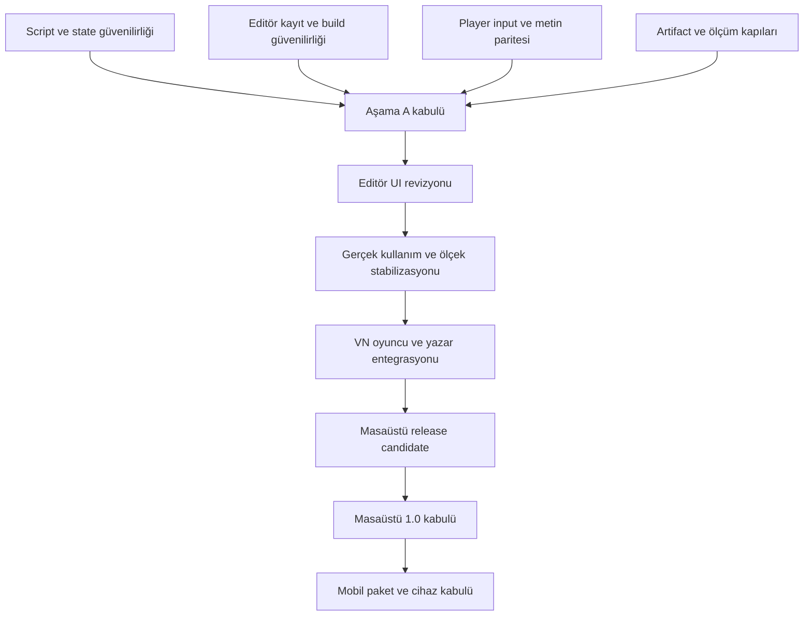

# Rowl Engine — gelişim yol haritası raporu

**Tarih:** 4 Ekim 2026

**Durum:** Önerilen uygulama planı; bu rapor yazılırken geliştirme başlatılmadı.

**Başlangıç kaynak sürümü:** `37a5a49119a00f9c52fefdf6962809202ae12968`

**Dayanak:** [4 Ekim incelemesi](REVIEW_2026-10-04.md), inceleme kanıtları ve 30 Eylül master yol haritasındaki kullanıcı sırası.

## 1. Amaç ve yönetici değerlendirmesi

Amaç, Rowl Engine'i güçlü bir teknik temelden güvenilir bir masaüstü visual novel üretim ürününe taşımak; masaüstü kabulünden sonra mobil oyuncu ve editör deneyimini tamamlamak.

Başlangıç incelemesindeki **67/100**, tamamlanma yüzdesi veya kalan işin %33 olduğu anlamına gelmez. Mevcut altyapı geniş; ilerlemenin ana yükü hata sınırları, ürün entegrasyonu ve gerçek hedef doğrulamasıdır. Bu plan puan artışı garantisi yerine ölçülebilir kabul kapıları kullanır.

Korunan sıra:

**Çekirdek/altyapı → editör UI revizyonu → genel stabilizasyon → VN ürün entegrasyonu → masaüstü 1.0 kabulü → mobil.**

30 Eylül planındaki “çekirdek tamamlandı” kaydı, o tarihteki CI sonucunu anlatır. 4 Ekim'de yeniden üretilen Lua, discard ve save-handoff kusurları nedeniyle **Aşama 1 kabulü yeniden açılmalıdır**. Bu, önceki düzeltmeleri geri almak veya onları yapılmamış saymak değildir.

## 2. Başlangıç durumu ve sınırlar

| Temel | Planın başlangıç kabulü |
| --- | --- |
| Graph/runtime, C ABI, VFS, save/load, restore | Mevcut temeli koru; hedefli güvenilirlik açıklarını kapat |
| Culling, minimap, arama, groups/subgraphs/chapters | Yeniden kurma; ergonomi, ölçek ve runtime bağlantısını doğrula |
| CPU shaping/rich text, OGG streaming, karakter katmanları | Yeniden kurma; gerçek oyuncu paritesi ve ürün yüzeyini tamamla |
| Localization desk, medya dönüşümü, staged build | Mevcut servisleri kullanıcı akışına güvenilir biçimde bağla |
| Native title/backlog/profile/global auto/skip | Kullanıcıya sunulan export akışı olarak tamamlanmalı |
| GUI/GPU/audio/cihaz kabulü | Headless testlerden ayrı kanıt olarak üretilmeli |
| Belgeler | Mevcut durum, hedef ve tarihsel kayıt ayrılmalı |

Önceki incelemede 70 native/tool CTest ve 510 editor testi geçti; bu değerler **başlangıç sürümünün kanıtıdır**. Yeni geliştirme commit'lerinin kabulü için ilgili kapılar yeniden çalıştırılır. Bu yol haritası turunda yeni genel derleme/test veya canlı CI kontrolü yapılmadı.

## 3. Aşamalar ve kilometre taşları

| Aşama | Somut çıktı | Geçiş koşulu |
| --- | --- | --- |
| **A — Çekirdek ve altyapı** | Kullanıcı kararını koruyan kayıt/build; sonlandırılabilir script; doğru input/metin; ölçülebilir bütçeler | A'nın release açısından kritik işleri ve karşı örnekleri kapanır; aynı commit'in ilgili CI kapıları geçer |
| **B — Editör UI revizyonu** | Tutarlı çalışma alanı, görünür kurtarma, akıcı import, anlaşılır hata/ilerleme | Gerçek GUI'de temel yazar yolculuğu ve mevcut davranışların korunması doğrulanır |
| **C — Genel stabilizasyon** | Gerçek medya, uzun oturum ve hedef platform kabul kanıtları | Yeni UI entegrasyonu, ölçek, migration ve hata senaryolarında kritik açık kalmaz |
| **D — VN ürün entegrasyonu** | Export edilmiş oyuncuda title/continue/backlog/profile/auto/skip; tamamlanmış author/runtime yüzeyleri | Editör açmadan paket üzerinden temel VN yolculuğu tamamlanır |
| **Masaüstü 1.0 kapısı** | Dondurulmuş kapsam, izlenebilir paket, destek matrisi ve geri dönüş yöntemi | İlan edilen her platform için aynı release artifact'ı ile paket/GUI/input/audio/save kabulü |
| **E — Mobil** | Android/iOS gerçek paket, oyuncu ve editör touch deneyimi | Platform başına signed package ve fiziksel cihaz kabulü |

İlk kabulü kullanıcıya açılan kontrollü beta ile masaüstü 1.0 kabulü ayırır. B ve C sırasında iç test sürümleri üretilebilir; bunlar title/profile/parity gerektiren dış beta kabulünün tamamlandığı anlamına gelmez.

## 4. Aşama A — çekirdek ve altyapı sağlamlaştırma

**Hedef:** Uygulama kullanıcı verisini ve kararını korusun; yürütme, input, render ve yayın tanıları gerçek davranışı temsil etsin.

| ID | İş paketi ve yaklaşım | Bağımlılık | Bitiş kriteri | İnceleme bağı |
| --- | --- | --- | --- | --- |
| A01 | Güncel capability/kanıt kaydı: implemented, partial, planned, external-proof ayrımı; commit ve artifact bağlantıları | Başlangıç | Baseline, implementation status ve player parity'deki çelişkiler çözülür; açık işler bu ID'lerle takip edilir | T5 |
| A02 | Save/discard/cancel kapanış kararı; pending debounce/recovery/background write iptali ve kapanış koordinasyonu | Başlangıç | Gerçek VM'de discard sonrası disk baytları değişmez; cancel pencereyi açık tutar; save hatası kapanışa izin vermez; in-flight save senaryosu da kapsanır | K2 |
| A03 | Typed save sonucu; SaveAs ve build'de başarısız kayıtta hedef işlem durur | A02 ile aynı persistence sözleşmesi | Başarısız callback ve gerçek IO hata enjeksiyonunda başarı bildirilmez, eski proje/çıktı korunur | K3 |
| A04 | SourceAssets ve gerekli proje dosyalarını kapsayan staged SaveAs; hedef değişimi ancak tam başarı sonrası | A03 | Kopyada raw kaynaklar ve provenance bulunur, yeniden dönüşüm çalışır; iptal/yarım kopya açık projeyi değiştirmez | E2 |
| A05 | Tek immutable build snapshot; tam linter/structure kontrolleri; UI-thread issue/progress dispatch | A03, A04 | Analiz'deki blocking hatalar build'i durdurur; build sırasında edit tutarlı eski/yeni tek snapshot kullanır; thread dışından UI koleksiyonu güncellenmez | E1, E6 |
| A06 | Lua yürütme mimarisi kararı ve uygulaması: host tarafından kontrol edilen yürütme veya process isolation; mutasyon/abort sözleşmesi | Başlangıç; condition ve script lifecycle ile ortak tasarım | Sonsuz catch, ağır script ve ilgili native-call senaryoları tanımlı bütçede gerçekten sonlanır; engine geçerli sonraki işi yapar; log hacmi sınırlıdır | K1 |
| A07 | Koşul değerlendirme saflığı: global/stdlib/module/variable değişimlerinin engellenmesi; eski yan etkili koşullara tanı | A06 yürütme sözleşmesi | Tekrarlanan koşul aynı state'te aynı sonucu verir; x ve math.abs karşı örnekleri state değiştirmez; hata sonraki koşulu bozmaz | R3 |
| A08 | State/history ile serialize/read/write bütçelerini birlikte tasarlama; tekrar eden geçmişi normalize etme | Save formatı ve rewind sözleşmesi tasarımı | 500×2000 karakter karşı örneği root state kayıpsız save/load yapar; eski kayıtlar yüklenir; sınır aşımı açık tanıdır | R1 |
| A09 | Uzun oturum rewind RAM bütçesi; köke dönüş korunarak gerekirse disk destekli checkpoint/spill | A08 ortak veri modeli | Uzun metin/değişken soak'ında tanımlı toplam RAM bütçesi; köke rewind; restore yan etkilerinin tekrarlanmaması; backing-store IO hatası testi | R2 |
| A10 | Native choice focus/confirm ve choice ekranında advance/misclick sözleşmesi | Mevcut runtime routing korunur | Klavye ile tüm etkin seçenekler seçilir; kutu dışı click kararı değiştirmez; disabled/condition-denied seçenek doğrulaması geçer; typewriter/pause davranışı korunur | O4 |
| A11 | Görünür player'da kaliteli font fallback; CPU/GPU shaped glyph, ofset, stil ve reveal paritesi | Mevcut shaping otoritesi; A10 ile bağımsız | Shaderless gerçek player'da okunabilir Unicode; ligatür/RTL/combining/markup/reveal golden örnekleri; debug text kullanıcı metninin normal fallback'i olmaz | O5, O6 |
| A12 | Checked return/last-result politikasını birleştirme; kontrollü generation sınır düzeltmesi | A06–A09 hata sözleşmeleri | Başarısız→başarılı fade tanısı tutarlı; ABI/owner-thread/destroy/caller-buffer kapıları korunur. Generation alt işi release riskiyle ayrı önceliklenir | R4, R7 |
| A13 | Release artifact gerçekliği ve dependency provenance; raw range stream iyileştirmesi ayrı alt dilim | Başlangıç; raw stream ölçümü A09 bütçeleriyle ilişkili | Boş binary, library isimli klasör, yanlış mimari ve bozuk paket reddedilir; temiz package smoke geçer; raw stream peak ölçümü ile bounded yaklaşım doğrulanır | T1, T6, R6 |
| A14 | Referans fixture/makine ölçümü ve editor regresyon politikası; perf/sanitizer kapsamı görünür | A01; sabit fixture | CPU/build/machine/fixture kimliği tam raporlar; uyumsuz/atlanmış koşu başarılmış kıyas sayılmaz; deliberate yavaşlama seçilen kapıyı düşürür | T2, T4 |

**A06 kararı:** Host timeout'u, poison flag veya normal Lua error'unu tekrar fırlatmak tek başına bitiş kriterini karşılamaz. Coroutine çözümünde yield edemeyen C çağrıları ve yakalanan hatalar sınanır. Güvence sağlanamazsa process isolation değerlendirilir. Thread'i zorla öldürme yaklaşımı kullanılmaz. Değişken/module state'inin başarısız çağrıdan sonra commit edilip edilmeyeceği ADR ile kaydedilir.

**A08–A09 kararı:** Yalnız 4 MiB limitini büyütmek veya `shrink_to_fit` çağırmak çözüm sayılmaz. Delta/persistent yapı büyümeyi azaltabilir; sınırsız geçmişi tek başına sabit RAM'e dönüştürmez. Köke rewind sözleşmesi korunur; gerekirse disk bütçesi, temizlik ve hata politikası birlikte tasarlanır.

**A kabulü:** K1–K3 karşı örnekleri gerçek üretim yolundan geçer; A10/A11 input ve render karşı örnekleri kapanır; save/build/paket tam sonuç taşır; veri bütçeleri yazılıdır; ilgili ABI/native/managed/package kapıları aynı kaynak commit'inde yeşildir. Release açısından kritik açıklar UI yeniden tasarımıyla ertelenmez. Düşük olasılıklı generation rollover ve ek stream optimizasyonu gibi alt işler ancak sahibi/kabul sınırı kaydedilerek sonraki dilime taşınabilir.

## 5. Aşama B — editör UI ve kullanıcı deneyimi revizyonu

**Hedef:** Mevcut güçlü araçları anlaşılır, akıcı ve tutarlı bir yazarlık deneyimine dönüştürmek.

| ID | İş paketi | Bağımlılık | Bitiş kriteri |
| --- | --- | --- | --- |
| B01 | Gerçek kullanıcı akışları, bilgi mimarisi, tema tokenları, panel rolleri ve odak/kısayol tasarımı | A kabulü | Create/open/edit/preview/export akışının ekran ve komut haritası; dar pencere ve klavye kullanımında erişilebilir tasarım |
| B02 | Canvas/kablo/selection/minimap/search ergonomisi; mevcut culling ve index'i koruma | B01 | Drag/zoom/connection/çoklu seçim/undo gerçek GUI'de çalışır; yeni stil mevcut doğruluk ve performans kapılarını bozmaz |
| B03 | Inspector, Assets, Localization ve diagnostic panellerinin tutarlı komut/hata dili | B01, A05 | Hata ilgili node/asset'e götürür; missing/changed çeviri ve dönüştürme durumu görünür; edit/save/undo davranışı korunur |
| B04 | Recovery restore/inspect/dismiss kullanıcı yüzeyi; async import progress/cancel ve collision kararı | A02–A05, B01 | Recovery GUI'den tamamlanır; import sırasında UI yanıt verir; aynı isimli asset kullanıcının açık kararı olmadan değişmez |
| B05 | Project Hub, recent/open/save-as/build durumları; işlem sırasında tutarlı boş/başarılı/hatalı durumlar | A03–A05, B01 | Kullanıcı çıktı/proje konumunu ve işlem sonucunu anlar; başarısız işlem başarı görünümü bırakmaz |
| B06 | Klavye odağı, metin ölçeği, kontrast, reduced-motion ve locale ile UI erişilebilirliği | B02–B05 | Temel yazar yolculuğu yalnız klavyeyle tamamlanır; hedef ölçeklerde clipping/odak kaybı görülmez; tercih kalıcılığı doğrulanır |

Mevcut UI'yi tek seferde değiştirmek yerine çalışma alanı → canvas → inspector/assets → hub şeklinde davranış korunarak dilimlenir. Yeni timeline motoru veya yeni genel shader sistemi bu revizyonun kendiliğinden kapsamı olmaz; somut kullanıcı ihtiyacı ve ayrı ürün paketi gerekir.

**B kabulü:** Gerçek pencerede create → edit → import → preview → save → SaveAs → export; ayrıca discard, recovery ve cancellation akışları doğrulanır. Screenshot/görsel kontrol, headless binding doğrulamasına ek kanıttır. Son tasarımın kullanıcı deneyimi kabulü açıkça kaydedilir.

## 6. Aşama C — genel bugfix, ölçek ve platform stabilizasyonu

**Hedef:** Yenilenen UI'nin motorla bağlantısını ve uzun gerçek üretim oturumlarını doğrulamak.

| ID | İş paketi | Bağımlılık | Bitiş kriteri |
| --- | --- | --- | --- |
| C01 | Golden Project ile gerçek decodable görsel/ses, translation ve script kullanan GUI→paket yolculuğu | B kabulü | Dört baytlık media stub yerine gerçek asset'ler; preview ve export aynı içerik; save/load/rewind/locale sonuçları doğrulanır |
| C02 | Linux/Windows gerçek input, display, audio ve Unicode path/save kabul matrisi | A10/A11, C01 | Pointer/keyboard/resize/focus, locale, ses çıkışı ve save yolları hedefte geçer; oturum/render host modu kaydedilir |
| C03 | 2.000 node/6.000 edge fixture ve uzun hikâye soak; baseline ile UI/native ölçümleri | A08/A09/A14, B02 | Aynı ortam kimliğiyle parse/save/search/drag/memory/frame ölçümü; belirlenen bütçeler ve uzun oturum save/rewind geçer |
| C04 | Disk dolu/izin, bozuk dosya, iptal, converter başarısızlığı, crash recovery ve migration matrisi | A02–A09, B04 | İyi proje/save/çıktı korunur; işlem sonucu kullanıcıya ulaşır; eski dosyalar sessiz sıfırlanmaz |
| C05 | Release-candidate CI kapsamı, tam sanitizer ilgili binary'leri ve gerçek davranış testleri | C01–C04 | Release kaynak commit'i için native/managed/package kapıları; uygun ASan/UBSan/TSan kapsamı; atlanan işler açık rapor; tersine test kusuru geri getirince kapı düşer |

Linux kabulü X11/XWayland/Wayland ve offscreen/embedded/standalone yüzeylerini ayırır. Mevcut embedded Wayland reddi, tüm Linux host modlarının destekli olduğu iddiasıyla örtülmez. Her hedefin çalıştırılan yolu destek matrisine yazılır.

Tek referans makinede gözlenen 3,74 ms steady kare veya 61,76 FPS transition, diğer hedeflerin kabul eşiği olmaz. FPS/latency/RAM bütçeleri gerçek fixture ve hedef donanım serisiyle belirlenir. Önce en az tekrar ölçümü ve varyans değerlendirmesi; sonra engelleyici eşik politikası.

**C kabulü:** Yeni UI kaynaklı kritik regresyon kalmaz; veri güvenliği fault matrisi, gerçek medya yolculuğu, ölçek ve hedef input/metin kanıtları tamamdır. Cihaz bulunmayan hedef “external proof pending” kalır; bu alan test edilmiş gibi kapatılmaz.

## 7. Aşama D — VN ürün özelliklerini uçtan uca bağlama

**Hedef:** Kullanıcı editörü açmadan export edilmiş pakette tam temel visual novel deneyimini yaşasın; yazar bu özellikleri editörden yönetebilsin.

| ID | İş paketi | Bağımlılık | Bitiş kriteri |
| --- | --- | --- | --- |
| D01 | Proje/oyun kimliği, kararlı content ID ve story save'den ayrı native profile/read/unlock store | C kabulü; A08 format sınırı | İki oyun birbirinin tercih/save/read verisini paylaşmaz; yeniden açma kalıcılığı; future-version profile sessiz sıfırlanmaz; migration/failure tanılıdır |
| D02 | Native branded title/new/continue/load/preferences/exit; zengin slot metadata | D01 | Paket açılışı title'a gelir; en yeni geçerli save continue; boş/bozuk save doğru davranır; slot tarih/özet/thumbnail sunumu |
| D03 | Native backlog ve güvenli voice/scene replay sınırı | D01, D02; A09 history | Geçmiş erişilebilir; replay ana hikâye değişkenlerini/slotunu değiştirmez ve node-entry yan etkilerini tekrar uygulamaz |
| D04 | Global auto/read-aware skip, next-choice stop ve driver state machine | D01, A10; D02 kabuk | Okunmamış metin/choice/pause/reveal sözleşmeleri; save/load/rewind/locale sırasında tutarlı read ve driver state |
| D05 | Player shell localization, locale-aware font fallback ve kalıcı erişilebilirlik tercihleri | A11, D01/D02 | Menü ve hikâye seçilen dili kullanır; bölgesel locale politikası korunur; Latin/TR/RTL/combining ve seçilmiş CJK fixture'ları paket içinde okunabilir |
| D06 | Mevcut karakter/layer/expression, audio ve chapter/prefetch yeteneklerinin author/runtime bağlantısı | C kabulü; D01 kimlikler | Editörde ayarlanan özellik export'ta aynı çalışır; kullanılmayan API'ler capability matrisiyle ayrılır; chapter geçişi save/load/rewind ve streaming'i bozmaz |
| D07 | CG gallery/music room/achievement ve unlock authoring; replay izolasyonu | D01, D03, D06 | Unlock yeniden açmada korunur; replay main progress'i değiştirmez; paketli gerçek içerik ve author yüzeyi çalışır. 1.0/1.x kapsam kararı ayrıca kaydedilir |

D01–D05, dış beta ve temel masaüstü 1.0 oyuncu kabulünün çekirdeğidir. D06 mevcut geniş yetenekleri yeni baştan kurma işi değildir. D07 master planın VN genişletme aşamasında kalır; mevcut product baseline bunu 1.x olarak ayırdığı için sürüm kapsamı çelişkisi dondurma öncesi çözülmelidir.

**D kabulü:** Paket başlat → yeni oyun → ikinci seçeneği klavyeyle seç → kaydet → çık → tekrar başlat → devam → backlog → tercih değiştir → auto/skip → rewind yolculuğu editör veya CLI yardımı olmadan tamamlanır. Kararlı content ID/read state migration ve iki ayrı oyun izolasyonu doğrulanır.

## 8. Masaüstü 1.0 release kabulü

Masaüstü hedef vizyonu Linux, Windows, macOS ve Steam Deck olarak korunur. İlk teknik kabul Linux/Windows üzerinde biriktirilir; diğer hedeflerin platform ve cihaz kapıları bağımsızdır. Compile-only macOS/ARM64 sonucu veya Linux başarısı Steam Deck kabulü sayılmaz. 1.0 paketlerinin ilan edilen destek listesi, gerçek tamamlanan kanıta bağlıdır; tüm masaüstü hedeflerinin aynı gün çıkış zorunluluğu kapsam kararında açıklaştırılır.

| Kapı | Gerekli teslim kanıtı |
| --- | --- |
| Kapsam ve bilinen sorunlar | 1.0/1.x ayrımı; kritik bilinen sorun kalmaması; açık sınırlamaların owner/etki/kararı |
| Kaynak ve ABI | Kaynak commit'i, ABI farkı, migration sözleşmesi; task-scoped diff ve ilgili test çıktıları |
| Tek artifact kimliği | Paket/player/runtime sürümleri ve hash'leri; CI ve cihaz testlerinin aynı artifact'a işaret etmesi |
| Temiz hedef kullanımı | Editor ve player launch, Golden Project, gerçek GUI/input/audio, Unicode save, locale, restart/continue/rewind |
| Kurulum/güncelleme/geri dönüş | Platform paket yöntemi; kullanıcı verisinin korunması; uninstall ve update rollback; temiz hedef üzerinde kanıt |
| Gerçek kullanıcı denemesi | Kod geliştirmesine katılmayan tester/yazarın örnek oyunu üretip çalıştırması; engeller ve kabul kaydı |
| Dağıtım ve lisans | Dependency/license envanteri; reproducibility kapsamı; hedef gerektiriyorsa signing/notarization; güven modeli |
| Dokümanlar | Kullanıcı kılavuzu, migration/recovery, destek matrisi, changelog ve bilinen sınırlar |

**Karar kuralı:** CI green, aynı commit'in bazı kapılarının geçtiğini gösterir. Release kabulü, aynı artifact'ın hedef cihazda temel yolculuğu ve veri korumasını geçmesini de gerektirir. Şifreli/imzalı dağıtım iddiası varsa ayrı anahtar/yayın güveni tasarımı gerekir; mevcut hash kontrolleri bu iddiaya yükseltilmez.

## 9. Aşama E — masaüstü kabulünden sonra mobil

| ID | İş paketi | Bağımlılık | Bitiş kriteri |
| --- | --- | --- | --- |
| E01 | Mobil PlatformHost/lifecycle/audio-focus/save/render/input sözleşmeleri; sürümlü runtime köprüsü | Masaüstü 1.0 kabulü | Resume/suspend/orientation ve interrupted IO tasarımı; masaüstü ABI/behavior regresyonu yok |
| E02 | Android gerçek APK/AAB üretimi, signing ve native dependency dağıtımı | E01; SDK/NDK/signing kaynağı | Fiziksel cihazda install/launch/story/save/restart/touch/audio kabulü; native artifact başarısı APK başarısı sayılmaz |
| E03 | iOS app/IPA üretimi, Xcode/signing ve cihaz kabulü | E01; Apple host ve identity | İmzalı development build fiziksel cihazda temel yolculuğu geçer; static lib üretimi app kabulü sayılmaz |
| E04 | Mobil oyuncu ve editör UX: safe area, touch target, pinch/drag/drawer, ekran klavyesi | E02/E03 ilk cihaz kabuğu | Desteklenen telefon/tablet boyutlarında author/player yolculuğu; iki parmak gesture ve IME metin odağı; masaüstü davranışı korunur |
| E05 | Mobil performans/enerji/bellek, yaşam döngüsü stres ve yayın hazırlığı | E02–E04 | Düşük/orta hedef cihazda bütçeler; pause/resume/rotation/background tekrarlarında veri korunması; mağaza paketi ve release kanıtı |

Mobil editör ile mobil oyuncu ayrı ürün yüzeyleri olarak planlanır. Paket, cihaz veya signing kaynağı eksikse bağımsız tasarım ilerleyebilir; ilgili yayın işi tamamlandı sayılmaz. Masaüstü yürütme/save/parity açıklarını mobil katmana taşımak kabul edilmez.

## 10. İlk uygulama dalgası

İlk çalışma dalgası yeni büyük özellik açmadan üç bağımsız güvenilirlik hattına ayrılır:

| Hat | Sıra | İlk teslim |
| --- | --- | --- |
| Editör persistence | A02 → A03 → A04 → A05 | Discard ve başarısız save karşı örneklerinin gerçek üretim yolunda kapanması |
| Script/runtime | A06 → A07; A08/A09 tasarımına ölçüm | Sonsuz catch'in gerçek sonlandırılması ve sonraki geçerli çağrı; condition saflığı |
| Player/render ve artifact | A13 verifier düzeltmesi; A10 → A11 | Geçersiz binary reddi; klavye choice ve görünür/shaderless metin karşı örnekleri |

A01 ve A14 kanıt/ölçüm kaydı ana koordinatör tarafından sürdürülür. İlk bütünleşme noktası A02/A03/A06/A13 çıktılarından sonra yapılır. Sonraki dalga, bu kabul sonuçlarına göre A08/A09/A10/A11 ağırlığıyla açılır.

Küçük düzeltmeler ile mimari işleri aynı tahmin ölçeğine sokma: A02/A03/A13 çoğunlukla sınırlı değişiklikler; A06 ve A08/A09 tasarım, migration ve maliyet belirsizliği taşır. İlk dalga gerçek teslim hızını göstermeden kesin haftalık bitiş tarihi üretmek güvenilir değildir.

## 11. Paralel çalışma ve teslim kuralları

- Bir ana ajan bağımlılıkları, kaynak sahipliğini ve bağımsız kabulü izler; uygun üç uygulama hattı paralel yürür.
- Aynı dosya/veri modeli üzerinde iki yazıcı çalışmaz. Örneğin A08/A09 ortak state tasarımına tek sahip atanır; diğer ajan test/ölçüm veya API tüketici sınırında çalışır.
- C ABI/PInvoke imzaları korunur; gereken eklemeler additive ve sürümlü yapılır. Büyük refactor davranış kabulü olmadan feature teslimi sayılmaz.
- Her iş önce güncel karşı örneğini ve mevcut testi kontrol eder; sonra küçük değişiklik ve anlamlı regresyon kanıtıyla teslim edilir.
- Native CTest, managed test, package/verifier ve cihaz kapıları kapsamlarına göre ayrı raporlanır. Headless/dummy-driver kanıtı GPU/ses/cihaz kanıtı değildir.
- Her tamamlanan dilim ilgili commit/test/artifact ve gerekiyorsa remote sonucu ile kayıtlanır. Proje ve Obsidian kayıtları task-scoped tutulur; ilgisiz değişiklikler teslim commit'ine alınmaz.
- Ajan raporu tek başına kabul değildir; ana ajan diff, commit ve gerekli test/karşı örnek sonuçlarını bağımsız kontrol eder.

İş durumları: **planlandı → çalışılıyor → doğrulamada → tamamlandı**; ayrıca **dış kanıt bekliyor** ve **kapsam kararı bekliyor**. Bu raporun yazılması hiçbir uygulama işini tamamlandı yapmaz.

## 12. Başarı göstergeleri ve kapsam kararları

| Gösterge | Ölçüm |
| --- | --- |
| Veri/karar güvenilirliği | Discard, failed save, migration, recovery, iki oyun izolasyonu ve fault matrisinin gerçek disk sonuçları |
| Çalıştırma güvenilirliği | Script sonlandırma süresi, sonraki işin çalışması, log sınırı, crash/hang sayıları |
| Ürün paritesi | Editor PlayerWindow/native RowlGame matrisi; her satırın gerçek kullanıcı yolculuğu |
| Performans | Kimliği tam fixture serileri; graph latency, frame, process memory, history ve IO bütçeleri |
| Test kalitesi | Kusur tekrar eklenince kırmızı olan davranış kapıları; geçerli medya ve gerçek hedef kabulü |
| Yayın kanıtı | Aynı release artifact'ı üzerinde hedef/oturum/cihaz/tarih/tester kaydı |

Dondurma öncesi kaydedilecek kapsam kararları:

1. **1.0 hedef platform listesi:** master vizyondaki macOS/Steam Deck ile baseline'daki Linux/Windows temel kapısının aynı gün çıkış mı, ayrı platform kabulü mü olduğu.
2. **Gallery/music room/achievement sürümü:** master VN aşaması ile baseline 1.x ayrımı. Teknik çalışmanın D07 sırası korunur; sürüm kapsamı açıklaştırılır.
3. **Save durability düzeyi:** process-crash atomicity yeterli kabul edilirse sınırlama açık yazılır; güç/OS kaybı garantisi hedeflenirse POSIX file+directory sync/Windows flush ve maliyet kabul işi eklenir.
4. **Rewind saklama politikası:** köke dönüş ve toplam RAM/disk bütçesi; backing-store sınırı ve disk hata davranışı.
5. **Paket güven modeli:** kazara bozulma kontrolleri ile imzalı yayın/authenticity hedefinin ayrımı.

Bu kararlar rapor içinde öneri/tasarım sınırı olarak görünür; kullanıcı adına onaylanmış yeni kapsam sayılmaz. A02/A03/A06/A13 gibi açık kusurların giderilmesi bu sürüm pazarlığına bağlı değildir.

## 13. Sonuç

En yüksek getirili ilk yatırım **kaydetme kararları, script sonlandırma ve gerçek player paritesidir**. Ardından UI modernleştirmesi mevcut yetenekleri erişilebilir hale getirir; stabilizasyon gerçek kullanım kanıtını üretir; VN entegrasyonu temel oyuncu döngüsünü tamamlar. Masaüstü 1.0, görev listesi veya puan hedefiyle değil, ilan edilen kapsamın aynı release paketi üzerinde kabul edilmesiyle kapanır. Mobil çalışma bu temelin üzerine kurulur.

## Kaynaklar

- `docs/REVIEW_2026-10-04.md` ve `docs/review-evidence/2026-10-04/`: bu planın güncel bulgu/karşı örnek dayanağı.
- `/home/chaple/second-brain/300-Projects/Rowl-Engine-Master-Yol-Haritasi-2026-09-30.md`: kullanıcının aşama sırası ve masaüstü/mobil vizyonu.
- `docs/PLAYER_RELEASE_PARITY.md`: native export ile editor-hosted oyuncu ayrımı.
- `docs/PLATFORM_SUPPORT.md`: compile/package/device kapsamı ve host sınırları.
- `docs/PRODUCTIZATION_BASELINE.md`: release acceptance tanımları; güncel özellik envanteri için incelemede saptanan eski satırlar düzeltilmeden uygulanmamalı.
