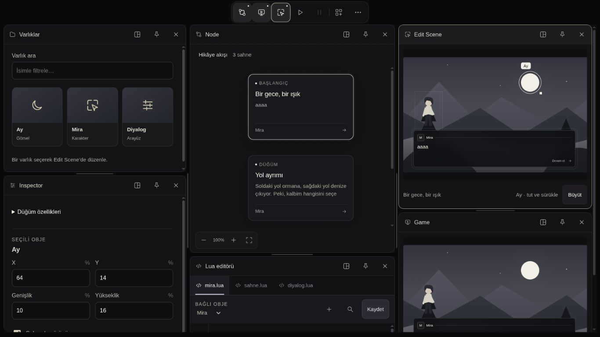

# Web prototipi — yoğun dizüstü düzeni ve pencereye git

6 Ekim 2026. Başlangıç kaynak SHA: `9c657d4`.
Dayanak: [82/100 puanlama raporu](UI_PROTOTYPE_SCORECARD_2026-10-06.md).

## Sonuç

Raporun ilk önceliği olan yoğun dizüstü düzeni geliştirildi. Aynı altı
panelli dört sütun ağacında, 1366×768 görünümünün kaydırma içeriği **3856 →
848 px** oldu. Paneller kapanmadan üç sütunda gösteriliyor: Varlıklar/Inspector,
Node/Lua, Edit Scene/Game. Node artık iki kartı birlikte gösterebiliyor.
Bu sonuç örneklenen ağaca aittir; bütün düzenlerin aynı yükseklikte olacağı
iddiası değildir.

## Uygulanan tasarım

- Kayıtlı ağaç sığıyorsa mevcut dock düzeni korunur. Sığmıyorsa ve çalışma
  alanı en az 1040 px ise komşu sütunlar görünüm için birleştirilir; önce
  iki sahne sütunu, ardından iki araç sütunu tercih edilir. Yaprak sırası,
  panel kimliği ve açık pencere sayısı korunur. Çok araçta ek kaydırma olabilir.
- Dar ekranda tam genişlikte dikey sunum devam eder. Genişlik değişimi
  özgün ağacı/oranları değiştirmez. Ara görünümün ayırıcı ölçüleri ayrı,
  oturumluk tutulur; geniş dönüşte özgün düzen, sıfırlamada varsayılanlar gelir.
- Ara görünümde hem genişlik hem yükseklik minimumları korunur. Node 520,
  Lua 320, Inspector 360, kütüphane 320, sahneler 280, diğer araçlar 240 px
  minimum yükseklik. Bu minimumlar yalnız birleştirilmiş sunuma aittir.
- Yeni Node/Lua bölmesinde Node payı %42 yerine %60 oldu. Bu, mevcut
  kullanıcının elle belirlediği ağaç oranını geriye dönük değiştirmez.
- Mevcut seçenekler menüsüne **Açık pencereye git** listesi eklendi. Panel
  kapanmadan görünür alana gelir; başlığındaki düzen kontrolü klavye odağını
  alır. Kapsülün ikinci tıklamada kapatma davranışı korunur; ikinci toolbar yok.
  Menü yüksekliği ekrana sınırlıdır ve çok öğede kendi içinde kayar.
- Büyük sahne önizlemesine «Açıldığı andaki sahne · canlı oynatım değil»
  açıklaması eklendi. 16 px ayrı okuma alanı korundu.

## Doğrulama

**34/34 Node testi geçti.** Üç yeni regresyon testi rapordaki dizüstü ağacını,
geçici yeniden boyutlandırma ve geniş dönüşü, on açık panelin örneklenen
1040–1900 px aralığında kimlik/minimum ölçülerini doğrular. Kaynak JS/MJS
sözdizimi ve diff kontrolü de yapıldı.

Canlı tarayıcı sonuçları:

| Kontrol | Kanıt |
| --- | --- |
| 1366×768, aynı altı panel | Ara görünüm, toplam 848 px. Node/Lua 520/320, Edit Scene/Game 420/420 px. Sütun genişlikleri yaklaşık 416/468/441 px. |
| Ayırıcı klavye → / ← | Ara görünümde genişlik değişti; kontrole odak geri geldi, minimum genişlikler korundu. |
| 1440×900 dönüş | Özgün dört sütun dock geri geldi. Node/Lua 495/330 px; yaprak kimlikleri korundu. |
| Mobil 390×844, Game'e git | Altı panel açık kaldı; Game 322 px ve tamamen görünür oldu, başlıktaki düzen düğmesi odaklandı. Sayfa genişliği 390 px. |
| 1366 px, on panel | 10 ayrı kimlik, DOM alan çakışması yok, toplam içerik 1680 px, sayfa genişliği 1366 px. |
| 320×740, on panel, Node'a git | On panel açık kaldı; Node başlığı odaklandı, yatay sayfa taşması yok. |
| Büyük mobil önizleme | Anlık görüntü açıklaması DOM'da ve ekranda mevcut. |
| Konsol | Bu tur örneklenen işlemlerden sonra hata/uyarı kaydı boş. |

Ekranlar gerçek tarayıcı yakalamalarıdır. Kaynak testleri fiziksel dokunma,
FPS veya native/Avalonia kabulü sağlamaz. İşaretçi iptalinde özgün ağaç ve
geçici oranları geri yükleyen yol güncellendi; bu tur ayırıcı kabulü klavye
üzerinden yapıldı, fiziksel dokunma/iptal senaryosu uygulanmadı.

Önceki kullanıcı sekmesi yenilenmedi. Kontroller ayrı yerel sekmede yapıldı;
proje/diyalog içeriği kaydedilmedi veya değiştirilmedi. Geçici viewport ölçüsü
inceleme sonunda sıfırlandı.

## Kalan tasarım işleri

Sahne içi küçük yazı için düzenleme sırasında yakınlaştırma/okuma ilişkisi;
çok uzun diyalog/başlık, çok proje ve çok bileşen durumları; yükleniyor/hata
kompozisyonları hâlâ sonraki tasarım çalışmasıdır. Otomatik sütun birleştirme
çok karmaşık ağaçlarda farklı sonuçlar verir; kullanıcı tarafından düzenlenen
birkaç gerçek çalışma ağacıyla yeniden görsel kabul yapılmalı.

Bu tur yeniden puanlama yapılmadı; eski 82/100 raporu kendi kaynak sürümüne
aittir. Native motor/Avalonia değişmedi. **UI aktarımı kullanıcının açık
onayına kadar başlamaz.**
