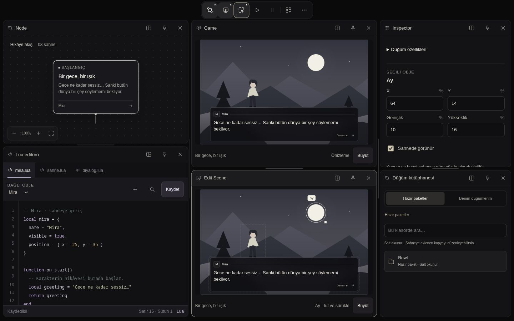
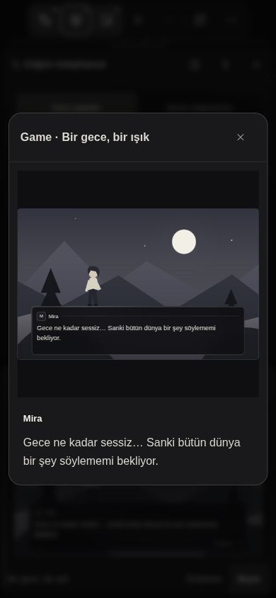

# UI prototipi — görsel inceleme sonrası iyileştirmeler

6 Ekim 2026. Başlangıç kaynak sürümü: `354a58a`.
Dayanak: [görsel inceleme](UI_PROTOTYPE_VISUAL_REVIEW_2026-10-06.md).

## Sonuç

Rapordaki üç P1 ve üç P2 bulgu için web prototipi geliştirildi. Sade üst
kapsül, siyah/kemik palet, sınırsız açık panel, görünür ×, taşıma kilidi olarak
pin, Inspector'da şablon kaydı ve Varlıklar/Store ayrımı korunuyor.
Native motor ve Avalonia arayüzü değiştirilmedi. UI aktarım onayı verilmiş
sayılmıyor; çekirdek yol haritasındaki sıradaki iş A05 olarak kalıyor.

| Bulgu | Uygulanan davranış |
| --- | --- |
| Mobil panel yüksekliği | Dar yerleşim artık masaüstü bölme oranlarını toplam yüksekliğe uygulamıyor. Panellerin ayrı içerik yükseklikleri var. Aynı Game kapat/aç karşı örneğinde 2807 px yerine **322 px** ölçüldü; altı panelin toplam kaydırma içeriği 5624 yerine **2744 px**. |
| Tablet minimum genişlik | 650 px altında veya dock ağacının minimum genişliği sığmadığında tam genişlikte dikey sıra kullanılıyor. 768 px'de eski 95 px sütunlar yerine **yaklaşık 742 px** paneller ölçüldü. Yeterli genişlikte dock ağacı korunarak oranlar okunabilir sınırlarla çiziliyor. |
| Küçük yazı | Editör ana metni 13 px, yardımcı metin 12 px, bölüm etiketleri 11 px oldu. Sahne yazısının ölçek ilişkisi korunuyor. **Büyüt**, sahne görüntüsü yanında diyalogu **16 px** okunabilir metinle gösteriyor. |
| Inspector bağlamı | Düğüm alanları katlanabilir. Sahne/hiyerarşi/varlıktan obje seçimi obje alanlarını üste çıkarıyor; bileşenler aynı bölümde. Node seçimi düğüm alanlarını yeniden açıyor. |
| Mobil ayar gezinmesi | Önceki/sonraki okları ve kenar ipuçları eklendi; oklar taşma olmadığında gizleniyor, uçta devre dışı kalıyor. Bölüm değişimi mevcut taslağı koruyor. |
| İkon ve durum dili | Fare veya klavye odağında kısa kapsül açıklaması; aktif panelde belirgin kenarlık/başlık, pin düğmesinde farklı dolgu. İkinci araç çubuğu yok. |

## Yerleşim sözleşmesi

`responsive-layout.mjs` yalnız görünümü hesaplar; viewport değişimi kayıtlı
dock ağacını veya oranlarını yeniden yazmaz. Minimum genişlikler Node/Lua
360, Game/Edit Scene 340, Inspector/kütüphane/Konsol 320, diğer araçlar
280 px. Yatay bölmelerde bu sınırlar gözetilir. Dock ağacı sığmıyorsa açık
paneller kapatılmadan dikey sunuma geçilir.

Dikey sunumda Node 620, Lua/kütüphane 440, Inspector 560, diğer araçlar
340 px başlangıç yüksekliği kullanır; Game/Edit Scene yüksekliği görünüm
genişliği ve sahne oranına bağlıdır. Tek panel ekranı doldurabilir. Ayırıcı
iki komşunun toplam yüksekliğini korur; ok tuşları 24 px değiştirir.
Minimum yükseklik Node 360, Lua 320, diğerleri 240 px. Elle verilen
yükseklikler oturumda korunur, yerleşimi sıfırlama bunları temizler.

Dar yerleşimde taşıma üst/alt yönlerle yapılır; yan yana yönleri kapalıdır.
Yeni panel açılma geçişinden sonra görünür alana gelir. Pin değişikliği
yeniden kaydırma yapmaz. Pin, yeniden boyutlandırmayı veya kapatmayı
engellemez. Escape/pointer iptalinde boyutlandırma önceki ölçülere döner.

## Hareket ve durum tablosu

| Hareket | Kural | Azaltılmış hareket |
| --- | --- | --- |
| Panel açılışı | 200 ms, `cubic-bezier(.22,1,.36,1)`; bölme/stack yüksekliği, içerikte 6 px hareket ve solma | Anında son yerleşim |
| Panel kapanışı | 180 ms daralma; içerikte 100 ms solma | Anında kaldırma |
| Araç menüsü | 140 ms, 5 px giriş | Animasyon kapalı |
| Taşıma / splitter | İşaretçiyle doğrudan takip; bırakmada son yerleşim | Aynı doğrudan takip |
| Seçim | Mevcut kısa renk/kenarlık geçişi | Geçiş kapalı |
| Oynatma göstergesi | Başlat/durdur ve duraklat/devam ikon durumları | Aynı durumlar |

Sistem tercihi ve prototipteki Hareketi azalt sınıfı desteklenir. Bu tur
prototip tercihinden reduce-motion açıldı; örnek node'un computed transition
süresi **0s** ve tekrarlı kapat/aç sonrası tek Game paneli doğrulandı.
Tercih test sonunda tekrar kapatıldı. Bu, fiziksel cihazda FPS kabulü değildir.

## Doğrulama

- `node --test prototypes/editor-workspace/*.test.mjs`: **31/31** geçti.
  Dört yeni test, eski mobil yeniden açma örneğini, tablet/wide projection,
  uç oranlarda okunabilir genişliği ve komşu yükseklik toplamını doğrular.
  Mevcut kütüphane, seçim durumu, layout ve oynatma testleri korunuyor.
- JS sözdizimi ve `git diff --check` kontrol edildi.
- Canlı tarayıcıda 1440×900, 768×900, 390×844, 320×740 örneklendi.
  On panel birlikte açıldı: **10 ayrı panel, alan çakışması yok**.
- 768 px'de klavye ↓ sonrası Node/Lua **644/416 px**, ↑ sonrası
  **620/440 px**: toplam 1060 px korundu.
- Pinli Game kapandı; yeniden açmada pin=false, panel sayısı=1,
  yükseklik=322 px. Mobilde üç tekrarlı Game kapat/aç işlemi aynı sonucu
  korudu; 320 px görünümde yükseklik 280 px, sayfa genişliği 320 px kaldı.
- Game mobilde yeniden açıldıktan sonra 1440 px'e dönüş dock sunumuna
  döndü: Node/Lua yaklaşık 360, Edit Scene 340, Inspector/kütüphane 320,
  Game 380 px. Oranlar sınırlarla çizilirken panel kimliği/sırası korunuyor.
- Inspector'da Ay seçimi, 16 px okuma penceresi, mobil ayar okunun
  160 px ilerlemesi ve azaltılmış hareket tercihi kontrol edildi.
  Son tarayıcı hata/uyarı kaydı boştu.

İnceleme sırasında statik sunucu bir kez kapanınca yeniden başlatıldı;
bağlantı hatası uygulama regresyonu olarak sayılmadı. Kabul kontrolleri çalışan
sunucuda tekrarlandı. Ekranlar gerçek tarayıcı yakalamalarıdır.

## Sınırlar ve sonraki tasarım çalışması

Bu bir görsel prototip iyileştirmesidir. Gerçek dokunmatik cihaz, Avalonia,
native motor, export/player veya üretim API kabulü yapılmadı. Büyük önizleme
açıldığı andaki görüntüdür; canlı runtime/oynatıcı yerine geçmez. Küçük sahne
içindeki yazı geometriyle ölçeklenir; okunabilir okuma metni ayrı sunulur.

Nihai uzun/boş/yükleniyor/hata/çok içerik tasarımları, gerçek dokunma hissi ve
kullanıcının diğer görsel çalışmaları tamamlandığında tasarım paketi yeniden
değerlendirilir. Üretim arayüzüne aktarım için kullanıcının açık onayı beklenir.
