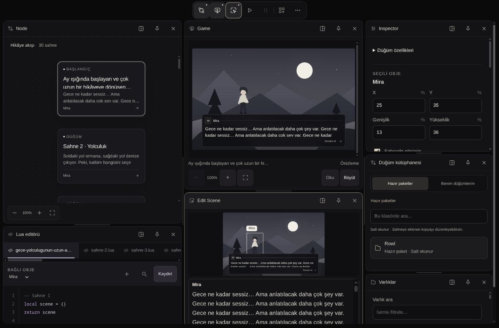

# Prototipi geliştirme ve Avalonia editörüne aktarım araştırması

7 Ekim 2026 · İncelenen kaynak: `fee0f569dfbdb32d13ed37cd6f9d5e2b81e8db41` · Durum: araştırma / öneri, aktarım uygulanmadı.

## Sonuç

Bu prototip, oyun motorunun **editöründe görmek istediğimiz görünümün ve kullanım davranışlarının tasarımıdır**. Kapsül, palet, panel başlıkları, Inspector, sahne kontrolleri, Hub ve animasyon dili Avalonia ile büyük ölçüde yeniden üretilebilir. HTML/CSS/JavaScript dosyalarını AXAML'ye otomatik dönüştürmek güvenilir bir teslim yöntemi değildir. Önerim, tasarımı mevcut C# editörün üzerine Avalonia kontrolleriyle yeniden kurmak; çalışan motor, proje kayıtları, undo ve komutları korumak.

En büyük iş renkleri taşımak değil, **bağımsız ve birlikte açılabilen panellerin yerleşim sistemini değiştirmek**. Mevcut editör sabit hiyerarşi/Inspector ve merkez görünümü + alt sekmeler kullanıyor; prototip ise bölünebilen bir dock ağacı kullanıyor. Edit Scene ve Game'in farklı veri kaynaklarını korumak ikinci kritik sınırdır.

Tasarımın görsel aktarılabilirliği yüksek; bütün pencere davranışlarının aktarımı orta/yüksek efor gerektiriyor. Prototipte temsil edilen yeni ürün özellikleri ayrıca uygulanmalı. Piksel düzeyinde her işletim sisteminde %100 aynılık garanti edilemez; font ölçüleri, DPI ve pencere sistemi farklıdır. Boyutlar/renkler ve davranışlar için ortak kabul ölçütleriyle aynı tasarım karakterini koruyabiliriz.

**Aktarım başlamadı.** Bu araştırma onay yerine geçmez; kullanıcının önceki durma/onay sınırı korunuyor.

## İnceleme kapsamı ve kanıt

- Prototip kaynakları, önceki tasarım/kanıt raporu ve güncel Avalonia kaynakları karşılaştırıldı. Editör `.NET 10`, `Avalonia 11.3.11`, `CommunityToolkit.Mvvm 8.4.0` kullanıyor (`editor/RowlEngine.Editor.csproj`).
- Bu tur canlı tarayıcıda yoğun örnek 1366×900 ve yatay telefon örneği 844×390 incelendi; DOM'dan gerçek yazı/panel ölçüleri alındı. Galeriye geri dönüldü ve geçici ekran boyutu temizlendi. Gerçek kullanıcı kaydı açılmadı.
- Mevcut native editörün GUI'si bu tur çalıştırılmadı. Native bulgular kaynak incelemesidir; aktarım deneyinin veya platform kabulünün sonucu değildir.
- Önceki uygulama raporundaki 41/41 Node testi önceki dilimin kanıtıdır; bu araştırmada tekrar çalıştırılmadı. Kod değişmediği için yeni test eklenmedi.
- Teknik araştırmada resmi Avalonia belgeleri ve Dock projesinin kendi deposu kullanıldı. Güncel belgeler daha yeni Avalonia özellikleri içerebilir; önerilen API/paketler **11.3.11 üzerinde ayrıca doğrulanmalıdır**.

## Daha iyi hale getirmek için somut işler

Önceki 92/100 öznel bir tasarım değerlendirmesidir. Bu tur yeniden puan verilmedi. Gerçek dosya/Hub/motor hizmeti bulunmaması bir görsel prototip kusuru değildir; önceki raporda bu noktayı puan gerekçesine katmak hatalıydı. Aşağıdaki işler yeni gözleme ve tasarım kabulüne dayanır.

| Öncelik | Bulgu / ihtiyaç | Önerilen tasarım | Kabul ölçütü |
| --- | --- | --- | --- |
| P0 | Kütüphane açıklaması gerçekte 10 px. `authoring.css` içindeki `.library-content .library-description`, `review.css` içindeki 12 px kuralını daha yüksek seçici önceliğiyle geçersiz kılıyor. | Yazı boyutlarını ortak tokenlarda toplamak; aynı bileşeni farklı CSS dosyalarında yeniden tanımlamamak. | Açıklama/path/durum metinlerinde hesaplanan boyut hedefle aynı; temel alanlar 13–14, yardımcı metin ≥12, okuyucu 16 px. |
| P0 | 844×390 yatay telefonda Edit Scene paneli 602 px yüksek; sahnenin alt kontrolleri ilk ekranda görünmüyor. Sayfa genişliği 844 px, yatay taşma yok; sorun dikey kullanım maliyeti. | Yüksekliği de dikkate alan sahne modu; görünür kalan panel alt kontrolleri; okuyucuyu gerektiğinde bağımsız çekmece olarak açmak. Paneller kapanmadan odağa alınabilmeli. | 844×390 ve 932×430'da başlık/zoom/Oku erişilebilir; sahne ile kontroller arasında sayfa kaydırmak gerekmiyor. Gerçek telefonda ayrıca kabul. |
| P0 | 1366 px yoğun düzende 16 px/2.000 karakter okuyucu 139 px alan kaplıyor; açılması sahneyi küçültüyor. | Yeterli genişlikte yan okuma alanı, dar/kısa panelde ayrılmış okuma görünümü. Kullanıcı panel oranını ayarlayabilmeli. | Okuyucu açılınca sahne düzenleme alanı belirlenen minimumun altına düşmüyor; yetmiyorsa açık bir odak modu sunuluyor; kamera/obje koordinatları korunuyor. |
| P1 | Yoğun Inspector'da konum alanları ile 10 bileşen aynı kaydırma alanında; önemli içerik aşağıda kalabiliyor. | Seçili obje adı sabit, Konum/Görünüm/Bileşenler grupları açılır; bileşen başlığı kısa bir değer özeti gösterir. | 10 bileşende seçili obje/konum bulunabilir; kapatılan grubun durumu korunur; tüm alanlar klavyeyle erişilebilir. |
| P1 | Uzun başlıklar/sahne metinleri görsel olarak kısaltılıyor. Hover başlık ipucu dokunmada yeterli değil. | Dokunma/klavye ile tam adı gösteren detay; satır sınırı ve kısaltma kuralları ortak. | Uzun proje/düğüm/dosya adı hiçbir akışta yalnız hover ile okunmaz. |
| P1 | Panel pin'i, seçim ve odak farklı anlamlara sahip; ilk kullanıcı bunları öğrenmek zorunda. | Kısa ilk kullanım açıklaması: “Sabitleme taşımayı kilitler”; kapatma, odak ve pin ayrı biçimlerle gösterilir. | Kullanıcı pin'in paneli kapatılamaz yapmadığını anlar; renk tek işaret değildir. |
| P1 | Hata/başarı durumları var; uzun işlemin ilerleme, iptal ve tekrar deneme davranışının tasarım sözleşmesi tamamlanmalı. | Aynı işlem kartında kısa hata, korunmuş taslak bilgisi, yeniden dene/iptal, ayrıntı açma. Gerçek işlev yerine örnek akış yeterli. | Kaybetme riski olan akışlar ve iptal sonrası görünüm tasarım galerisine eklenir; odak geldiği kontrole döner. |
| P2 | Animasyonlar incelendi; düşük donanımda süre ve akıcılık ölçülmedi. | Açılma/kapanma/odak/yerleşim için süre/easing tablosu; hızlı işlem birikmesini iptal eden tek animasyon oturumu. | Hareket azaltma sıfır/sade geçiş; 20 hızlı aç/kapatta hayalet panel/odak kaybı yok; belirlenen referans cihazda kare süreleri ölçülür. |
| P2 | Ayarlar çok sayıda görsel seçeneği temsil ediyor; hangisinin editör, oyun projesi veya oyuncu tercihi olduğu aktarım için netleşmeli. | Her ayarı sahiplik grubuna eşlemek; örnek gösterilen seçenekleri ayrıca işaretlemek. | Editör yerleşimi oyunun paketine girmez; oyuncu erişilebilirliği proje yazarının tasarımını değiştirmez. |

Bu öneriler bu tur uygulanmadı. İlk web dilimi: CSS/token tutarlılığı ve yatay telefonun yükseklik davranışı; ardından okuyucu/Inspector yoğunluğu. Sırf 100 puan almak için görünür arayüze yeni kontrol eklemek yerine kabul ölçütlerini tamamlamak daha değerlidir.

## Prototip → gerçek editör eşleme

| Prototip parçası | Mevcut karşılık ve kanıt | Aktarım yolu / güçlük |
| --- | --- | --- |
| Palet, kapsül, ikonlar | `Styles/ThemeStyles.axaml`, `Views/MainWindow.axaml`: tema tokenları ve iki satırlı araç çubuğu | Renk/ölçü tokenları, ControlTheme ve şablonlarla tek kapsül; mevcut Kaydet/Undo/Build/Arama vb. komutlar menü/kısayolda korunmalı. Düşük–orta. |
| Node | `Views/Panels/NodeGraphView.axaml`: gerçek sonsuz tuval, zoom/pan, kablolar ve gruplar | Kart/port görünümünü taşımak; prototipin sıralı örnek graph'ıyla gerçek bağlantıları değiştirmemek. Orta. |
| Edit Scene | `Views/LivePreviewControl.axaml(.cs)`: 1920×1080 sanal tuval, seçim/taşıma/resize/pointer capture | Dışına zoom/okuyucu kabuğu; coordinate adapter, undo ve iptal davranışı korunur. Orta–yüksek. |
| Game | `Views/EnginePreviewControl.axaml(.cs)` ve `Src/Native/EngineHost.cs`: motor bitmap'i ve oyun pointer girişi | SVG mock'u değil gerçek bitmap'i aynı panel kabuğuna bağlamak; görüntü zoom'u motor çözünürlüğü değildir. Orta–yüksek. |
| Hiyerarşi/Inspector | `NodeHierarchyView`, `NodeInspectorView`, `InspectorViewModel.SelectedObject` ve `EditorSelectionCoordinator` | Aynı ViewModel/seçim bağlarını kullanıp görünümü değiştirmek. Her panel için ayrı seçili obje üretmemek. Orta. |
| Varlıklar/Konsol | `ProjectAssetsView`, `OutputLogView` | Kartlar ve durum stili yeniden tasarlanır; import, yollar ve kayıt servisi korunur. Orta. |
| Hub | `ProjectHubWindow`, `ProjectHubViewModel`: gerçek registry, oluşturma/açma ve boş durum | Prototip kartlarını gerçek listelerin üzerine uygulamak; dosya işlemlerini mevcut servislere bırakmak. Düşük–orta. |
| Lua editörü | `ScriptComponentView` yalnız script yolunu düzenliyor; incelenen editor envanterinde prototipteki sekmeli kod editörünün eşdeğeri bulunmadı | Yeni panel/uzman kod editörü kararı; dosya izinleri, dirty, kaydet/yenile, arama ve dil desteği ayrı özellik işi. Yüksek. |
| Düğüm kütüphanesi | Prototipte klasörlü bağımsız şablon kaydı; aynı UI/servis incelenen native kaynakta bulunmadı | Yeni proje/yerel kütüphane formatı ve instantiate kimlik/bağlantı kuralları; yalnız görsel taşıma sayılmaz. Yüksek. |
| Assets Store | Prototipte “Yakında gelecek” | Yer tutucu görsel aktarılabilir. Gerçek mağaza bu aktarım kapsamından ayrı. |
| Panel yerleşimi/pin | `EditorWorkspaceLayoutService`: sabit yan alanlar, merkez geçişleri, alt sekme indeksleri, üç önayar | Bağımsız panel registry'si, layout ağacı, responsive sunum ve yerleşim kalıcılığı gerekir. En yüksek yapısal efor. |

Native ana pencere `MinWidth=1100`, `MinHeight=700`; merkez alanı `MinWidth=520`. Telefon ekranına yalnız CSS ölçülerini çevirerek uyum sağlanamaz. Projede incelenen csproj masaüstü giriş noktasıdır; web görünümünün telefonda çalışması bir Android/iOS editör uygulamasının hazır olduğunu göstermez. Önce masaüstü kabuk, sonra kısa/yatay ekran sunumu ve platform projesi kabulü planlanmalı.

## Hangi aktarım yöntemi?

| Yöntem | Artı | Maliyet / karar |
| --- | --- | --- |
| **Avalonia ile yeniden kurma — önerilen** | Mevcut C# komutları, bitmap, seçim, dosya hizmetleriyle doğrudan çalışır; ortak tasarım tokenları kullanılabilir | HTML/CSS kopyalanmaz; AXAML/C# karşılıkları yazılır. Tasarım sadakati yüksek, ilk uygulama eforu daha fazla. |
| WebView içinde aynı site | Web görünümü en hızlı korunabilir; JS↔C# mesajlaşması mümkündür | Normal prototipin localStorage/veri mantığı çıkarılmalı; komut/olay protokolü, motor görüntüsünün taşınması, odak, pointer ve platform dağıtımı çözülmeli. Çift durum kaynağı riski. Ana editör için ilk tercih değil. |
| Karma çözüm: native editör + sınırlı web paneli | Yardım/dokümantasyon veya izole araç için uygun aday | Tüm dock kabuğunu iki UI sistemi arasında bölmek karmaşıklığı büyütür. Gereksinim varsa sınırlı panelde değerlendirilir. |

Avalonia 11 ControlTheme/ControlTemplate ile kontrol görünümünün özelleştirilmesi destekleniyor; mevcut projeye uygun temel budur. [Avalonia 11 Control Themes](https://v11.docs.avaloniaui.net/docs/basics/user-interface/styling/control-themes/).

WebView teknik olarak mümkündür: resmi API JS mesajları ve script çağrıları sunar. Platform web çalışma zamanlarının kurulumu/uyumu gerekir. Resmi sayfada Linux'a ilişkin temel kullanım notuyla sonraki backend tablosu arasında WPE/fallback anlatımı tutarsız; belirli paket sürümü ve hedef dağıtımda doğrulama gerekir. Bu araştırmada WebView kurulmadı; 11.3.11 paket uyumu ve lisans/dağıtım şartları kesinleştirilmedi. [Resmi WebView belgeleri](https://docs.avaloniaui.net/docs/app-development/embedding-web-content).

### Dock kararı

İki seçenek var: prototipteki sınırlı split ağacını C# saf model + Avalonia panel host olarak kurmak veya Dock kütüphanesini kullanmak. Kendi modelimiz pin/kapat/komşu birleştirme sözleşmesine daha doğrudan uyar; sürükleme, klavye, serileştirme ve erişilebilirliğin bakımını üstleniriz. Dock daha zengin docking ve model/serializer seçenekleri sunar, ancak gereksiz özellikleri ve görünümünü sınırlandırmamız gerekir.

**Öneri:** onaydan sonra önce Node + Edit Scene + Inspector içeren küçük, gerçek ViewModel'lere bağlı bir Avalonia denemesinde iki yaklaşımı kıyaslamak. Prototip için işletim sistemi seviyesinde floating window şart değil; panel içi docking yeterli. Uyumluluk/performans/görünüm kabulü geçmeden paket seçmemek. Dock'un güncel deposu Avalonia 11 için `.v11` hattını ve 11.3.22 hedefini belirtiyor; mevcut 11.3.11'e son sürümü doğrudan eklemek güvenli bir varsayım değildir. Sürüm yükseltme ayrı değişiklik olmalı. [Dock deposu ve Avalonia 11 uyarısı](https://github.com/wieslawsoltes/Dock#avalonia-11-packages).

## Aktarımda korunacak teknik sözleşmeler

1. **Tek veri sahibi:** C# proje/öğe ViewModel'leri authoritative kalır. JavaScript state kodu davranış referansıdır; normal JSON/localStorage kayıtları native proje formatına geçirilmez. Layout, pin, odak ve kamera ayrı makine/oturum ayarıdır; oyun sahnesini kirletmez.
2. **Koordinatlar:** web yüzdeleri native sanal tuval birimiyle aynı değildir. Sınır adaptörü `x = yüzdeX / 100 × sahneGenişliği`, benzeri y/w/h dönüşümü yapmalı. Mevcut LivePreview 1920×1080 kullanıyor; EnginePreview pointer eşlemesi de 1920/1080 ile çarpılıyor. Dinamik oran desteği görsel kabukla birlikte her iki dönüşümde doğrulanmalı; bitmap'i farklı orana germek çözüm değildir.
3. **Game ve Edit ayrımı:** Game motorun çalışan durumu, Edit yazarın seçtiği düğüm. `OnSelectedNodeChanged` şu anda `PushSceneToEngine` çağırıyor; aynı anda açık panellerde edit seçiminin çalışan oyunu değiştirmediğini ayrıca doğrulamak gerekir. Bu kaynak gözlemi kesinleşmiş çalışma zamanı bug'ı değildir. Gerekirse authoring/oynatım oturumları ayrıştırılır; sadece gizleme ile çözülmez.
4. **Okuyucu verisi:** Edit seçili diyalogdan beslenir. Game için `EngineHost.GetDialogue/GetSpeaker` mevcut; ancak incelenen getter aktif metni döndürüyor, yazı animasyonunda gösterilmiş karakter sayısı sözleşmesini tek başına kanıtlamıyor. Harf harf eşleşme gerekiyorsa runtime metin görünürlük durumunu doğrula; yeni ABI gerekirse ayrı native/managed sözleşme dilimi.
5. **Panel yaşam süresi:** her açık panel için tek view instance; yer değiştirmede yeniden engine initialize/tick aboneliği yapılmaz. Kapatmada abonelik ve pointer capture temizlenir. Seçim bilgisi aynı coordinator üzerinden akar. Mevcut üç merkez yerleşim şablonunu yeni dock host'una birebir çoğaltmak yerine panel registry'si kullanılır.
6. **Undo ve dosya güvenilirliği:** bir drag tek undo işlemi; Escape/capture lost eski konuma döner. Hata/dirty UI mevcut save/discard/SaveAs kararlarına bağlanır; güzel durum kartı hatayı başarıya çeviremez. UI değişimi için C API'yi genişletmek varsayılan ihtiyaç değildir.
7. **Performans:** bitmap yeniden boyutlama ile panel kamera zoom'unu ayır; görünmeyen panellerde gereksiz iş yapma. Büyük liste/varlık katalogları sınırlı yükseklikte sanallaştırılır; graph için görünür alan stratejisi ayrı değerlendirilir. [Avalonia performans rehberi](https://docs.avaloniaui.net/docs/app-development/performance).
8. **Animasyon:** bölme ölçüsü değişirken mantıksal ağaç ve hit-test nihai boyutla tutarlı kalmalı; kapatılmış panele tıklama olmamalı. RenderTransform komşu kontrol yerleşimini değiştirmediği için flex büyüme animasyonunu yalnız scale ile taklit etmek yeterli değildir. Opacity/transform geçişleri ve kontrollü layout işlemleri ayrılır. [Render ve layout dönüşümleri](https://docs.avaloniaui.net/docs/graphics-animation/render-vs-layout-transforms).

## Onay sonrası önerilen aşamalar

| Sıra | Teslim | Geçiş koşulu |
| --- | --- | --- |
| 0 — şimdi web tasarımı | Token düzeltmesi, yatay telefon, okuyucu/Inspector; onaylanacak ekranlar ve animasyon tablosu | Kullanıcının tasarım düzenlemeleri tamamlandı; temsil ekranları seçildi |
| 1 — ayrı aktarım onayı | Tasarım tokenları, panel IDs, komut eşleme ve veri sahipliği sözleşmesi | Kullanıcı native aktarımı açıkça onayladı |
| 2 | Üç panelli Avalonia denemesi; kendi split model/Dock karşılaştırması | Seçim korunuyor, %200 drag/undo/iptal doğru, kapsül/panel görünümü kabul edilebilir |
| 3 | Tek kapsül, panel registry/dock ve responsive masaüstü kabuk | Açık panel kaybolmuyor; pin/close/focus/resize, bozuk layout fallback, geniş ekrana dönüş doğru |
| 4 | Gerçek Edit/Game, okuyucu, koordinatlar ve oynatım ayrımı | Oyun akarken edit seçimi/taşıması Game durumunu bozmaz; pointer/letterbox/zoom eşlemesi doğru |
| 5 | Inspector/hiyerarşi, assets/log, Hub/ayarlar ve gerçek işlem durumları | Mevcut dosya/undo/SaveAs/build ve kısayollar korunur; uzun içerik okunabilir |
| 6 | Yeni Lua editörü ve düğüm kütüphanesi ayrı ürün dilimleri | Dosya/kütüphane sözleşmeleri ve bağımsız kopyalama kabulü geçer |
| 7 | Platform, DPI, erişilebilirlik ve performans kabulü | Masaüstü gerçek GUI + hedef telefon/platformlarda ölçümlü kabul |

Planlama tahmini: mevcut panellerin görsel aktarımı ve masaüstü dock/scene kabulü yaklaşık **15–25 odaklı mühendislik günü**; tam Lua editörü, kütüphane hizmeti ve mobil editör hedefi ayrıca kapsamlandırılmalı. Bu bir süre garantisi değildir; ilk üç panelli deneme sonrası belirsizlik azalır. Yaklaşık dağılım: sözleşme/deneme 3–5, dock/kabuk 4–7, sahne/paneller 5–8, kabul/onarım 3–5 gün. İlk native denemeyi web tasarımı bitmeden başlatmak bu kullanıcının onay sınırına uymaz.

## Kabul matrisi ve 100/100 yaklaşımı

- Temsil ekranları: 1440×900, 1366×768/900, tablet 768 px, telefon yatay 844×390 ve 932×430; dikey telefon ikincil kontrol. 100/125/150/200% DPI ve Türkçe uzun metin. Piksel ölçüsü ile Avalonia DIP farkı dikkate alınır.
- Durumlar: seçili öğe yok, uzun/kalabalık içerik, filtre eşleşmiyor, yükleniyor, hata/yeniden dene, dirty, devre dışı, iptal, başarı. Backend'in tamamını prototipe bağlamak gerekmez.
- Kullanım: mouse, klavye, gerçek touch; odak sırası/geri dönüş, tüm panel kapatma ve yeniden açma, pin, hızlı değişim, zoom altında taşıma ve iptal. Web kontrolleri native pointer kabulünü kanıtlamaz.
- Saf model ve headless testler layout/selection/undo sözleşmesini doğrular. Native xUnit, headless editor, CTest ve paket kontrolleri değişen kapsama göre ayrı çalıştırılır; GUI/GPU/audio/platform kabulü diye sunulmaz.
- Animasyon kabul bütçesi ilk referans cihazda belirlenir. 60 Hz hedeflenirse yaklaşık 16,7 ms kare aralığı başlangıç bütçesidir; p95/p99 frame süreleri ve düşük donanım fallback ölçülür. Bu tur performans ölçülmedi.

100/100 için tanımlı tasarım ölçütlerinin kabulü gerekir; sayısal puan, her cihazda kusursuzluk veya üretime hazır olma garantisi değildir. Öncelik, görünür tutarsızlıkları ve kısa ekran kullanım maliyetini gidermek, ardından tasarım dilini veri/işlem sınırlarını koruyarak native editöre taşımaktır.

## Kaynak dosyaları ve önceki kayıt

- [Güncel prototip uygulama raporu](UI_PROTOTYPE_DESIGN_COMPLETION_2026-10-07.md)
- [Native ana pencere](../editor/Views/MainWindow.axaml), [yerleşim servisi](../editor/Services/EditorWorkspaceLayoutService.cs)
- [Edit sahnesi](../editor/Views/LivePreviewControl.axaml), [pointer işlemleri](../editor/Views/LivePreviewControl.axaml.cs)
- [Game sahnesi](../editor/Views/EnginePreviewControl.axaml), [Game girişi](../editor/Views/EnginePreviewControl.axaml.cs)
- [EngineHost](../editor/Src/Native/EngineHost.cs), [seçim koordinasyonu](../editor/Services/EditorSelectionCoordinator.cs)
- [Tema](../editor/Styles/ThemeStyles.axaml), [Hub](../editor/ViewModels/ProjectHubViewModel.cs), [editör ayar sahipliği](../editor/Services/EditorSettingsProfile.cs)
- [CSS öncelik bulgusu](../prototypes/editor-workspace/authoring.css), [iyileştirme CSS'i](../prototypes/editor-workspace/review.css)
