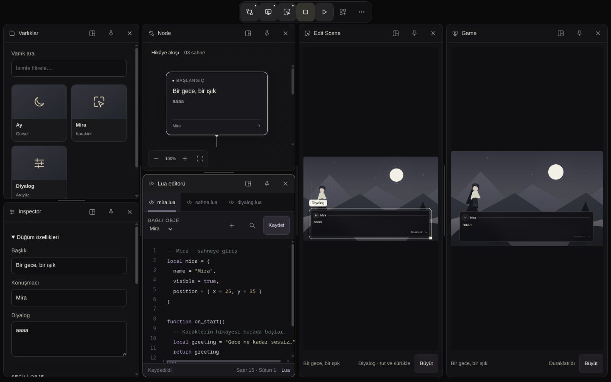
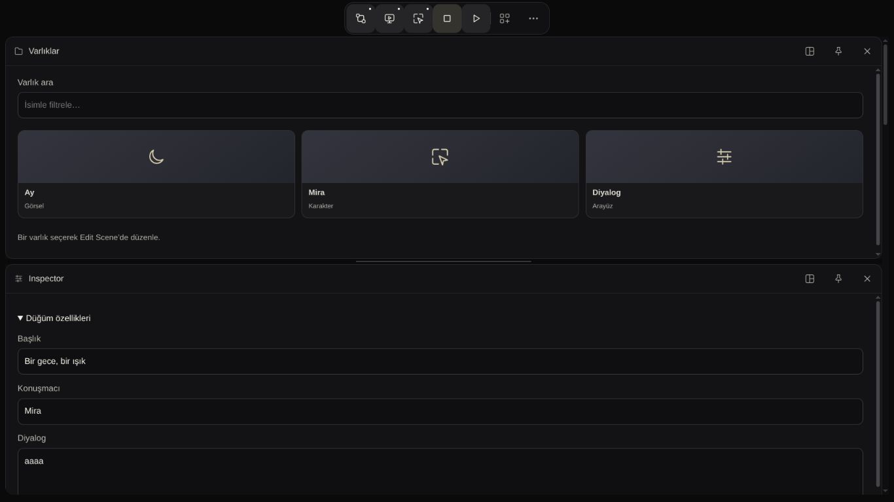

# Rowl Engine — web prototipi yeniden inceleme ve puanlama

**6 Ekim 2026 · Sonuç: 82/100.**
İncelenen kaynak: `8f6b0b57d1128761090ba50720b11bf9f6d1f148`.
Canlı adres: `http://127.0.0.1:4173/`.

Görsel kimlik tutarlı ve önceki düzeltmeler faydalı. Prototip, ana çalışma
alanının tasarımını tartışmak için yeterince olgun. Yoğun panel düzeni,
dar sahne metni ve içerik çeşitliliğine ait durum tasarımları tamamlanmadan
üretim arayüzü için tasarımın dondurulmasını önermiyorum.

## Kapsam ve puanın anlamı

Puan, görsel prototipin tasarım olgunluğuna ilişkin gerekçeli bir tasarım
kanaatidir; otomatik test sonucu, motor tamamlanma yüzdesi veya kullanıcı
araştırması sonucu değildir. Gerçek motor, Lua çalıştırma, API, export ve
Store altyapısı puanın dışında tutuldu. Store'un planlı «Yakında gelecek»
yer tutucusu eksik backend olarak puan kırma nedeni yapılmadı.

Canlı tarayıcıda Node, Game, Edit Scene, Varlıklar, Inspector, Lua,
düğüm kütüphanesi, Hub ve proje ayarları örneklendi. Store yer tutucusu
kontrol edildi. Hiyerarşi/Konsolun bütün alt durumları, sekiz ayar bölümünün
her alanı ve bütün panel yerleşim permütasyonları bu tur tek tek incelenmedi.
Kaynakta hareket sözleşmesi ve son stil düzeltmeleri de kontrol edildi.

Bu tur kod değiştirilmedi. İnceleme başındaki dört panel Varlıklar, Node,
Edit Scene ve Game idi; Inspector/Lua eklenerek yoğun düzen örneklendi.
Kütüphane ve Store geçici açıldı. Geçici paneller kapatıldı, arama temizlendi,
ayarlar uygulanmadan kapatıldı. Mevcut «aaaa» örnek diyaloğu değiştirilmedi.

## Puanlama

Her başlıkta tam puan; tutarlı görünümün yanı sıra örneklenen yoğun/dar
kullanımda da aynı tasarım amacının korunmasını gerektirir. 90–100:
tasarım dondurmaya yakın; 80–89: güçlü prototip, belirgin iyileştirme işleri
var; 70–79: ana fikir var, sık kullanımda belirgin sürtünme var; 70 altı:
önce temel tasarım kararları gözden geçirilmeli. Bunlar bu raporun ölçeğidir.

| Ölçüt | Puan | Gerekçe |
| --- | ---: | --- |
| Görsel kimlik ve tutarlılık | **18/20** | Siyah/kemik palet, ikonlar, köşeler ve seçili durumlar aynı dili konuşuyor. Yoğun düzende benzer koyu yüzeylerin ayrımı ve küçük yardımcı metinler daha güçlü olabilir. |
| Bilgi hiyerarşisi ve alan kullanımı | **16/20** | Araç ayrımı ve Inspector obje bağlamı anlaşılır. Kısa Node alanında akışın yalnız ilk kartı görünürken sahne panellerinde geniş boş alan kalıyor; eşzamanlı çalışma dengesi zayıflıyor. |
| Farklı ekranlara uyum | **14/20** | Dar sütun sıkışması çözülmüş, mobil paneller tam genişlikte ve makul yükseklikte. Fakat yoğun düzen 1366 px'de bile bütünüyle dikey sıraya geçiyor; aktif panele erişim çok kaydırma gerektiriyor. |
| Tipografi ve okunabilirlik | **12/15** | Ana alanlar daha okunur; büyük önizlemede ayrı diyalog 16 px. Sahne içindeki metin ölçeklenerek küçük kalıyor ve okumak için ikinci görünüm gerekiyor. |
| Etkileşim ve durum geri bildirimi | **14/15** | Görünür kapatma, pin/odak ayrımı, isimli kontroller, boş arama mesajı ve ayar okları yararlı. Kapsül açık paneli kapattığı için dar düzende mevcut panele doğrudan odaklanma ayrı bir tasarım kararı gerektiriyor. |
| Hareket tasarımı | **8/10** | Açılma/kapanma kısa, iptal ve azaltılmış hareket yolları kaynakta var. Yoğun yerleşim değişimlerinin görsel sürekliliği ve gerçek dokunma hissi henüz yeterince örneklenmiş değil. |
| **Toplam** | **82/100** | **Güçlü görsel prototip; tasarım çalışması devam etmeli.** |

Önceki incelemede aynı sayısal ölçek kullanılmadı; bu nedenle «önce X,
şimdi 82» biçiminde bir artış iddiası yok. Sonraki tur aynı ölçütlerle
karşılaştırılabilir.

## Güncel tarayıcı kanıtları

| Örnek | Bu tur gözlenen sonuç |
| --- | --- |
| 1440×900, başlangıçtaki dört panel | Yan yana yerleşim; Node akışı üç kartla görülebiliyor. |
| 1440×900, altı panel | Varlıklar/Inspector yaklaşık 320, Node/Lua 360, Edit Scene 340, Game 380 px genişlikte. Node yüksekliği **346,5 px**; ilk kart görünür, devamı iç kaydırmada. |
| 1366×768, aynı altı panel | Tam dikey sıra; panel genişliği **1340 px**, çalışma alanı kaydırma içeriği **3856 px**. Game/Edit Scene ayrı ayrı **928 px** yüksekliğe çıkıyor. Bu sonuç bu dock ağacına bağlı; her 1366 px düzen böyle değil. |
| 768×900, aynı düzen | Dar sütun yerine tam genişlikte paneller. İlk görünüm Varlıklar ve Inspector'a ayrılıyor; Node/Game aşağıda kalıyor. |
| 390×844, aynı düzen | Sayfa genişliği **390 px**, paneller **370 px**; Game/Edit Scene **322 px**, toplam kaydırma içeriği **2644 px**. Yatay sayfa taşması yok. |
| 390×844, Game Büyüt | Sahne kopyasındaki diyalog **9,207 px**, altındaki ayrı okuma metni **16 px**. Görüntü ve okunabilir metin birlikte sunuluyor. |
| 320×740, proje ayarları | Alt eylemler görünür; sonraki bölüm oku gezinmeyi **160 px** ilerletiyor. İç form kaydırılabiliyor. |
| Ay obje seçimi | Inspector düğüm alanlarını katlıyor; Ay'ın **X64/Y14/G10/Y16** alanları görünür oluyor. |
| Kütüphanede eşleşmeyen arama | «Bu klasörde eşleşme yok.» mesajı var; boş durum bütünüyle eksik değil. |
| Hub / Store | Hub örnek proje kartı ve dönüş eylemi gösteriyor; Store açıkça yer tutucu. |

Ölçüler CSS pikselidir. Toplam yükseklik önceki raporun altı panelli
örneğiyle bire bir kıyaslanamaz: açık araçlar ve dock ağacı farklıdır.
Bu tur konsol hata/uyarı kaydı boştu. Node testleri yeniden çalıştırıldı:
**31/31 geçti**. Bu testler görsel beğeni veya fiziksel cihaz kabulü sağlamaz.

## Öncelikli tasarım işleri

### P1 — Yoğun düzenin dizüstünde tamamen dikeyleşmesi

Minimum genişlik koruması doğru bir sorunu çözüyor; ancak eldeki dört
sütunlu ağaç 1366 px'e sığmayınca altı panelin tümü sıraya giriyor. Node,
sahne ve özellikler aynı anda görülemiyor. Bu artık önceki 95 px sütun
hatası değil; okunabilirlik karşılığında çalışma sürekliliği kaybı.

**Öneri:** İlk tasarım diliminde 1366×768 için Node/sahne/Inspector
önceliklerini gösteren alternatif yerleşimler çiz. Yardımcı araçları aynı
bölgede sekmeyle sunma veya yalnız sığmayan dalı dikeyleştirme seçeneklerini
karşılaştır. Tüm açık araçların erişimini ve kullanıcının sınırsız panel
tercihini koru; otomatik panel kapatma gerekmiyor. Mevcut kapsülün kapatma
anlamını bozmadan açık panele gitme/odaklanma yolu tasarla.

**Görsel kabul:** Node + bir sahne + Inspector yaygın dizüstü boyutunda
birlikte incelenebilsin; yardımcı panellere ulaşmak için tüm sayfayı taramak
gerekmesin. Dar/geniş geçişinde aktif bağlamın nerede kaldığı anlaşılabilsin.

### P2 — Node akışı ile sahne boşluğunun dengesi

1440 px yoğun örneğinde 346,5 px Node alanı tek karta düşüyor; Edit Scene
ve Game ise uzun, çoğunlukla boş yüzeyler. Paneller elle ayarlanabilir,
fakat başlangıç dengesi sık düzeltme gerektiriyor.

**Öneri:** Akış ağırlıklı ve sahne ağırlıklı iki görsel çalışma düzeni
hazırla. Node'da seçili düğümle en az bir komşusunu görebilecek yükseklik;
sahnede geometriyi koruyan fakat boşluğu azaltan yerleşim karşılaştırılsın.
Bu çalışma, P1'e önerilen düzenin içerik oranlarını belirler.

### P2 — Küçük sahne metnini inceleme maliyeti

16 px ayrı okuma çözümü faydalı; sahne içi küçük metin sorunu tamamen
bitmiş değil. Metin okumakla objeleri aynı anda düzenlemek arasında görünüm
geçişi gerekiyor. Büyük görünüm de açıldığı anın kopyası.

**Öneri:** Sahne oranını değiştirmeden yakınlaştırma/okuma alanını nasıl
sunacağımıza karar ver. Dar ekranda kısa ve çok uzun diyalogla karşılaştır;
ayrı okuma metni ile sahne metninin ilişkisi açık olsun. Kopya önizlemenin
canlı olmadığı görsel olarak anlaşılmalı.

### P2 — Tasarım durumlarının kapsanması

Kütüphane boş arama durumu mevcut. Hub ise bu tur tek kartla örneklendi;
çok proje, uzun ad, hiç proje olmaması gibi kompozisyonlar değerlendirilmedi.
Uzun metin, çok bileşen, çok dosya ve hata/yükleniyor durumları için bütünlüklü
bir tasarım galerisi henüz bu incelemeyle doğrulanmış değil.

**Öneri:** Backend eklemeden bu durumları örnek veriyle tasarla. Önce uzun
Node başlığı/diyalog, çok öğeli kütüphane ve çok proje Hub; ardından alan
hatası ve bekleme/başarı/başarısızlık görünümü. Store'un kapsamı kullanıcıyla
kararlaştırılana kadar yer tutucuyu koru.

### P3 — Son görsel inceltme

Küçük yardımcı metinlerin ayrımı, ikonların ilk kullanım açıklaması ve
pin/odak/seçim durumlarının birlikte görünümü gözden geçirilsin. İkinci
bir araç çubuğu eklemek şart değil. Bu tur kontrast standardı veya tam
klavye erişilebilirlik sertifikasyonu yapılmadı; uygunluk iddiası yok.

## Hareket ve entegrasyon kararı

Kaynakta panel açılışı 200 ms, kapanışı 180 ms ve kapanan içerik solması
100 ms. Sistem veya prototip azaltılmış hareket tercihi animasyonu atlıyor;
bekleyen animasyonların iptal/tamamlama yolu var. Bu tur panel aç/kapat
sonuçları canlı örneklendi. Azaltılmış hareketin 0s ölçümü önceki iyileştirme
raporunun kanıtıdır; bu tur tercih yeniden değiştirilmedi. FPS, gerçek
dokunmatik donanım, ekran okuyucu ve OS tercihi ayrı kabul gerektirir.

**Sıradaki web tasarım işi P1 yoğun dizüstü yerleşimi olmalı.** Ardından
Node/sahne oranları, metin inceleme ve içerik durumları tamamlanmalı.
Bunlar web prototipinde yapılabilir. Bu rapor UI aktarım onayı değildir.
Native/Avalonia aktarımı kullanıcının açık onayından ve çekirdek yol
haritasındaki ilgili kabul kapılarından sonra ele alınır.

Kanıt dizini: [ekranlar ve doğrulama notu](verification-evidence/2026-10-06-ui-scorecard/README.md).
