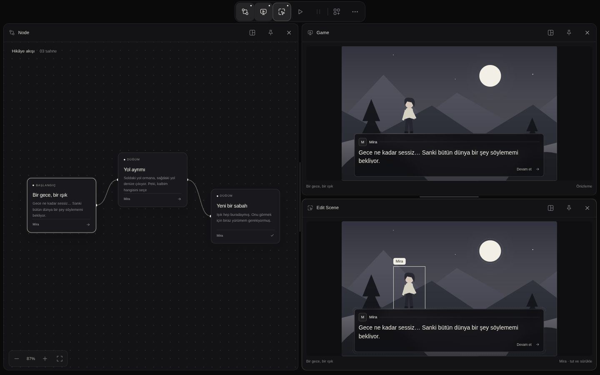
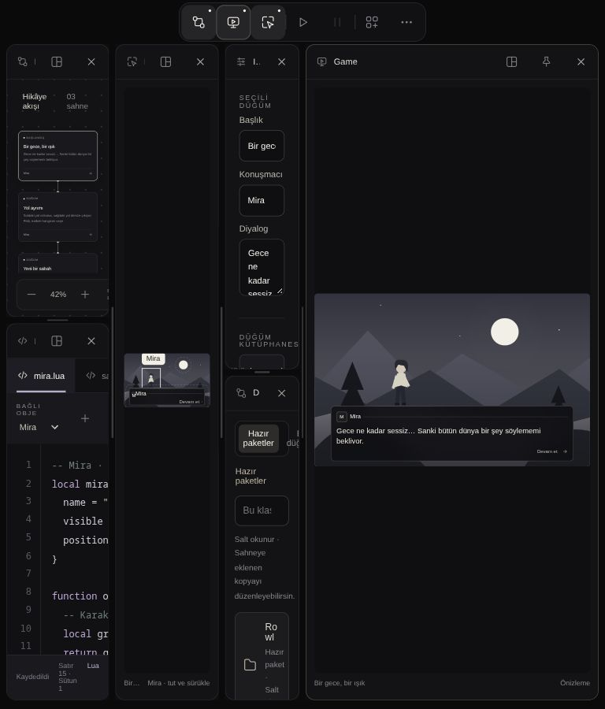
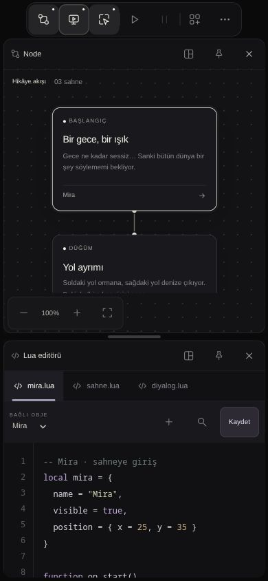

# Rowl Engine — UI prototipi görsel incelemesi

6 Ekim 2026 · Kaynak sürümü: `2bef579592634e9c4593f5ced953598bc1be4e3f`

## Aşama ve kapsam

**UI aktarım aşamasına henüz gelmedik.** A02/A03 ve A04 yerel kabul kapılarıyla tamamlandı; sıradaki uygulama A05. [Doğrulanmış yol haritasında](VERIFIED_ROADMAP_2026-10-06.md) UI aktarımı Aşama B'dedir ve Aşama A'nın gerekli kabul kapılarından sonra gelir. Ayrıca kullanıcının açık tasarım onayı gerekir. Bu inceleme aktarım başlatmaz.

`prototypes/editor-workspace/` yerel tarayıcıda açıldı. Prototip; yerleşim, görünüm, panel ilişkileri ve hareket tasarımı referansı olarak değerlendirildi. Motor bağlantısı, gerçek Lua çalıştırma, export, ses ve Store hizmeti eksikliği görsel kusur sayılmadı. Örnek sahne grafikleri ürünün nihai sanat kalitesi olarak puanlanmadı.

Canlı örnekleme: başlangıç Node; Node/Game/Edit Scene; Lua, Inspector ve kütüphane; Tools, seçenekler ve Store boş durumu; Proje/Editör ayarları; başlat/duraklat/durdur. Viewportlar: 1440×900, 768×900, 390×844 ve 320×740. CSS/JS'deki metin ve hareket kuralları da kontrol edildi. Tüm ayar bölümleri, tüm bileşen diyalogları ve kütüphane işlemleri tek tek kabul edilmedi. Gerçek dokunmatik cihaz, Avalonia, FPS veya kare kare animasyon ölçümü yapılmadı.

## Tasarım değerlendirmesi

Ana yön iyi: siyah/kemik palet dikkat dağıtmıyor; tek üst kapsül çalışma alanına yer bırakıyor; Node/Game/Edit Scene ayrımı hikâye, sonuç ve düzenleme arasındaki ilişkiyi anlaşılır kılıyor. Seçili node'un aydınlık kenarı ve seçili objenin çerçevesi aynı görsel dili kullanıyor. Inspector üzerinden düzenleme, kütüphaneden tekrar kullanım ve ayrı Lua paneli tutarlı bir iş akışı oluşturuyor.

En olgun yüzey ayarlar: başlık → bölüm → kart → alan hiyerarşisi belirgin; masaüstü kartları mobilde alt alta geliyor; Uygula/Vazgeç alt bantta erişilebilir kalıyor. 320 pikselde araç menüsü iki sütunla ekrana sığıyor ve üst kapsül korunuyor. Aktif araçların dolgu/kenarlıkla belirtilmesi iyi.

**Ana yerleşimi yeniden tasarlamak yerine ölçü ve durum kurallarını tamamlamak gerekir.** Mevcut görünüm tasarım referansı olarak yeterli; yoğun ve dar düzenler henüz aktarım için dondurulacak kadar tutarlı değil.

## Öncelikli bulgular

P1: aktarım öncesinde çözülmeli. P2: tasarım netleştirme önerisi. Ölçülen davranış ile değerlendirme ayrı belirtilmiştir.

| Öncelik | Bulgu / kanıt | Tasarım önerisi |
| --- | --- | --- |
| P1 | **Mobilde panel yüksekliği büyüyor.** 1440'ta Node, Game, Edit Scene, Lua, Inspector ve kütüphane açıldı; 390×844'e geçildi; Game kapatılıp yeniden açıldı. Game yaklaşık **2807 px**, çalışma alanı içeriği **5624 px** oldu. Küçük sahne dev panelin ortasında kaldı. | Mobilde her panel için içerik odaklı yükseklik/minimum belirle; masaüstü bölme oranlarını mobil toplam yüksekliğe doğrudan uygulama. Panel aç/kapat ve ekran döndürme sırasında bu ölçüleri koru. Panel sayısı sınırı veya otomatik kapatma gerekmez. |
| P1 | **Yoğun tablet düzeni kullanılabilir genişliği kaybediyor.** Aynı panel grubunda Game yeniden açılıp yerleşim sıfırlandıktan sonra 768×900'de Inspector/kütüphane yaklaşık **95 px**, Node/Lua/Edit Scene yaklaşık **131 px** genişlikte kaldı. Başlıklar kısaldı, metinler birkaç karakterlik satırlara düştü. | Panel türüne göre okunabilir minimum genişlik tanımla. Eşik altında aynı araçları dikey düzenle veya kullanıcının seçtiği paneli genişletmesini kolaylaştır. 650 px tek eşik, çok panelde yeterli değil. |
| P1 | **Mobil önizleme metni aşırı küçülüyor.** 390 px görünümde diyalog metni yaklaşık **9,96 px**, “Devam et” **6 px**, Lua'nın “Bağlı obje” etiketi **7 px** ölçüldü. Ana araç başlıkları 11 px; pek çok yardımcı yazı 8–10 px. | Editör metni ile sahnenin ölçeklenen metnini ayrı ele al. Editör alanlarında okunabilir bir alt sınır; küçük önizlemede büyütme/odaklı görüntüleme tasarla. Sahne görünümünün oranını korumak, tüm yazıları editör metni gibi büyütmek anlamına gelmez. |
| P2 | **Inspector'da seçim bağlamı aşağıda kalıyor.** 1440×900'de altı panel açıkken başlık, konuşmacı, diyalog ve kütüphaneye kaydet alanları görünür; seçili objenin konum/boyut alanları panelin kaydırılan alt kısmında kalıyor. | Seçili düğüm ve seçili obje bölümlerini net ayır; sahneden obje seçildiğinde ilgili bölümün görünür olmasını veya katlanabilir grupları değerlendir. Kütüphaneye kaydet yine Inspector'da kalsın. |
| P2 | **Mobil ayar gezinmesi keşfedilmeyi bekliyor.** 390 px'de ilk dört bölüm görünür; diğerleri yatay kaydırmada. 320 px'de kaydırma çubuğu daha açık görünüyor. Bölümler erişilebilir, kesilmiş/kayıp değiller. | Sıradaki sekmenin bir kısmını veya kenar geçişini göstererek yatay devamı belli et. Sekme değişince seçilen bölümün görünür kalması mevcut davranış olarak korunmalı. |
| P2 | **İkon ve durum dilinin son kararı gerekli.** Kapsül yalnız ikonlarla çalışıyor; masaüstünde tooltip/erişilebilir ad var. Panelin açık olması, aktif odak, pin ve oynatma farklı ama birbirine yakın nötr tonlarla gösteriliyor. Bu bir kullanım değerlendirmesi; erişilebilir ad yokluğu değildir. | İlk kullanımda kısa açıklama veya odakta görünen ad değerlendir. Aktif odak/pin/açık panel için kenarlık, nokta ve dolgu rollerini açıkça belirle. Kalıcı ikinci araç çubuğu eklemeye gerek yok. |

Tablet örneği:

Mobilde yeniden açılan Game:

Mobil yükseklik davranışının kaynak karşılığı `app.js:164–174`: `minimumHeight` alt ağaçların yüksekliğini bölme oranlarına böler; mobilde masaüstünün yatay bölmeleri de dikey çizilir. Yeni 50/50 bölme, bir paneli diğer bütün panellerin toplam yüksekliğiyle eşitleyebilir. Bu nedenle sorun yalnız örnek sahnenin boş olmasıyla açıklanmıyor.

## Animasyon ve etkileşim yönü

Kaynakta panel açılışı **200 ms**; kapanış/bölme daralması **180 ms**; kapanan içerik solması **100 ms**; menü girişi **140 ms**. Açılışta 6 px içerik hareketi ve `cubic-bezier(.22,1,.36,1)` kullanılıyor. Süreler kısa ve mevcut sakin görsel dil için uygun başlangıç değerleri. Bölme alanlarını animasyonla ayırma yaklaşımı, panellerin üst üste uçmasından kaçınmak için doğru bir temel.

Canlı aç/kapat ve başlat → duraklat → durdur işlemlerinin son durumları tutarlıydı. Ancak bu, hareketin her karede akıcı olduğuna veya hızlı ardışık tıklamaların bütün kombinasyonlarına kabul değildir. `workspace-motion.js` sistemin azaltılmış hareket tercihini ve `.reduce-motion` sınıfını kontrol ediyor; CSS de sistem tercihini ele alıyor. Bu tur işletim sistemi tercihi değiştirilerek doğrulanmadı.

Tasarım tamamlanırken hareket tablosunu şu şekilde dondurmak yararlı olur: açılma/kapanma, yeniden yerleştirme, splitter sürükleme, menü, seçim ve oynatma durumu. Her biri için süre, easing, hangi öğenin hareket ettiği ve azaltılmış hareket karşılığı yazılmalı. Doğrudan sürükleme kullanıcıyı gecikmeli animasyonla takip etmemeli; son bırakma düzeni kısa geçişle netleşmeli. Mobil yükseklik sorunu çözülmeden hareket cilası öncelik almamalı.

## Aktarım öncesindeki tasarım paketi

1. Panel minimum genişlik/yükseklikleri; dar/geniş ekran dönüşümü; yeni panelin nereye ve hangi boyutta açılacağı.
2. Metin ölçekleri ve palet tokenları: editör yazısı, sahne yazısı, yardımcı metin, pasif/aktif/seçili/odaklı/pin durumları.
3. Node, Game, Edit Scene ve Inspector arasında seçim/odak davranışı; mobilde panel erişimi.
4. Hareket tablosu ve azaltılmış hareket karşılıkları.
5. Görsel durum örnekleri: boş, uzun metin, çok obje/çok node, arama sonucu yok, yükleniyor, hata, kaydedilmemiş değişiklik. Bunlar tasarım ihtiyacıdır; prototipte gerçek servis eksikliği bulgusu değildir.
6. Kullanıcı tasarım onayı ve sonrasında Aşama B'de Avalonia'ya kademeli aktarım. Önce kabuk/dock/stil, sonra mevcut gerçek kontroller ve komutlar. Görsel token envanteri şimdi çıkarılabilir; üretim UI'si onaydan önce değişmez.

Bu incelemede prototip veya motor kaynakları değiştirilmedi. Rapor ve ekran kanıtları oluşturuldu. Kullanıcının sade kapsül, görünür ×, panel sayısı sınırı olmaması, taşıma kilidi olarak pin, Inspector'da şablon kaydetme ve Varlıklar/Store ayrımı kararları korunmuştur.
