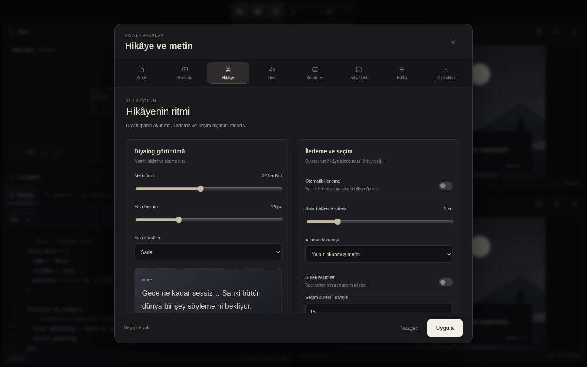
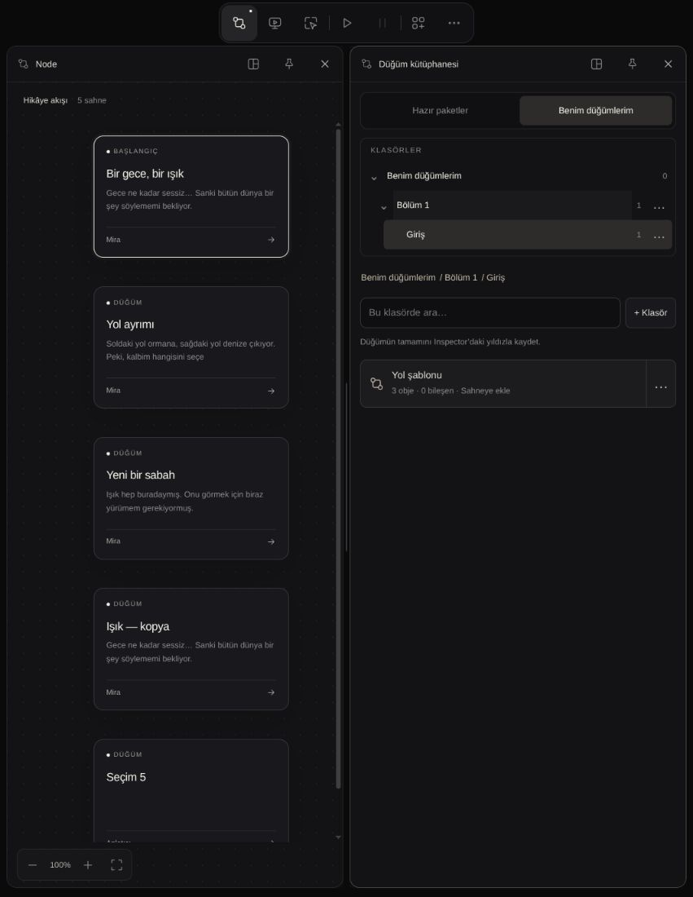

# Rowl çalışma alanı — tarayıcı prototipi

Motor ve Avalonia editöründen bağımsız, yerel örnek veri kullanan tasarım denemesi.
Paket kurulumu ve derleme gerektirmez:

```sh
python3 -m http.server 4173 --bind 127.0.0.1 --directory prototypes/editor-workspace
```

Tarayıcı: `http://127.0.0.1:4173`.

## Ekranlar ve araçlar

- **Node:** örnek hikâye akışı ve sahne seçimi.
- **Game:** oyun sahnesinin önizlemesi.
- **Edit Scene:** aynı sahnede Ay, Mira ve diyalog kutusunu sürükleyerek düzenle. Seçili obje ok tuşlarıyla da taşınır; Shift adımı büyütür.
- **Hiyerarşi:** seçili node'un objeleri; seçim Edit Scene ve Inspector ile ortak.
- **Inspector:** seçili objenin konum/boyut yüzdeleri, görünürlüğü ve diyalog metni. Değerler sahne sınırlarında tutulur.
- **Varlıklar:** örnek varlıkları isimle filtrele, seçerek Edit Scene'e geç.
- **Konsol:** gerçek prototip etkileşimlerinin oturum kayıtları; Temizle ile boşaltılır.
- **Lua editörü:** dosya sekmeleri, satır numaraları, renkli kod, obje seçimi, arama, yeni script ve kaydetme durumu. Kod yazılabilir; script taslakları bu tarayıcıda saklanır. Lua çalıştırılmaz.

PC ve mobilde aynı üst kapsül var: **Node · Game · Edit Scene | Başlat · Duraklat | Araçlar · …**. Yedi düğmenin dokunma alanı 44×44 piksel; kapsül 314 piksel genişliğiyle 320 piksel ekrana sığar. Sağ alttaki düğme kaldırıldı. **Araçlar**, kapsülün altında her iki cihazda da aynı iki sütunlu isimli menüyü açar; Düğüm kütüphanesi de bu menüdedir. Açık araçlar menüde işaretlenir; ikinci tıklama aynı pencereyi kapatır.

## Pencere yerleşimi

- Açık pencere sınırı ve otomatik pencere değiştirme kaldırıldı. Dokuz pencere birlikte açılabilir; ilk açılışta yalnız Node açık.
- Başlığı başka pencerenin sol/sağ/üst/alt tarafına sürükle: hedef alan bölünür. Pencereler kendi bölmelerinde kalır, birbirine binmez. Örneğin Node solda; Game ve Edit Scene sağda alt alta.
- Lua, Node yanında veya altında geniş bir bölmede açılır. Diğer araçlar masaüstünde sağ sütunda, mobilde altta gruplanır. Mobil çalışma alanı gerektiğinde aşağı kayar; her araç kendi içinde de kaydırılabilir.
- Bölme çizgisini sürükle veya klavyede odaklayıp ok tuşlarını kullan.
- Başlıktaki yerleşim menüsü dokunmatik/klavye için hedef ve yön seçimi sunar.
- **Sabitleme**, başlıktan sürüklemeyi ve menüden taşımayı kilitler. Bölme boyutları ayarlanabilir; sabit pencere elle kapatılabilir.
- Görünür **×**, son pencere dahil herhangi bir pencereyi kapatır; kapanan pencerenin sabitlemesi temizlenir.
- Escape/pointer iptali sürüklemeyi geri alır; alan dışına bırakma eski konumu korur.

## Geçişler

Pencere açılırken bölme oranları 200 ms içinde yumuşakça değişir; yeni içerik hafifçe belirir. Kapanırken içerik solar, kapanan bölme 180 ms içinde daralır. Mobilde çalışma alanının yüksekliği de geçişe katılır. Animasyonlar pencereyi diğerinin üzerine taşımak yerine flex bölmelerini değiştirir. Hızlı aç/kapat önceki geçişi sonlandırıp güncel duruma geçer. `prefers-reduced-motion` açıkken geçişler anında gerçekleşir.

## Lua editörü

Üç örnek dosya: `mira.lua`, `sahne.lua`, `diyalog.lua`. Sekmeler arasında geçiş düzenlemeleri korur. Yeni script düğmesi yeni bir sekme açar. Değişen dosyanın sekmesinde küçük nokta ve altta **Düzenlendi** görünür. **Kaydet** veya Ctrl/Cmd+S taslakları yerelde kaydeder. Tab iki boşluk ekler. Arama, yazılan metnin eşleşme sayısını gösterir. Uzun satırlar yatay, kod dikey kayar; satır numaraları kaydırmayı izler.

Obje seçimi, script bağlantısı arayüzünün tasarım denemesidir. Örnek fonksiyonlar motor API sözleşmesi değildir. Kod doğrulama, çalıştırma veya gerçek projeye yazma yoktur.

## Proje menüsü ve detaylı ayarlar

Sağ üst **…** menüsü sekiz bölüm açar. Her bölümde açıklamalı kartlar, aynı üst bölüm şeridi ve sabit **Vazgeç / Uygula** alt alanı bulunur. Mobilde aynı şerit yatay kayar, seçili bölüm görünür kalır; kartlar alt alta gelir.

| Bölüm | Tasarlanan seçenekler |
| --- | --- |
| Proje | Kapak görünümü, ad, yapımcı, sürüm, kısa açıklama |
| Görüntü ve sahne | Yatay/dikey çözünürlük, pencere biçimi, ekran uyumu, boş alan rengi, kare hızı, başlangıç sahnesi; oran önizlemesi |
| Hikâye ve metin | Metin hızı, yazı boyutu/karakteri, diyalog önizlemesi, otomatik ilerleme, bekleme, atlama, süreli seçim |
| Ses ve müzik | Genel ses, müzik, efekt, seslendirme, sessiz başlangıç, arka planda müzik, müzik geçişi |
| Kontroller | Yedi klavye eylemi için kısayol alanı, dokunma, kaydırma, uzun dokunma, kontrolcü |
| Kayıt ve dil | Kayıt yuvaları, diyalog geçmişi, otomatik kayıt/noktası, dil, büyük metin, hareket azaltma; örnek kayıt kartı |
| Editör | Tema/vurgu önizlemesi, Node ızgarası, obje çerçeveleri, hizalama ve cetvel tercihleri |
| Dışa aktarma | Platform kartları, paket adı/boyutu, içerik seçimi, taslak özeti ve JSON taslağı indirme |

Bölüm değiştirmek uygulanmamış düzenlemeleri korur. **Vazgeç**, × ve Escape onları bırakır; **Uygula** tasarım tercihlerini yerelde saklar. Çözünürlük, başlangıç sahnesi, ızgara ve obje çerçeveleri mevcut örnek sahneye uygulanır. Hareket azaltma, pencere geçişlerini kapatır. Diğer seçenekler tasarım önizlemesi ve tercih taslağıdır; ses motoru, giriş eşleme, kayıt sistemi veya paket oluşturma çalıştırılmaz.

Dışa aktarma sürümü `rowl-workspace-prototype/v2`: sahneler, temel ayarlar, tasarım tercihleri, seçiliyse Lua taslakları ve çalışma alanı yerleşimi. Gerçek motor paketi değildir. **Yerleşimi sıfırla** açık pencereleri varsayılan yerleşime getirir.

Ayarlar ve kaydedilmiş script taslakları localStorage alanında kalır. Kaydedilen örnek sahneler sayfa yenilenince geri yüklenir; yerleşim ve oynatma sıfırlanır.

## Oynatma

- **▶ Başlat:** ayarlardaki başlangıç sahnesinin bağımsız kopyasını oynatır, Game'i açar; düğme **■ Oyunu kapat** olur.
- **Ⅱ Duraklat:** Mira hareketi ve diyalog yazısını mevcut karede dondurur; tekrar tıklamak kaldığı yerden devam eder. Bekleme süresi oynatıma eklenmez.
- Node, Edit Scene ve Inspector kullanılabilir; düzenleme verileri çalışan/donmuş Game kopyasını değiştirmez. ■ ile kapatınca Game düzenleme önizlemesine döner.
- Ekran simgesi yalnız pencereyi açar/kapatır. Game'de Devam et duraklatılmışken; duraklat düğmesi oyun kapalıyken devre dışıdır.

## Doğrulama — 2026-10-05

23 durum testi: sekiz pencere açma, sabit/son pencere kapatma, odak, dört yönlü yerleşim, pin kilidi, oran sınırları, 1000 karma işlemde alanların çakışmaması; ayar doğrulama ve Inspector sınırları; bağımsız oynatma kopyası, donma ve devam etme.

```sh
node --test prototypes/editor-workspace/*.test.mjs
```

Önceki kontrol kapsülü doğrulaması: 1440×900 ve 320×740 görünümlerinde aynı sıra ve 44×44 düğmelerle doğrulandı. 2×2 araç menüsü 260 piksel genişlikte iki görünümde de aynı yerleşimi kullanır. Sekiz hızlı Game aç/kapat işleminden sonra pencere ve düğme durumları tutarlı kaldı; Inspector kapanıp kaldırıldı ve yeniden açıldı. Başlat/duraklat akışı korundu.

Tarayıcıda 1440×900'de yedi pencere birlikte açıldı; DOM alanları çakışmadı. Hiyerarşi seçiminden Inspector konum/görünürlük düzenleme, Edit Scene'e yansıma ve donmuş Game kopyasının değişmemesi doğrulandı. Varlık filtreleme/seçim, Konsol kayıtları, sabit pencerenin yön düğmelerinin kapanması kontrol edildi. Çözünürlük ve başlangıç sahnesi uygulandı; yenileme sonrası korundu. Izgara/çerçeve tercihleri uygulandı. İndirilen JSON açılarak üç sahne, yedi pencere ve ayarlar doğrulandı.

390×844'te beş pencere çakışmadan alt alta açıldı; Inspector'a kaydırarak ulaşıldı. 320×740'ta üst kontroller ve dört araç düğmesi ekrana sığdı. Gerçek mobil cihaz kabulü yapılmadı.

Lua/ayar turu: 1440×900'de sekiz pencere birlikte açıldı; DOM alanları çakışmadı. Lua sekmeleri, yeni script, arama eşleşmeleri, düzenlenmiş/kaydedilmiş durum, sabit pencerenin taşımayı kilitlemesi ve × ile kapanıp yeniden açılması doğrulandı. Sekiz ayar bölümü açıldı; bölüm değişiminde taslak korunması, vazgeçme, metin hızı önizlemesi, dikey ekran oranı, Android seçimi ve JSON indirme bildirimi kontrol edildi. 320×740 ve 390×844'te Lua, seçenekler menüsü ve ayarlar incelendi. Tarayıcı hata/uyarı kaydı boştu. Gerçek mobil cihaz testi yapılmadı.

Siyah/kemik beyazı palet, yerel SVG sahne. Harici font, resim, API veya motor bağlantısı yok.


[Mobil araç pencereleri](previews/mobile.jpg)



[Mobil ayarlar](previews/settings-mobile.jpg)

## Sade içerik üretme akışı — 2026-10-05

Çalışma alanında yalnız mevcut 56 px üst kapsül var. Son denemedeki **Proje / Kaydet / Paket kontrolü** barı, Node'daki **Düğüm ekle / Seçileni düzenle** barı ve Edit Scene işlem barı kaldırıldı. Düzenleme Inspector'da; kaydetme ve hub dönüşü **…** menüsünde. Dışa aktarma mevcut ayarlar bölümünde kaldı.

- **Araçlar → Düğüm kütüphanesi:** Hazır paketler ve Benim düğümlerim sekmeleri bulunan dock paneli. Hazır paketler salt okunur; kullanıcı bölümü iç içe klasörler, düğüm kısayolları, düzenleme, taşıma ve arama içerir.
- **Hazır paketler → Rowl → Standart düğüm:** gerçek editörün tek varsayılan düğüm ekleme akışını temsil eder ve Inspector’ı açar. Bileşenler düğüm çeşidi değildir. Hazır çeşit kataloğu ve Türler sekmesi kaldırıldı; gelecekteki çeşitler mevcutmuş gibi gösterilmez.
- **Inspector → Düğüm kütüphanesi:** yıldızla o andaki düğümün tüm obje hiyerarşisini ve Inspector ayarlarını bağımsız şablon olarak kaydeder. Kayıt adı ve klasörü seçilir; sonraki değişiklikler Kaydı güncelle ile aktarılır. Kullanıcı kütüphanesinden eklemek yeni kimlikli bir kopya oluşturur. Eski bağlantı hedefleri temizlenir; yeni hedefler ayrıca atanır. Kopyayı düzenlemek kaynak düğümü veya şablonu değiştirmez. Yıldız veya kısayol kaldırma onay ister; sahnedeki kopyaları silmez. Klasör kaldırma da onay ister, içeriğini üst konuma taşır; ad çakışırsa klasöre numara eklenir.
- **Inspector:** düğüm başlığı, konuşmacı ve diyalog doğrudan düzenlenir; seçili obje özellikleri ve bileşen ekleme burada bulunur. Node kartına çift tıklamak Inspector'ı açar. Ayrı düzenle düğmesi yok.
- **… → Kaydet / Ctrl+S:** sahneler, ayarlar, bileşen özellikleri, script taslakları ve varlık metadata'sı yerelde saklanır; yenilemede geri yüklenir. Lua panelinin kendi kaydetme davranışı korunur.
- **… → Hub’a dön:** taslağı saklar ve örnek proje seçim ekranını açar. Proje kartı çalışma alanına döner. Gerçek hub'ın dosya/şablon/son projeler hizmetleri bu tarayıcıya bağlanmadı.
- **Mobil:** üst kapsül 56 px kalır; ek işlem barı yok. Dar ekranda dock bölmeleri alt alta ve tam genişlikte görünür. Kütüphane gerektiğinde kendi içinde kaydırılır. Masaüstünden dar ekrana geçişte bölme yönü yeniden hesaplanır.

### Kaynakla karşılaştırma

| Gerçek kaynak | Tasarımda kullanılan mevcut davranış |
| --- | --- |
| `editor/Views/ProjectHubWindow.axaml`, `ProjectHubViewModel.cs` | Proje seçimi hub üzerinden; çalışma alanında ikinci proje yöneticisi yok |
| `editor/Views/MainWindow.axaml` | Kaydet, proje hub'ı, ayarlar, dışa aktarma ve mevcut paneller |
| `editor/ViewModels/InspectorViewModel.cs`, `Views/Panels/NodeInspectorView.axaml` | Seçili düğüm/obje ve bileşen özellikleri |
| `editor/ViewModels/MainWindowViewModel.cs::AddNode`, `Services/StoryGraphCanvasService.cs::CreateDefaultNode` | Varsayılan diyalog düğümü ekleme |
| `editor/ViewModels/NodeViewModel.cs`, `Components/ComponentRegistry.cs`, `SearchViewModel.cs` | Düğüm bileşimi ve desteklenen davranış türleri |

Klasörlü kütüphane ve yıldızlı kısayollar yeni prototip tasarımıdır; mevcut native ürün özelliği diye sunulmaz. Assets Store paneli yalnız **Yakında gelecek** gösterir; Varlıklar paneli arama ve sahne objesi seçme akışını korur; diyalog dışındaki bileşen davranışları çalıştırılmaz. Örnek graph sıralıdır; gerçek dallanma, native proje açma veya `.rowlpkg` üretimi yok.

27 durum testi geçti; klasör taşıma döngüleri, kaldırma sonrası içerik koruması ve ad çakışmaları test edildi. Yıldızlı şablonun kopyadan bağımsızlığı ve eski hedefleri taşımaması ayrıca test edildi. Tarayıcıda yıldızla → kütüphanede gör → kopya ekle → Inspector'dan değiştir → kaydet/yenile ve hub dönüşü doğrulandı. 320×740'ta üst yükseklik 56 px, ek bar sayısı 0, yatay sayfa taşması yok; kütüphane 310 px tam panel genişliğinde. Bu çalışma native GUI kabulü veya tüm motorun denetimi değildir; inceleme ilgili editör akışlarıyla sınırlıdır.



[Mobil düğüm kütüphanesi](previews/library-mobile.jpg)

Kütüphane güncellemesi: tarayıcıda hazır paketin salt okunur görünümü, kullanıcı klasörü/alt klasörü oluşturma, seçili düğümü kaydetme, yenileme sonrası kalıcılık, kaldırmadan vazgeçme ve Assets Store boş ekranı doğrulandı. 320×740 kaldırma penceresi ekrana sığıyor, yatay sayfa taşması yok. Klasör kaldırma sonucu durum testlerinde doğrulandı.

Assets / Assets Store düzeltmesi: mevcut Varlıklar panelinin arama ve seçim davranışı geri getirildi. Assets Store ayrı araç/pencere olarak eklendi; yalnız Yakında gelecek gösterir. Diğer araçlar korunuyor. Tarayıcıda Varlıklar filtreleme, ayrı Store paneli ve araç listesi doğrulandı; 26 test yeşil.

Inspector yıldız güncellemesi: Node kartı yıldızları ve kütüphanedeki Seçileni kaydet düğmesi kaldırıldı; kayıt tek yerde Inspector içindedir. Tüm objeler, görünürlük/konum/boyut ve bileşen özellikleri kopyalanır. Bağımsız hiyerarşi kopyası durum testi eklendi. UI’da Mira X=40 ve gizli olarak kaydedildi, kaynak X=25/görünür yapıldı; kütüphaneden eklenen kopyanın X=40/gizli kaldığı doğrulandı. 27 test yeşil.


### Kategori düzeni güncellemesi

Benim düğümlerim içinde açılıp kapanan klasör ağacı, seçili klasör vurgusu, düğüm sayıları ve konum yolu var. + Klasör seçili konumda alt klasör oluşturur. Klasörün … ekranından isim ve üst klasör değişir; kendisi/alt klasörleri hedef listesinde gösterilmez. Düğümün … ekranından isim ve klasör değişir; taşınan kaydın konumu açılır. İçerik düzenleme Inspector’dadır; burada kaydedilen hiyerarşi salt okunur incelenebilir. Kaldırma … içine alındı ve onay korunur.

Tarayıcıda düğümü Bölüm 1 / Giriş’e taşıma, yenileme sonrası korunması, seçili alt klasörde yeni klasör formunun doğru hedefi seçmesi, geçersiz üst klasör hedeflerinin gizlenmesi ve kaldırma onayından vazgeçme doğrulandı. 320×740’ta yatay sayfa taşması yok. 27 durum testi yeşil.
