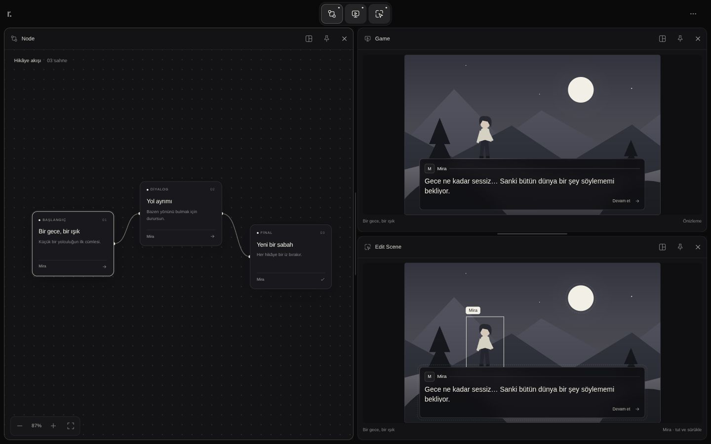

# Rowl çalışma alanı — tarayıcı prototipi

Motor ve Avalonia editöründen bağımsız, örnek veri kullanan tasarım denemesi.
Paket kurulumu ve derleme gerektirmez:

```sh
python3 -m http.server 4173 --bind 127.0.0.1 --directory prototypes/editor-workspace
```

Tarayıcı: `http://127.0.0.1:4173`.

## Ekranlar

- **Node:** örnek hikâye akışı ve sahne seçimi.
- **Game:** oyun sahnesinin önizlemesi.
- **Edit Scene:** Game ile aynı sahnenin doğrudan düzenlenebilir görünümü. Ay, Mira ve diyalog kutusu tutulup sürüklenebilir; konumları Game'e anında yansır. Seçili obje ok tuşlarıyla da taşınabilir; Shift adımı büyütür.

Edit Scene, inspector formu değildir. Inspector için ayrı bir kullanıcı tasarımı bekleniyor.
Üst alan üç ekran simgesi ve küçük bir seçenek düğmesinden oluşur. Proje çubuğu, tasarım rozeti ve alt bilgi çubuğu kaldırıldı.

## Pencere yerleşimi

- Başlığı sürükle: başka pencerenin sol/sağ/üst/alt tarafına bırakınca o alan bölünür. Ortasına bırakıldığında da en yakın tarafa göre bölünür. Bölmeler iç içe kurulabilir; örneğin Node solda, Game ve Edit Scene sağda alt alta.
- Bütün pencereler kendi bölmesinde kalır; birbirinin üstüne binmez. Serbest pencere modu kaldırıldı. Sürüklerken pencere yerinde kalır, yalnız hedef bölmenin önizlemesi gösterilir.
- Bölmeler arasındaki çizgiler sürüklenerek boyutlandırılır. Klavyede çizgiye odaklanıp ok tuşları kullanılabilir.
- Pencere başlığındaki yerleşim düğmesi aynı işlemler için dokunmatik/klavye alternatifi sunar: hedef pencere ve dört yön.
- Escape veya pointer iptali sürüklemeyi geri alır. Alan dışına bırakılan pencere önceki konumunda kalır.
- Mobilde yeni açılan pencereler varsayılan olarak alt alta yerleşir; kullanıcı yönlerini ve boyutlarını değiştirebilir. Üçlü başlangıçta alan dengeli paylaşılır.

## Açık pencere sınırı ve sabitleme

- Başlangıçta yalnız Node açık, sınır iki pencere. Üst simge gizli ekranı açar, açık ekranı odaklar.
- Sağ üst seçenek menüsünde üç pencere seçimi tüm ekranları açar. İkiye dönüş sabit olmayan en eski pencereyi kapatır.
- Her pencerenin başlığında yerleşim, sabitleme ve görünür **× kapatma** düğmeleri var. Çok dar pencerede sabitleme yerleşim menüsünden de kullanılabilir.
- **Pencereyi sabitle**, otomatik ekran değiştirmede o pencerenin korunmasını sağlar. Kullanıcı sabit pencereyi bizzat taşıyabilir veya × ile kapatabilir.
- İki pencere doluyken üçüncü simge, sabit olmayan en eski pencerenin aynı bölmesini devralır.
- Bütün açık pencereler sabitse yeni ekran açılmaz; açıklama gösterilir. Üçü sabitse ikiye geçmeden sabitleme kaldırılmalıdır.
- ×, son açık pencere dahil herhangi bir pencereyi kapatır. Boş çalışma alanında üst simgelerden yeniden ekran açılabilir. Kapatılan pencerenin sabitlemesi kaldırılır. Seçenek menüsündeki başlangıca dön eylemi örnek veriyi ve yerleşimi sıfırlar.

## Doğrulama — 2026-10-04

15 durum testi: kapasite/sabitleme, sabit ve son pencereyi elle kapatma, boş alandan yeniden açma, dört yönde iç içe yerleştirme, aynı konumu devralma, oran sınırları, mobil başlangıç ve 1000 karma işlemde pencere tekilliği ile alanların çakışmaması.

```sh
node --test prototypes/editor-workspace/*.test.mjs
```

Son düzeltmede masaüstü ve 390×844 görünümde başlığı başka pencerenin ortasına bırakma kontrol edildi; sonuçta pencerelerin gerçek DOM alanları çakışmadı. Bölme boyutlandırma ve dört yönlü yerleşim menüsü çalışıyor. Kapatma, sabitleme ve üst simgeden yeniden açma korunuyor.
Bu kontrol gerçek mobil cihaz kabulü değildir. Game/Edit Scene ortak obje konumları ve klavyeyle obje taşıma önceki sürümde doğrulandı; bu değişiklik sahne düzenleme davranışını değiştirmez.

Siyah/kemik beyazı paleti mevcut KARAR-0 kararından gelir. SVG sahne yereldir; harici font, resim, API veya motor bağlantısı yoktur. Örnek veri sayfa yenilenince sıfırlanır.



[Mobil ekran görüntüsü](previews/mobile.jpg)
